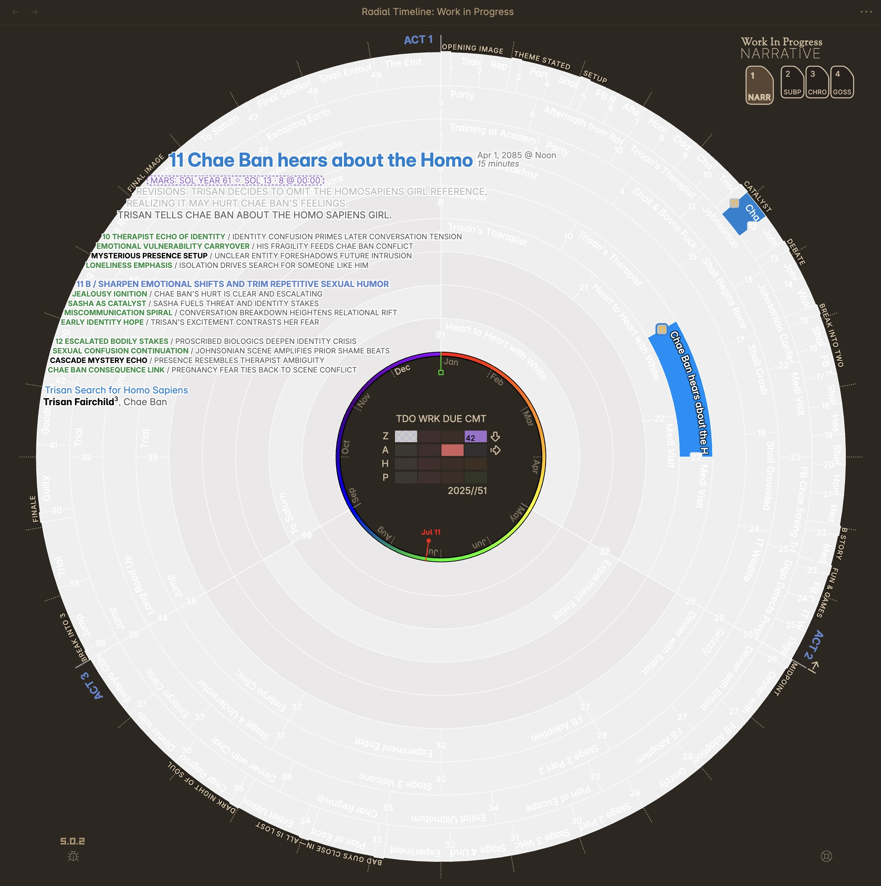
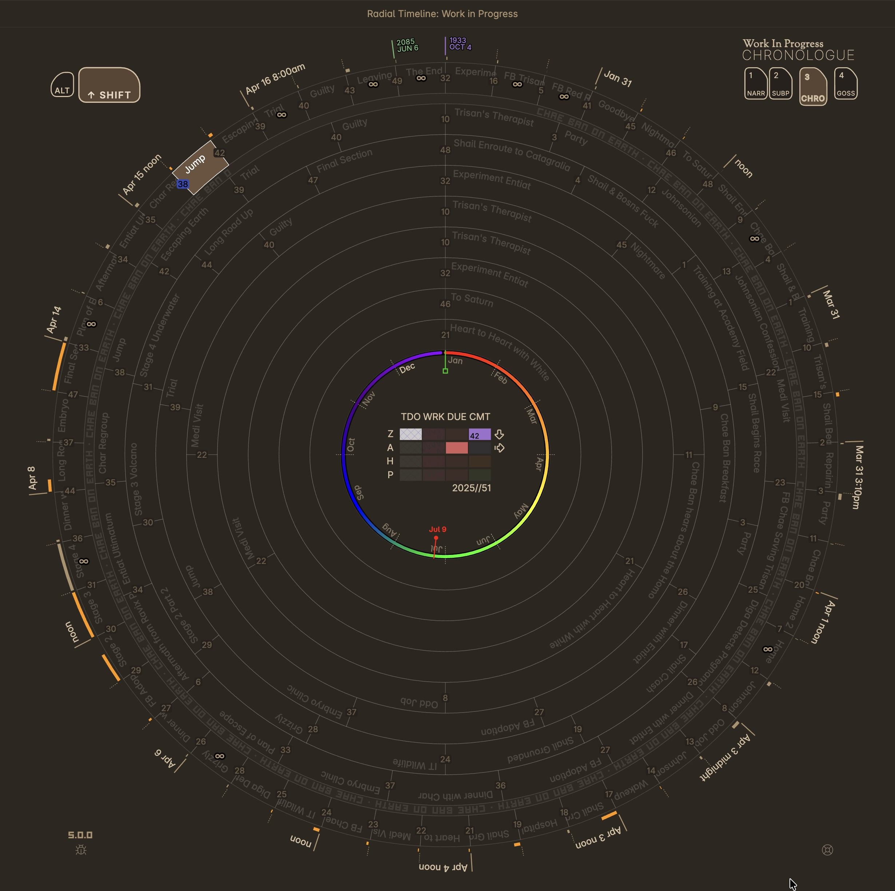
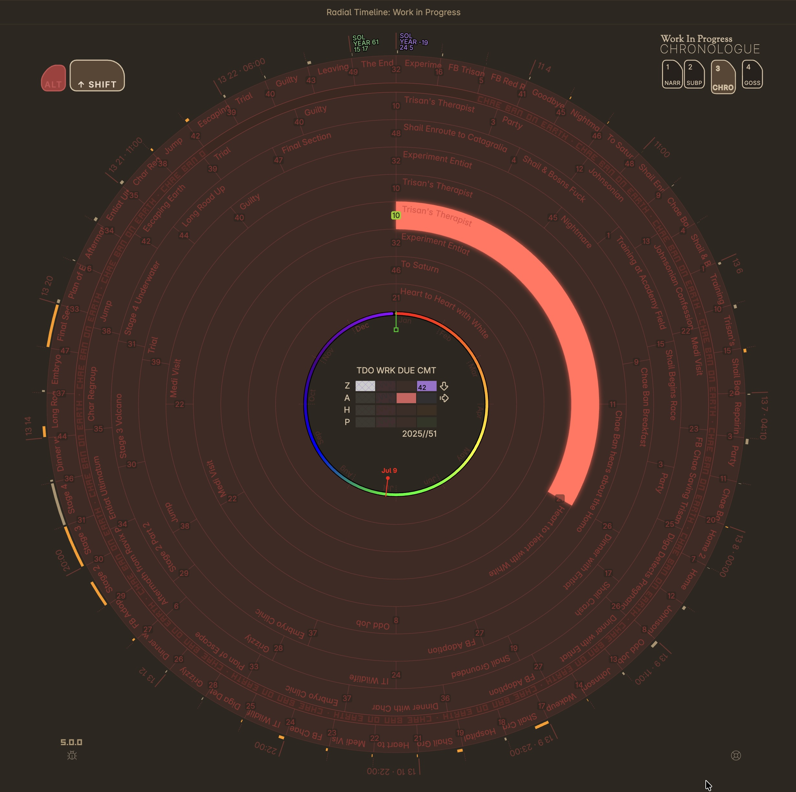

## Provisional Patent Draft — Radial Timeline™ (Working Copy)

Inventor: Eric Rhys Taylor  
Assignee: None (individual filing)  
Date: 2025-12-26  

---

### Title
Single-screen radial visualization system for structured content with multi-thread ring mapping and multi-timeline modes

---

### Technical Field
The disclosure relates to computer-implemented user interfaces and visualization systems for planning, organizing, and managing structured content, including fiction and non-fiction narrative works, screenplays, podcasts, video scripts, and other segmented content sets.

---

### Background
Creators of structured content — including fiction (novels, short stories, screenplays) and non-fiction (essays, memoirs, biographies, textbooks, how-to guides), as well as podcasts, video scripts, and other segmented works — often rely on lists, folders, and spreadsheets to track segments (e.g., scenes/sections/episodes/chapters), threads (e.g., subplot/storyline/topic/character arc/thematic thread), and timing (e.g., reader order, in-world chronology, episode sequence). Conventional tools fragment this information across multiple views and screens, which can make it difficult to perceive structure and continuity at scale, and to stay on schedule as a work evolves.

---

### Summary (High Level)
Disclosed is a computer-implemented system that renders an entire structured work on a single screen as a radial map. Content segments (scenes, episodes, chapters, sections, beats) are arranged around a circle and mapped into concentric rings representing threads/subplots. A mode controller renders the same underlying dataset in four coordinated modes that implement four timelines: narrative time, chronological time, scene status time, and publishing stage time. The interface surfaces dense segment metadata (e.g., synopsis, duration, status, stage) without requiring navigation away from the one-screen map and supports direct manipulation for reordering and exploration.

---

### Brief Description of the Drawings (Example Figure Set)
The following figures are exemplary and may be replaced or supplemented by additional screenshots:

- **FIG. 1**: Narrative mode radial map showing all segments and thread rings, with beat-system markers/labels on the perimeter and thread-based color coding.
- **FIG. 2**: Hover synopsis view showing information-dense segment metadata and analysis context while the radial map remains visible.
- **FIG. 3**: Thread-isolated mode emphasizing scene status and publish stage indicators for schedule adherence.
- **FIG. 4**: Chronological mode ordering segments by time metadata with adaptive time labeling and duration/overlap visualization.
- **FIG. 5**: Chronological shift sub-mode showing elapsed-time comparison between selected segments and discontinuity/gap visualization.
- **FIG. 6**: Momentum mode showing beat-level momentum values and trajectory visualization.
- **FIG. 7**: Planetary Time alternate calendar view showing parallel in-world calendar system alongside Earth dates in Chronological mode.

---

### Figures

The following figures illustrate various embodiments and modes of the invention:

\newpage

---

### Detailed Description

#### A. Data model (content segments + metadata)
In one embodiment, a "content segment" is a discrete unit of a structured work stored as a file. Content segments can include three primary types:

1. **Narrative segments**: Scenes, chapters, episodes, sections, or other primary organizational units
2. **Structural beat segments**: Story beat markers positioned on the outer ring to mark major narrative milestones or turning points according to established beat systems (e.g., Save the Cat, Hero's Journey, Story Grid). Beat segments serve as the structural framework for tracking narrative progression.
3. **Backdrop segments**: Contextual events or settings that supplement narrative segments, such as lunar cycles, seasonal changes, crop failures, volcanic activity, political upheavals, or other major events/contexts that drive or influence the plot

The work can be of any length and any genre, including fiction (novels, short stories, novellas, screenplays), non-fiction (essays, memoirs, biographies, textbooks, how-to guides, articles), podcast series, video scripts, or other segmented content. Each segment may include, or be associated with, metadata fields including:

- Identifier (e.g., filename prefix number)
- Thread assignment (one or more threads/subplots; a segment may belong to multiple threads)
- Narrative ordering attribute (e.g., numeric prefix in title/filename)
- Chronological time attribute (e.g., "When" date/time) and optionally duration
- Summary/synopsis text
- Character(s), Location, Point-of-view perspective
- Scene status (e.g., Todo/Working/Overdue/Complete) and optionally due date
- Publishing stage (e.g., Zero/Author/House/Press)
- Beat system annotation (e.g., Save the Cat, Hero's Journey, Story Grid, custom)
- Momentum/analysis scores generated by AI services via API calls that use existing beat segments as a lens to evaluate narrative drive at key structural points

The metadata can be stored as structured frontmatter (e.g., YAML) within human-readable markdown files, and is read by the system during rendering and displayed using a customizable color palette.

#### B. Single-screen radial map (ring/thread model with equispacing and density allocation)
The system renders a circular map with:

- Angular positions corresponding to a chosen ordering (e.g., narrative order or chronological order)
- Concentric rings corresponding to distinct threads/subplots, with mode-specific outer ring behavior:
  - **Narrative and Chronological modes**: The outermost ring unites all segments across all threads to represent the entire story as a unified whole
  - **Thread-isolated mode**: The outermost ring displays only the "Main Plot" thread, keeping all subplot segments separated in their respective inner rings (each ring visually representing one thread)
- Segment indicators (e.g., number squares or labeled arc slices) placed on rings to represent segments

**Equispacing optimization**: Each content segment occupies substantially equal angular space within its ring, independent of date or duration metadata. This ensures that all segment indicators remain clickable and can display identifying text (e.g., title), avoiding "tiny sliver" problems that would result from strict positional sizing by date.

**Ring density allocation**: Threads are ordered radially such that threads having more content segments are positioned at larger radii (outer rings) where more circumferential space is available, and threads having fewer content segments are positioned at smaller radii (inner rings) where less space is available. This optimizes the radial layout for balanced information density.

**Three-act angular structure (Narrative mode)**: In narrative mode, the radial layout is divided into three 120° angular sectors representing the traditional three-act structure (Act I, Act II, Act III), with visual dividers and labeled act identifiers. This provides a narrative scaffold to help orient the author and facilitate scene placement according to traditional dramatic structure. The system may support customizable sector counts (e.g., five-act structure) for different narrative frameworks.

This mapping enables an entire work (manuscript, screenplay, podcast series, video script, or other structured content) to be visualized at once on a single screen as an information-dense "visual puzzle" that the author assembles and refines.

#### C. Modes implementing four timelines
The system includes a mode controller configured to render four modes that implement four timelines:

1. **Narrative mode** (Narrative time): segments shown in reader order; thread colors dominant; may show beat-system markers/labels for pacing reference positioned at angular locations corresponding to beat-annotated segments.

2. **Thread-isolated mode** (Scene Status time + Publishing Stage time): unique threads shown; visual encoding emphasizes scene status (Todo/Working/Overdue/Complete) and publish stage colors; includes a central status/stage grid (4×4 matrix with status columns and stage rows) for rapid schedule assessment. The publish stage color system permeates UI elements, including the central status grid, tints for plaid patterns indicating incomplete work, Act labels, and hover meta scene titles, providing consistent visual continuity across the interface.

3. **Chronological mode** (Chronological time): segments positioned by chronological time metadata; may show duration arcs extending radially from segment positions (arc length proportional to duration); time labeling adapts to the span of the story timeline using adaptive time units that compare adjacent scenes and express the most easily understood time unit based on elapsed time. Backdrop events (e.g., seasonal tides, solar movements, volcanic periods, lunar cycles, crop failures, political upheavals) are rendered as a dedicated ring immediately inside the outermost ring of content segments, with start and end times corresponding to the outer ring timeline dates. Overlapping backdrops may be encoded using a plaid fill pattern.

4. **Gossamer Momentum mode** (Momentum timeline over structure): beat segments and momentum values displayed across the work's structure; hides scenes and creates a bezier curve plot showing the narrative drive and momentum at key story beat junctures (e.g., Save the Cat beats); may show trajectories, ranges, and historical values. The system may support multiple selectable beat systems (e.g., Save the Cat, Hero's Journey, Story Grid, custom) and filter/render beat segments according to the selected system. Momentum scores are generated by AI services via API calls that analyze narrative drive using the existing beat segments as a structural framework for evaluation. Previous scores are referenced by AI and previous score justifications to help provide context for the current evaluation.

**Gossamer visualization sophistication**:
- **Ideal range specification**: Each beat segment may include metadata specifying an ideal momentum range (e.g., 10-20 for an opening beat), forming a canonical rising mountain narrative shape across all beat segments that represents the idealized dramatic arc for the work
- **Overlay rendering**: The system renders both (i) the idealized mountain overlay showing ideal ranges and (ii) actual AI-evaluated momentum scores, enabling visual comparison between ideal and actual narrative drive
- **Historical tracking**: Multiple evaluation runs can be plotted as distinct bezier curves around the timeline, allowing the author to compare changes across revisions (e.g., after each publishing stage completion)
- **Multi-element encoding**:
  - Larger dots represent actual momentum scores at beat positions
  - Smaller dots represent idealized range values for beat segments
  - Thick lines along radial spokes extending from beat positions indicate divergence from ideal ranges, color-coded to show positive divergence (above ideal) or negative divergence (below ideal)
- **Longitudinal analysis**: The system enables authors to track narrative momentum evolution across multiple evaluation cycles, visually revealing improvements or degradations in story drive at specific structural points

The four modes allow the author to switch between timelines without leaving the one-screen radial representation.

#### D. Information-dense interaction on a single screen
The interface can include interactions such as:

- **Hover/selection**: Display a synopsis panel containing dense metadata (title, date, alien planet/alternate calendar, synopsis, thread labels, characters, point-of-view, AI analysis, and other fields) while the radial map remains visible.
- **Dominant thread color indicator**: When a segment belongs to multiple threads, the system renders a visual cue (e.g., folded-corner indicator at a beginning position of a ring) to identify the dominant thread color for that segment in the outermost "all threads" ring.
- **Cross-ring highlight propagation**: Upon selection of a content segment in one ring, the system may highlight instances of the content segment in all other rings in which the segment appears, enabling rapid tracking of multi-thread segment relationships.
- **Direct manipulation reordering**: Drag-and-drop a segment indicator to reorder segments in narrative order, with automatic persistence of the new ordering to file metadata.
- **Point-of-view markers**: Typographic markers (e.g., superscript numerals `¹`, `²`, `³` or symbolic indicators like `°`) encode narrative voice/POV on segment hover meta.
- **Search with metadata highlighting**: The system receives a search query, identifies content segments having metadata matching the query (including synopsis, character, subplot, date-time, and AI analysis fields), and simultaneously highlights matching segment number indicators and meta search terms.
- **Conditional missing-time warnings**: In chronological mode, the system displays a missing date warning indicator (e.g., red square) for a content segment only when a scene status field indicates active work or completion (e.g., Working or Complete), implementing progressive disclosure that does not nag authors about chronological dates until scenes are actively being written.

#### E. Central status/stage grid and rainbow ring (progress tracking core)
In an embodiment, the system renders a central information core comprising:

**4×4 Status/Stage Grid**: A matrix positioned at the center of the radial layout with:
- **Column headers**: Scene status values (Todo, Working, Complete, Overdue)
- **Row headers**: Publishing stage values (Zero, Author, House, Press)
- **Cell contents**: Each cell displays a count of content segments having the corresponding status and stage combination
- **Progressive activation**: When a publishing stage is complete, the final cell in that row displays the total scene count for that stage, and the next row (next stage) becomes active for new work
- **Visual encoding**: Cell appearance changes based on status/stage combination, enabling rapid assessment of workflow state

**Rainbow Ring**: A circular calendar visualization surrounding or adjacent to the status/stage grid, comprising:
- **Annual progression indicator**: A color-gradient ring representing the elapsed portion of the current year
- **Month markers**: Labeled tick marks positioned around the ring to indicate calendar months
- **Target completion marker**: A first tick mark indicating an author-specified target completion date (configurable; defaults to January 1)
- **Estimated completion marker**: A second tick mark indicating a system-calculated estimated completion date based on (a) projected number of remaining content segments and (b) observed completion velocity (rate of recent segment completions)
- **Time awareness**: The combined visualization keeps the author continuously aware of time remaining in the writing year and progress toward completion targets

The central core enables single-glance assessment of both granular workflow state (which scenes are in which status/stage) and macro project timeline (year progression, target vs. estimated completion).

#### E. Chronological shift (elapsed-time + discontinuity visualization)
In an embodiment, the chronological mode includes a shift sub-mode in which selecting two segments generates an elapsed-time visualization (e.g., an arc) representing time between the selected segments. The system may identify large time gaps (discontinuities) and display gap indicators (e.g., an infinity symbol) to highlight potential continuity issues.

#### F. Planetary Time (alternate parallel calendar system)
In one embodiment, the chronological mode includes a Planetary Time feature accessible via keyboard shortcuts (e.g., Alt+Shift keys) or mode controllers. This feature displays a parallel in-world calendar system alongside Earth dates, allowing authors to:
- Plan narrative timelines using Earth dates (for rapid pacing decisions)
- View converted "local" calendar dates for fictional worlds with custom day/month/year structures
- Toggle between Earth time and planetary/alternate calendar views
- Maintain chronological accuracy across both calendar systems simultaneously

This enables authors of speculative fiction, fantasy, or alternate-history works to manage dual temporal frameworks within a single visualization.
---

### Abstract (150–250 words; Working Draft)
A computer-implemented system provides a single-screen, information-dense visualization of an entire structured work as a radial map. The work is decomposed into content segments comprising narrative segments (scenes, episodes, chapters), structural beat segments marking major narrative milestones or turning points on the outer ring, and backdrop segments (contextual events such as lunar cycles, crop failures, or political upheavals), each having associated metadata including at least one thread assignment and at least one timeline attribute. The system generates a circular layout in which concentric rings represent distinct threads and angular position represents ordering. Content segments occupy substantially equal angular space independent of duration to ensure clickability and title display; rings are ordered radially by segment density (more segments outward, fewer inward). A selectable mode controller renders the same underlying dataset in four coordinated modes that implement four author-facing timelines: (i) a narrative mode presenting content segments in reader order with thread coloring and beat-system markers; (ii) a thread-isolated mode presenting one thread at a time while emphasizing scene status and publishing stage with a central 4×4 status/stage grid showing segment counts at each status-stage intersection; (iii) a chronological mode positioning content segments by time metadata with duration arcs, adaptive time labeling, and dedicated backdrop-event rings for contextual events; and (iv) a Gossamer Momentum mode hiding segments to create a bezier curve plot showing narrative drive and momentum at key story beat junctures, with momentum scores generated by AI services via API calls that use existing beat segments as a structural framework for evaluation. A central rainbow ring surrounds the status/stage grid, displaying elapsed time in the current year with month markers, an author-specified target completion date, and a system-calculated estimated completion date based on observed completion velocity. User interactions surface dense metadata without leaving the screen, including hover-based synopsis display, cross-ring highlight propagation for multi-thread segments, dominant thread indicators (folded-corner cue), and direct manipulation to reorder segments. The result is a unified one-screen interface that allows an author to assemble, verify, and maintain structural coherence across many segments of any content type while simultaneously tracking progress and publication stage.

---

### Claims (Optional for provisional; included for later non-provisional drafting)

1. **A computer-implemented method** for visualizing a structured work on a single display, the method comprising:  
   receiving, by one or more processors, a plurality of content segments stored as files, each content segment representing an organizational unit of the structured work selected from the group consisting of scenes, episodes, chapters, sections, and beats, each content segment having (i) an identifier, (ii) a narrative-order attribute, (iii) a thread attribute associating the content segment with at least one thread, and (iv) at least one metadata field selected from the group consisting of synopsis, character, location, point-of-view, duration, status, due date, and publish stage;  
   generating a radial layout in which (a) a plurality of concentric rings represent respective threads, (b) angular position represents ordering of the plurality of content segments, and (c) each content segment occupies substantially equal angular space within its ring independent of duration metadata;  
   ordering the plurality of concentric rings radially such that threads having more content segments are positioned at larger radii and threads having fewer content segments are positioned at smaller radii;  
   rendering, on a single screen, the radial layout in a selectable plurality of modes comprising a narrative mode, a thread-isolated mode, a chronological mode, and a Gossamer Momentum mode, each mode implementing a different timeline selected from narrative time, chronological time, scene status time, and publishing stage time;  
   in the narrative mode, presenting content segments in narrative order with visual thread indicators and beat-system markers positioned at angular locations corresponding to beat-annotated segments;  
   in the thread-isolated mode, presenting content segments associated with a selected thread while visually emphasizing scene status and publish stage, and rendering a central status/stage grid comprising a matrix with status columns and stage rows for rapid schedule assessment;  
   in the chronological mode, positioning content segments according to a chronological time field, displaying time gaps between non-adjacent chronological positions, and rendering backdrop events as a dedicated ring immediately inside an outermost ring of content segments;  
   in the Gossamer Momentum mode, hiding content segments and creating a bezier curve plot showing narrative drive and momentum at key story beat junctures; and  
   providing one or more interactive controls that, without leaving the single screen, (i) display metadata for a selected content segment and (ii) modify ordering of the content segments.

2. **A system** for single-screen visualization of a structured work, comprising:  
   one or more processors;  
   a memory storing instructions that, when executed by the one or more processors, cause the system to:  
   ingest a plurality of content segments, each representing an organizational unit of the structured work selected from the group consisting of scenes, episodes, chapters, sections, and beats, each associated with metadata including thread assignment and at least one timeline attribute;  
   compute a radial layout having concentric rings corresponding to threads and angular positions corresponding to ordering, wherein each content segment occupies substantially equal angular space within its ring independent of duration metadata;  
   order the concentric rings radially such that threads having more content segments are positioned at larger radii and threads having fewer content segments are positioned at smaller radii;  
   render the radial layout on a display in a plurality of selectable modes comprising a narrative mode, a thread-isolated mode, a chronological mode, and a Gossamer Momentum mode, wherein the modes implement respective timelines of narrative time, chronological time, scene status time, and publishing stage time; and  
   implement an interaction controller configured to present metadata for selected segments and to reorder segments via direct manipulation.

3. The method of claim 1, wherein the thread attribute is derived from a structured frontmatter field and wherein a content segment is associateable with multiple threads.

4. The method of claim 3, wherein, for a content segment associated with multiple threads, the method further comprises rendering a folded-corner visual indicator at a beginning position of a ring to identify a dominant thread for display in an outermost ring.

5. The method of claim 1, wherein, in the narrative mode, the radial layout is divided into angular sectors representing structural divisions, each sector spanning a predetermined angular range to provide a narrative scaffold for scene placement and author orientation.

6. The method of claim 5, wherein the angular sectors comprise three 120-degree sectors representing a three-act structure with labeled act identifiers.

7. The method of claim 1, wherein the thread-isolated mode replaces thread coloring with a scene status palette representing status values including at least Todo, Working, Overdue, and Complete.

8. The method of claim 7, wherein the thread-isolated mode, for a content segment marked Complete, encodes the content segment according to a publish stage value.

9. The method of claim 8, wherein publish stage color encoding permeates the thread-isolated mode by tinting at least the central legend grid, plaid patterns for incomplete segments, act labels, and hover metadata titles.

10. The method of claim 7, wherein incomplete content segments are encoded using a plaid fill pattern.

11. The method of claim 1, wherein the interactive controls include hover interaction that displays a synopsis panel including at least a title and one or more metadata fields selected from synopsis, character, location, point-of-view, duration, status, due date, publish stage, and AI-generated analysis.

12. The method of claim 1, wherein the interactive controls include drag-and-drop reordering by selecting a segment indicator and dropping the segment indicator at a new position, further comprising persisting the new order by updating at least one ordering attribute stored in a file name or metadata.

13. The method of claim 1, wherein the chronological mode includes parsing partial time values including year-only and year-and-month values and defaulting missing components to first of month and time of noon.

14. The method of claim 1, wherein, in the chronological mode, the method further comprises rendering duration arcs extending radially from content segment positions, the arc length proportional to duration metadata.

15. The method of claim 1, wherein the chronological mode implements adaptive time labeling by comparing adjacent content segments and selecting a time unit for display based on elapsed time between the adjacent content segments.

16. The method of claim 1, further comprising receiving and rendering backdrop events as a dedicated ring immediately inside an outermost ring of content segments in the chronological mode, each backdrop event including a start time and an end time corresponding to the chronological timeline, wherein backdrop events represent contextual events or settings selected from the group consisting of lunar cycles, seasonal changes, crop failures, volcanic activity, and political upheavals.

17. The method of claim 16, wherein overlapping backdrop events are encoded using a plaid fill pattern.

18. The method of claim 1, wherein the chronological mode displays a missing-time warning indicator for a content segment only when a scene status field of the content segment indicates active work or completion.

19. The method of claim 1, wherein the chronological mode includes a shift sub-mode that, upon selection of two content segments, displays an elapsed-time comparison between the selected segments.

20. The method of claim 19, wherein the shift sub-mode identifies and visually marks discontinuities when an elapsed time between adjacent chronological content segments exceeds a threshold.

21. The method of claim 1, wherein the Gossamer Momentum mode associates momentum values with beat segments conforming to one of a plurality of selectable beat systems and renders the momentum values according to the selected beat system.

22. The method of claim 21, wherein the plurality of selectable beat systems includes Save the Cat, Hero's Journey, Story Grid, and custom beat systems.

23. The method of claim 21, wherein momentum values are generated by AI services via API calls that analyze narrative drive using the beat segments as a structural framework for evaluation.

24. The method of claim 1, wherein beat segments mark major narrative milestones or turning points and are positioned on an outer ring of the radial layout.

25. The method of claim 1, wherein each beat segment includes metadata specifying an ideal momentum range, and wherein the Gossamer Momentum mode renders an idealized mountain overlay representing a canonical dramatic arc formed by connecting the ideal ranges across all beat segments.

26. The method of claim 25, wherein the Gossamer Momentum mode renders both the idealized mountain overlay and actual AI-evaluated momentum scores, enabling visual comparison between ideal and actual narrative drive.

27. The method of claim 26, further comprising rendering multiple evaluation runs as distinct bezier curves around the timeline, allowing comparison of momentum changes across revisions.

28. The method of claim 27, wherein the Gossamer Momentum mode renders: (i) larger dots representing actual momentum scores at beat positions; (ii) smaller dots representing idealized range values; and (iii) thick lines along radial spokes indicating divergence from ideal ranges, color-coded to show positive or negative divergence.

29. The method of claim 1, wherein the Gossamer Momentum mode enables longitudinal analysis by tracking narrative momentum evolution across multiple evaluation cycles at specific structural points.

30. The method of claim 1, wherein content segments include point-of-view metadata and the system renders typographic markers selected from superscript numerals and symbolic indicators to encode narrative voice on segment indicators.

31. The method of claim 1, further comprising: receiving a search query; identifying content segments having metadata matching the query, the metadata including at least synopsis, character, location, point-of-view, duration, and AI-generated analysis fields; and simultaneously highlighting matching segment indicators and matching text within hover synopsis panels.

32. The method of claim 1, further comprising: upon selection of a content segment in a first ring, highlighting instances of the content segment in all other rings in which the content segment appears.

33. The method of claim 1, further comprising: computing a predicted completion date based on a rate of content segment completion; and displaying the predicted completion date as a marker on the radial layout.

34. The method of claim 1, wherein each content segment is stored as a human-readable markdown file having structured YAML frontmatter containing the metadata fields, and wherein the system renders the content segments using a customizable color palette.

35. The method of claim 1, wherein content segments comprise at least three types: narrative segments representing primary organizational units, structural beat segments marking story structure points, and backdrop segments representing contextual events that influence the narrative.

36. The method of claim 1, further comprising rendering a central status/stage grid comprising a 4×4 matrix with column headers representing scene status values and row headers representing publishing stage values, wherein each cell displays a count of content segments having the corresponding status and stage combination.

37. The method of claim 36, wherein the status values include Todo, Working, Complete, and Overdue, and wherein the stage values include Zero, Author, House, and Press.

38. The method of claim 36, wherein, when a publishing stage is complete, a final cell in a row corresponding to that stage displays a total scene count for that stage, and a next row corresponding to a next stage becomes active.

39. The method of claim 1, further comprising rendering a rainbow ring visualization comprising a color-gradient ring representing elapsed time in a current year and month markers positioned around the ring.

40. The method of claim 39, further comprising rendering on the rainbow ring: (i) a target completion marker indicating an author-specified target completion date; and (ii) an estimated completion marker indicating a system-calculated estimated completion date based on projected remaining content segments and observed completion velocity.

41. The method of claim 40, wherein the target completion date is configurable and defaults to January 1 of a subsequent year.

42. The method of claim 40, wherein the estimated completion date is computed based on a rate of recent content segment completions and a count of remaining content segments.

43. The method of claim 1, further comprising rendering a central information core comprising both a status/stage grid and a rainbow ring, wherein the central core enables single-glance assessment of workflow state and project timeline.

44. The method of claim 1, wherein the outermost ring unites all content segments across all threads in the narrative mode and the chronological mode, and wherein the outermost ring displays only a Main Plot thread in the thread-isolated mode while inner rings display respective subplot threads.

45. The method of claim 1, wherein the chronological mode further comprises a Planetary Time feature that displays a parallel in-world calendar system alongside Earth dates, enabling dual temporal framework management for speculative fiction or alternate-history works.

