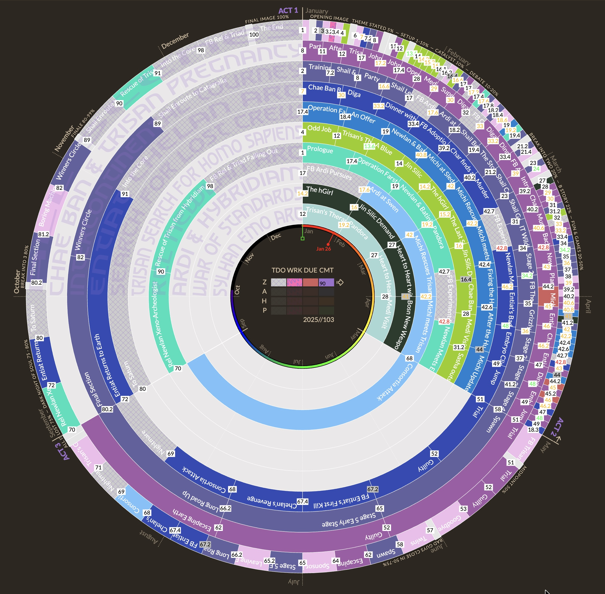
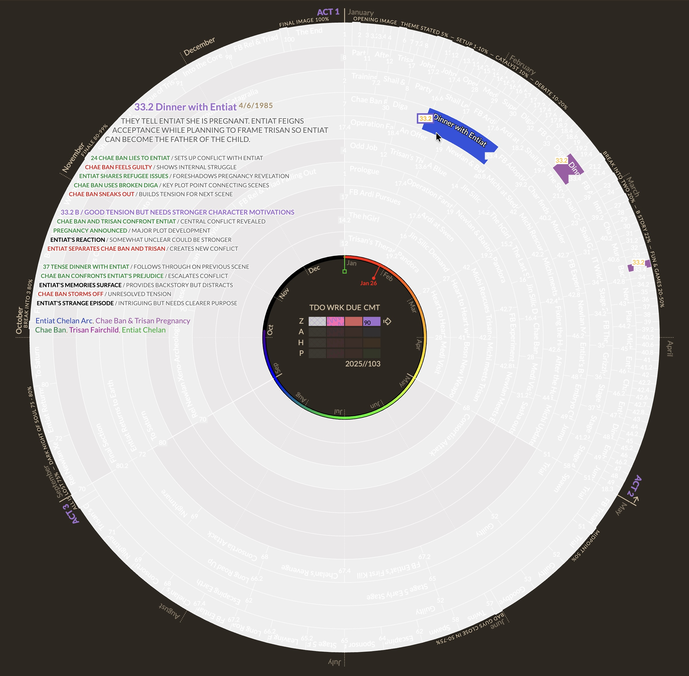

Radial Timeline — Documentation and Images
© 2024–2025 Eric Rhys Taylor

About this document
- This companion PDF provides context screenshots and documentation to aid examination.
- Keep file size under ~25 MB.

Overview

Radial Timeline is an Obsidian community plugin that visualizes manuscript scenes as a radial timeline organized by act and subplot. It renders interactive SVG showing rings for subplots, colored stage/status indicators, and hover synopses, enabling authors to track structure and progress.

Selected documentation (excerpt from README)

- Features: interactive radial visualization; subplot rings; hover details; search; completion estimate; stage colors; zero draft mode; AI beats integration.
- Commands: open timeline, search, clear search, create template scene, update beats (manuscript / subplot), clear beats cache.

Screenshots

Main radial visualization interface

Caption: Main radial visualization interface showing nested acts and subplots with colored status and stage rings.

Synopsis and hover details

Caption: Hover reveals scene synopsis, subplot/character labels, and AI beats when enabled.

Design notes (brief)
- Visualization: pure SVG in DOM; radial layout with arcs per scene; subplot labeling; number squares for manuscript order.
- Interaction: hover highlight, synopsis panels, search highlighting, click to open scenes; optional zero draft interception.
- Configuration: color palettes for publish stages and subplot rings; source folder; optional target completion date; AI provider settings.

End of document

