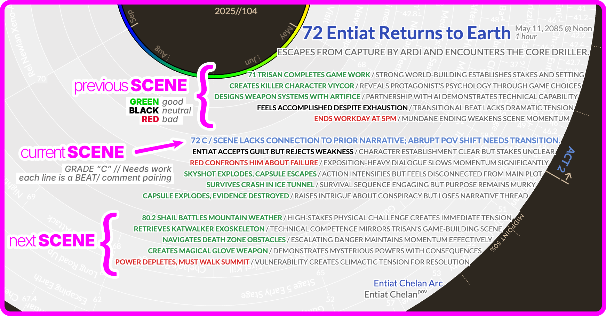

**Pulse Triplet Analysis using AI**

*   **Scene-by-scene evaluation**: AI analyzes individual scenes in triplets (previous/current/next) to provide story pulse assessment and grade evaluation.
*   **Multiple ordering options**: Run analysis in manuscript order (Narrative mode) or by subplot order to get different perspectives on narrative scene flow.

**Modes**: Narrative mode (key 1), Subplot mode (key 2), Chronologue mode (key 3)
**Command**: `Scene pulse analysis (manuscript order)`, `Scene pulse analysis (subplot order)`
**Settings**: `AI LLM for scene analysis`

  
  
Story Beats Analysis

## Local LLM / Ollama Notes

You can point Radial Timeline at any OpenAI‑compatible endpoint (Ollama, LM Studio, etc.) via **Settings → AI LLM for scene analysis → Local / OpenAI compatible**. Keep these restrictions in mind:

- The JSON schema is strict: the `currentSceneAnalysis` item must be graded **A/B/C**; follow‑up bullets must use `+`, `-`, or `?`. The plugin now validates this and surfaces the exact error per scene.
- Smaller local models (7B–13B) often refuse to follow those constraints. Perhaps more reliable output can be had from 30B+ instruction models; otherwise the modal will flag the run as “Not valid JSON”.
- See the AI folder for log notes.

The cloud providers (Claude, Gemini, GPT‑4.1) remain the recommended option as they have the highest intelligence and therefore the best on-point feedback and they reliably follow the json return formatting.
