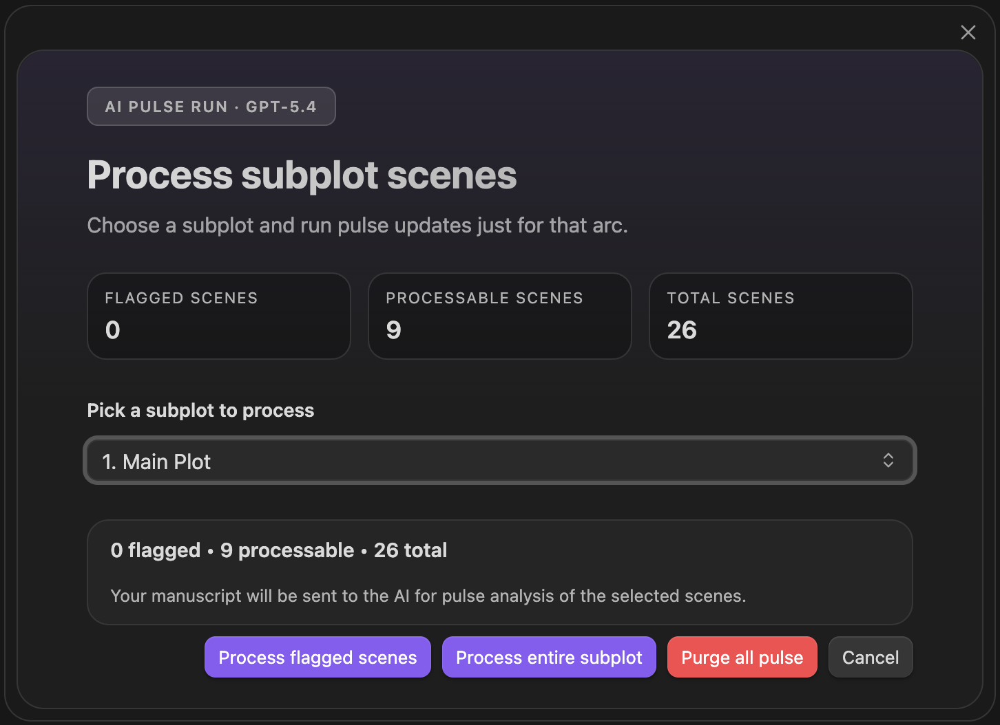
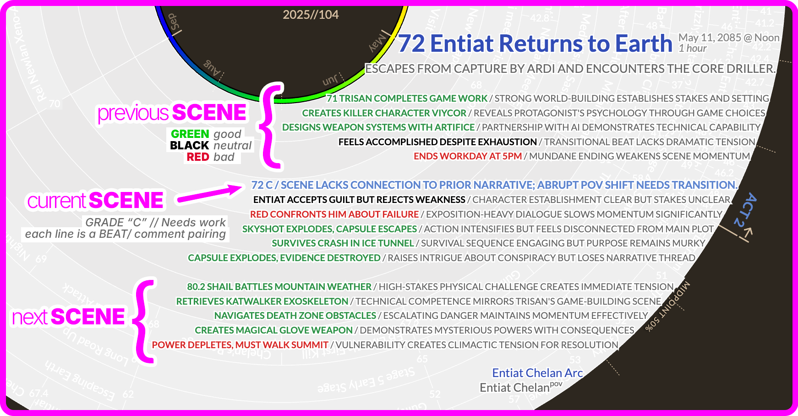

*   **Scene-by-scene evaluation**: AI analyzes individual scenes in triplets (previous/current/next) to provide story pulse assessment and grade evaluation.
*   **Multiple ordering options**: Run analysis in manuscript order (Narrative mode) or by subplot order to get different perspectives on narrative scene flow.
*   **Editorial signal at a glance**: This is the Radial Timeline bread-and-butter evaluation system shown in scene hover meta, giving valuable editorial feedback on what is working and what is not in the manuscript.
*   **Compact hover option**: A settings toggle can hide previous and next scene analysis so hover meta shows only the current scene for a slimmer read.

The Pulse Triplet Analysis is the key first line of defense in stress testing the manuscript from a developmental editor's viewpoint.

**Modes**: Progress mode (key `1`), Narrative mode (key `2`), Chronologue mode (key `3`)
**Command**: `Scene pulse analysis (manuscript order)`, `Scene pulse analysis (subplot order)`
**Settings**: `AI LLM for scene analysis`

  
  
AI Pulse Triplet Analysis

  
  
Pulse triplet output — previous, current, and next scene grades surfaced in hover

## Supported Providers

Pulse currently works best with the hosted AI providers:

*   **Anthropic Claude**
*   **OpenAI GPT**
*   **Google Gemini**

Local/OpenAI-compatible setups are documented under [Settings → AI → Local LLM](Settings-AI#local-llm). For Pulse itself, use the hosted providers above for now.

For the command-specific batch workflows, see:

*   [Scene pulse analysis (manuscript order)](Commands#scene-pulse-analysis-manuscript-order)
*   [Scene pulse analysis (subplot order)](Commands#scene-pulse-analysis-subplot-order)
*   [Summary refresh](Commands#summary-refresh)
