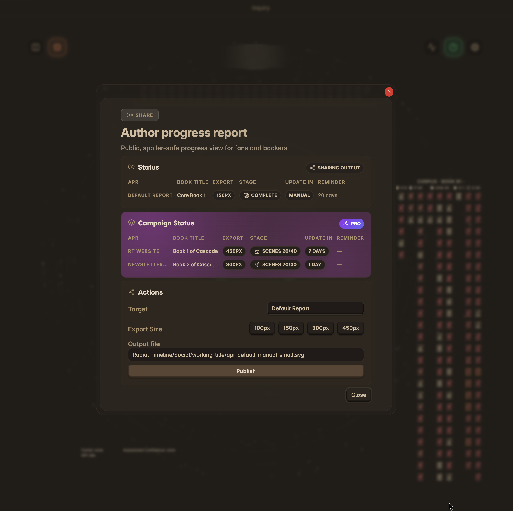

# Author Progress Report (APR)

The Author Progress Report is a shareable, spoiler-safe graphic that shows your book's progress without revealing story details. Perfect for Kickstarter updates, Patreon posts, newsletters, and social media.

  
  
Author Progress Report — configure, preview, and export your progress graphic

## Progress Tracking

APR can measure progress in three ways:

| Mode | How It Works | Best Use |
|------|--------------|----------|
| **Stage Tracking** | Tracks one stage at a time against a scene goal. | Zero drafting, focused revision passes, or any stage-specific sprint |
| **Full Manuscript** | Tracks all scenes across Zero → Press. | End-to-end public progress across the full pipeline |
| **Date Goal** | Tracks elapsed time between a start date and a target date. | Deadline-driven campaigns and schedule-based updates |

### Stage Tracking

Stage Tracking focuses on one stage at a time. Choose the tracked stage, then set a scene goal when you want a fixed denominator. This is especially useful in **Zero** when you know the target scene count for the draft and want APR to reflect that specific push.

### Full Manuscript

Full Manuscript measures the book across the full revision path from **Zero** to **Press**. Use this when you want APR to reflect overall manuscript maturity rather than just the stage you are currently pushing.

### Date Goal

Date Goal measures progress against time rather than scene counts. Set a start date and target date, and APR will show how far you have moved through that range.

> **Note**: APR tracking is separate from the timeline's Estimated Completion feature, which projects pace inside the working manuscript view.

## Reveal Options

Control how much of your story structure is visible:

| Option | What It Shows |
|--------|---------------|
| **Subplots** | Multiple concentric rings for each subplot |
| **Acts** | Act boundary spokes dividing the timeline |
| **Status Colors** | Scene stage/status colors (Todo, Draft, Complete, etc.) |
| **% Complete** | Large percentage number in the center |

**Tip**: Uncheck all options for a simple progress ring—perfect for early teasers or minimal updates. Manual reveal options are disabled when Teaser Reveal is enabled.

## Teaser Reveal (Pro)

For campaigns, enable **Teaser Reveal** to automatically show more detail as your book progresses.

Reveal stages:

| Stage | Shows |
|-------|-------|
| Teaser | Progress ring only |
| Scenes | Scene cells (no colors) |
| Colors | Scene cells with status colors |
| Full | Complete timeline with subplots and acts |

Preset schedules:
- **Slow**: 15%, 40%, 70%
- **Standard**: 10%, 30%, 60% (default)
- **Fast**: 5%, 20%, 45%
- **Custom**: Set your own thresholds (1-99%)

You can click the middle stages in the preview (Scenes, Colors) to skip them and jump to the next stage.

## Export Sizes

| Size | Dimensions | Best For |
|------|------------|----------|
| Thumbnail | 100x100px | Tiny embeds, favicons |
| Small | 150x150px | Social media replies, profile badges |
| Medium | 300x300px | Posts, newsletters |
| Large | 450x450px | Website embeds, high-res displays |

## Styling Options

- **Transparent Background**: Recommended for embedding on any background
- **Background Color**: Use when transparency isn't supported
- **Theme Contrast**: Light or dark strokes for visibility against your background
- **Book/Author Color**: Color for the perimeter text ring
- **Branding Color**: Color for the "RT" badge

## Campaigns (Pro)

Create multiple APR configurations for different platforms:

- **Kickstarter**: 7-day refresh reminders
- **Patreon**: 14-day refresh reminders
- **Newsletter**: 14-day refresh reminders
- **Website**: 30-day refresh reminders

Each campaign can have its own update frequency, refresh alert threshold, embed file path, export size, and reveal settings. Teaser Reveal can be enabled per campaign, and manual reveal options are available when Teaser Reveal is disabled.
