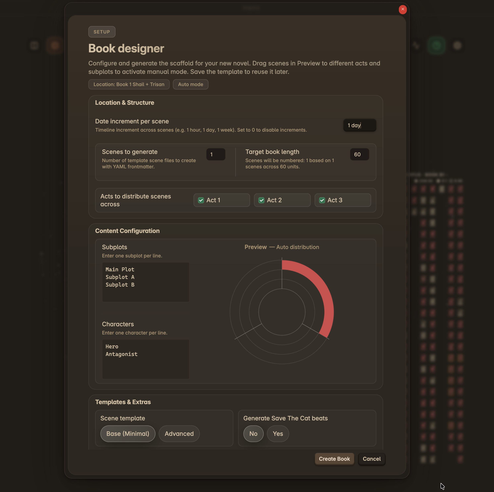

# Book Designer

The **Book Designer** is a powerful setup utility that generates a complete manuscript skeleton tailored to your specifications. It creates scene files with pre-configured YAML frontmatter, distributes them across acts and subplots, and can even generate story beat templates.

This tool is perfect for starting a new project or rapidly prototyping a story structure.

## Accessing the Book Designer

You can open the Book Designer in two ways:
1.  **Command Palette**: Open the Command Palette (`Cmd/Ctrl + P`) and search for "Radial Timeline: Book designer".
2.  **Welcome Screen**: If your timeline is empty, click the "Book Designer" button on the Radial Timeline Welcome Screen.

<div style="text-align: center; margin: 20px 0;">
  
  <div style="font-size: 0.85em; margin-top: 8px; color: #666;">Book Designer — configure structure, subplots, and templates with live preview</div>
</div>

## Workflow

The Book Designer modal guides you through three key configuration sections:

### 1. Location & Structure
*   **Target location**: The folder path where your new book files will be created (e.g., `Book 1`). The folder will be created if it doesn't exist. Otherwise root of the vault will be used.
*   **Scenes to generate**: The total number of scene files to create.
*   **Target book length**: Used for numbering distribution. For example, if you generate 10 scenes with a target length of 60, scenes will be numbered 1, 7, 13, etc., leaving gaps for future scenes.
*   **Acts to distribute scenes across**: Choose which acts (1..N) to populate, where **N** comes from your **Settings → Acts → Act count**. Scenes are distributed evenly across the selected acts.

### 2. Content Configuration
*   **Subplots**: Enter your subplots, one per line. Scenes will be assigned to these subplots in a round-robin fashion. Each scene will belong to only one subplot.
*   **Characters**: Enter your main characters, one per line. These will be added to the YAML frontmatter of the generated scenes.

### 3. Templates & Extras
*   **Scene template**: Choose between 'Base' (minimal) and 'Advanced' YAML templates. These templates are defined in the Radial Timeline settings. Note, the Advanced YAML can be customized.
*   **Generate Beats**: Optionally generate beat sheet files based on your selected beat system (e.g., Save the Cat, configured in Settings).

## Visual Preview
As you adjust the settings, the **Preview** donut chart updates in real-time to show you how your scenes will be distributed across acts and subplots. This helps you visualize the structure before generating any files. After generation, if you don't like what you get, open the Book designer and regenerate. 

## Generating Your Book
Once configured, click **Create Book**. The plugin will:
1.  Create the target folder.
2.  Generate individual markdown files for each scene, populated with the correct YAML frontmatter (scene number, act, subplot, characters, date).
3.  (Optional) Create beat sheet notes if selected.

You'll see a notification confirming the number of scenes and files created. Your Radial Timeline will immediately update to display your new story structure.

## Customizing Templates

The Book Designer uses one of two templates:
1.  **Base**: A minimal template with only the essential fields required for Radial Timeline.
2.  **Advanced**: A richer template with analysis fields, stats, and more.

### Adding Custom Properties
If your writing methodology uses fields beyond the built-in keys (e.g., Story Grid values, Dramatica signposts), you can add them to the Advanced template:
1.  Go to **Settings → Scene YAML templates & remapping**.
2.  Enable **Advanced YAML editor**.
3.  Add your custom keys to the list.
4.  In the Book Designer, select **Advanced** as your template type.

> **Note**: Radial Timeline already tracks draft status (`Status` and `Publish Stage`), point of view (`POV`), and many other metadata fields in the built-in templates. Only add custom keys for data that your methodology requires beyond what the plugin already provides. See [[YAML-Frontmatter]] for the full list of built-in fields.

## Custom Beat Systems

If you use a story structure not listed in the standard options (like 7 Point Story Structure):
1.  Go to **Settings → Story beats system** and select **Custom**.
2.  Name your beat system and add beats in the **Custom story beat system editor**. Assign each beat to an act.
3.  In the Book Designer, enable **Generate Beats** to automatically generate beat notes for your custom system.

After generating beats, you can reorder or rename them in the editor. Row colors indicate sync status (green = aligned, orange = needs merge, red = duplicate). Use **Merge** to realign existing files after changes.

You can also create custom beat notes manually:
*   Create a new note for each major beat (e.g., "Pinch Point 1").
*   Add the following frontmatter (replace `Custom` with your system name):
    ```yaml
    Class: Beat
    Beat Model: Your System Name
    ```
*   Radial Timeline will detect these notes and display them in Gossamer mode. The `Beat Model` value must match the system name in settings to be recognized.

> [!NOTE]
> Custom beat notes use the same YAML structure as preset systems. Custom per-beat YAML field editing is planned for a future revision.

## Advanced Metadata

Some writing methodologies rely on tracking complex properties rather than just linear beats. You can accommodate this using the **Advanced Template**:

1.  Go to **Settings > Scene YAML templates & remapping**.
2.  Enable **Advanced YAML editor**.
3.  Add custom keys for your methodology.
4.  When you generate or edit scenes, these properties will be preserved, allowing you to use the plugin's timeline to visualize your story while maintaining your specific data structure in the notes.
