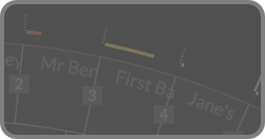

**Constructing Your Story Timeline**

> *Watch the full walkthrough on [YouTube](https://www.youtube.com/watch?v=XKWq32LB0d0)*

Chronologue mode is essential for constructing and visualizing the chronological backbone of your story—particularly valuable for non-linear narratives, mysteries, thrillers, or any story where **when events happen** differs from **when you reveal them**. The palette matches Narrative mode (subplot colors only) so the timing comparisons stay clean while Subplot Mode retains the Todo/Working/Overdue and publish-stage overlays.

### Core Workflow
1.  **Add chronological metadata**: As you create scenes, fill in the `When` field (YYYY-MM-DD HH:MM) and `Duration` field (e.g., "2 hours", "3 days", "1 week").
2.  **Switch to Chronologue mode** (keyboard **3** or top-right navigation): Scenes rearrange to show story-world event order across the full 360° circle.
3.  **Activate Shift mode** (keyboard **Shift** or click shift button or use caps lock): See the bones of your story's temporal structure for all scenes and subplots.
4.  **Compare elapsed time**: In shift mode, click two scenes to see the elapsed story-time between them with the duration arc. Keep clicking more scenes as needed.
5.  **Analyze time gaps**: Also in shift mode, discontinuities (large time jumps) appear with ∞ symbol—identify gaps that might need bridging scenes.

> **Minimum metadata**: Chronologue only needs a year in the `When` field to place a scene. Year-only (`When: 2045`), year+month (`When: 2045-07`), or textual month+year (`When: July 2045`) all work—missing pieces default to the 1st of that month at noon. Month-only, day-only, or time-only values are ignored and treated as "no When" until you add at least the year.

> **Drafting calmly**: Red "Missing When" number squares only appear once a scene's `Status` is `Working` or `Complete`, so Todo scenes can stay quiet while you're still sketching. When a date is missing, the hover synopsis displays the dates of the immediately preceding and following scenes (in narrative order) to help you pinpoint the correct timing.

### Why this matters
Some authors choose to organize scenes in manuscript/narrative order, but Chronologue mode lets you construct and verify the underlying chronological scaffolding without the constraints of the 3 acts or title ordering. You can spot:
*   Pacing issues (too much/too little story time between events)
*   Flashback positioning opportunities
*   Timeline consistency problems
*   Missing transition scenes

**Modes**: Chronologue mode (key **3**), Shift mode (key **Shift**)
**Settings**: Duration arc cap, Discontinuity gap threshold (Chronologue section)

  
  
Discontinuity infinity symbols in Chronologue Mode

  
  
Duration Marks in Chronologue Mode (red, orange and normal)

---

### FAQ: Custom Calendars & Alien Time

For a detailed explanation of why Radial Timeline does not support custom calendars or alien time, see the [[FAQ]].