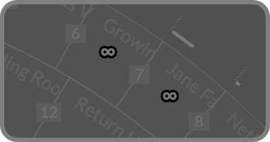
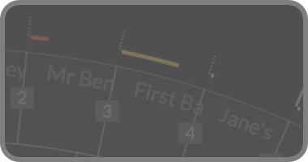
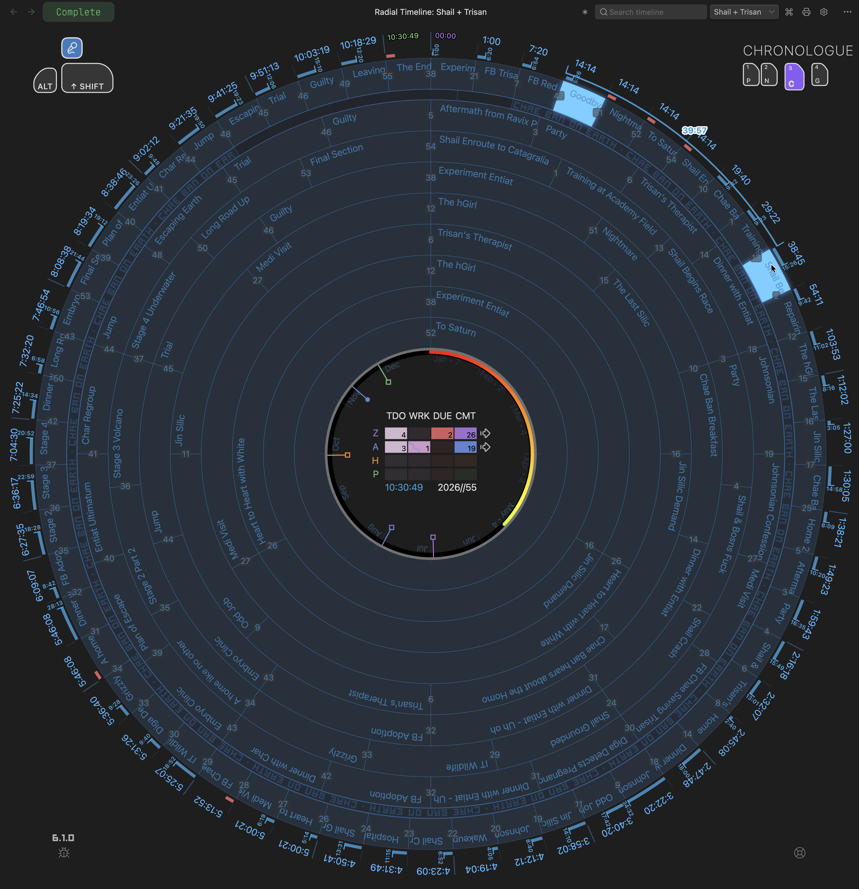
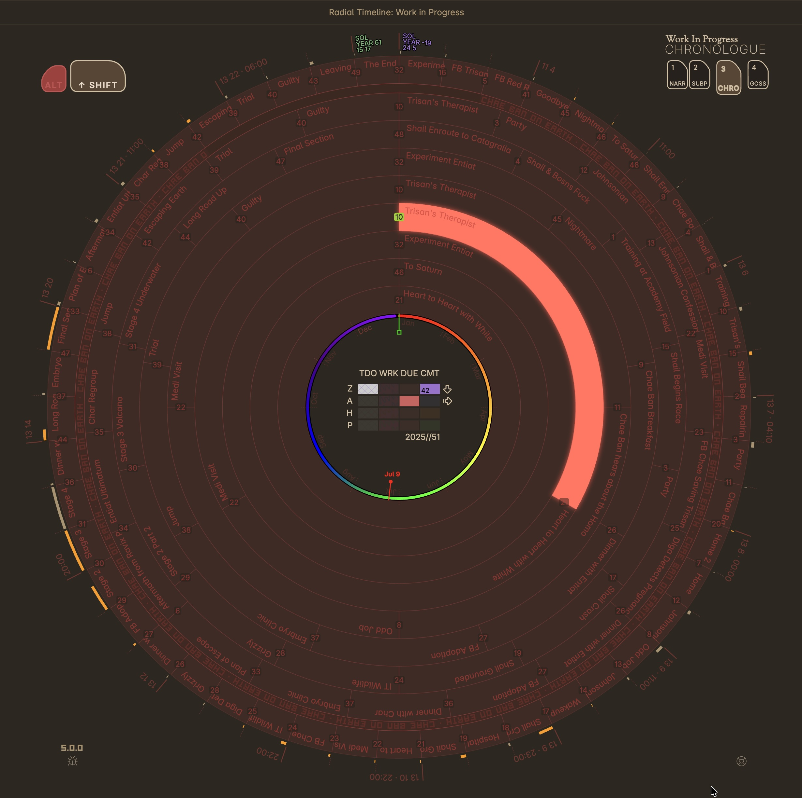
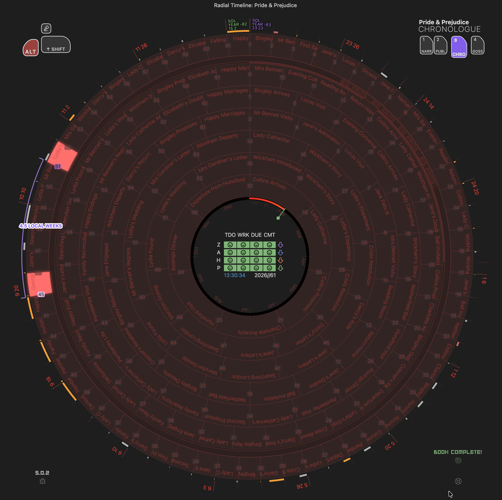

<a href="https://www.youtube.com/watch?v=XKWq32LB0d0" target="_blank" rel="noopener">
  

    
  

  

    Chronologue Mode walkthrough 
    Full video on YouTube
  

</a>

Chronologue is one of four modes within the Radial Timeline View. It is essential for constructing and visualizing the chronological backbone of your story — particularly valuable for non-linear narratives, mysteries, thrillers, or any story where **when events happen** differs from **when you reveal them**. The palette matches Narrative mode (subplot colors only) so the timing comparisons stay clean while Progress mode retains the Todo/Working/Overdue and progress-stage overlays.

### Core Workflow
1.  **Add chronological metadata**: As you create scenes, fill in the `When` field (YYYY-MM-DD HH:MM) and `Duration` field (e.g., "2 hours", "3 days", "1 week").
2.  **Switch to Chronologue mode** (press `3` or use the top-right navigation): Scenes rearrange to show story-world event order across the full 360° circle.
3.  **Activate the Shift sub-mode** (press `Shift`, use `Caps Lock`, or click the Shift button): See the bones of your story's temporal structure for all scenes and subplots.
4.  **Compare elapsed time**: In the Shift sub-mode, click two scenes to see the elapsed story-time between them with the duration arc. Keep clicking more scenes as needed.
5.  **Analyze time gaps**: Also in the Shift sub-mode, discontinuities (large time jumps) appear with an infinity symbol — identify gaps that might need bridging scenes.

> **Minimum metadata**: Chronologue only needs a year in the `When` field to place a scene. Year-only (`When: 2045`), year+month (`When: 2045-07`), or textual month+year (`When: July 2045`) all work — missing pieces default to the 1st of that month at noon. Month-only, day-only, or time-only values are ignored and treated as "no When" until you add at least the year.

> **Drafting calmly**: Red "Missing When" number squares only appear once a scene's `Status` is `Working` or `Complete`, so Todo scenes can stay quiet while you're still sketching. When a date is missing, the hover synopsis displays the dates of the immediately preceding and following scenes (in narrative order) to help you pinpoint the correct timing.

### Why this matters
Some authors choose to organize scenes in manuscript/narrative order, but Chronologue mode lets you construct and verify the underlying chronological scaffolding without the constraints of the 3 acts or title ordering. You can spot:
*   Pacing issues (too much/too little story time between events)
*   Flashback positioning opportunities
*   Timeline consistency problems
*   Missing transition scenes

**Mode**: Chronologue (key `3`)
**Sub-modes**: Shift (key `Shift`), Alt (key `Alt`), Runtime ✦ (click `RT`)
**Settings**: Discontinuity gap threshold, Runtime estimation

  
  
Discontinuity infinity symbols in Chronologue mode

  
  
Duration marks in Chronologue mode (red, orange, and normal)

---

## Sub-modes

Chronologue mode includes three sub-modes, each rendering a distinct wireframe overlay.

### Shift sub-mode (bones view)
- Toggle with `Shift` (or `Caps Lock`) to strip the overlays and see the raw chronological scaffold.
- Gray wireframe. Click any two scenes to measure elapsed story time; keep clicking to update the arc.
- Discontinuities (infinity symbols) help you spot opportunities for bridge scenes.

  
  
Shift sub-mode — gray wireframe view

### Runtime sub-mode ✦ Pro

The Runtime sub-mode replaces elapsed story time with **runtime duration arcs** — showing how long each scene takes to read or perform rather than how much story time passes.

- Toggle with the `RT` button in Chronologue mode (requires Runtime Estimation to be enabled in Settings → Core)
- Blue wireframe overlay distinguishes it from Shift (gray) and Alt (red)
- Duration arcs scale automatically to show relative scene runtime — longer scenes have larger arcs
- Click scenes to compare their runtime visually

**Use cases:**
- **Screenplay pacing** — Verify act timing and scene balance for screen time
- **Audiobook planning** — Estimate chapter and scene durations for narration
- **Podcast structure** — Plan episode segments with time awareness

  
  
Runtime sub-mode — blue wireframe with scene duration arcs

**How to use:**
1. Enable Runtime Estimation in **Settings → Core**
2. Configure a runtime profile matching your content type (Novel or Screenplay)
3. Switch to Chronologue mode (`3`)
4. Click the `RT` button to enter the Runtime sub-mode

> [!NOTE]
> Runtime estimates appear in scene hover tooltips when Runtime Estimation is enabled. See [Settings → Runtime estimation](Settings-Core#runtime-estimation) for configuration and [Pro](Pro) for full Pro documentation.

---

## Backdrop Notes & Micro-backdrop Rings

Chronologue mode offers two ways to layer contextual information behind your scenes.

### Backdrop Notes
Backdrop notes visualize major contextual events — historical wars, planetary alignments, or seasonal changes — that drive your plot but aren't specific scenes.

*   **Create**: Use **Radial Timeline: Create note…** and choose **Story world** → **Backdrop** to generate a file with start/end times.
*   **Visualize**: These appear as a dedicated ring in Chronologue mode, grounding your scenes in their temporal context.
*   **Overlaps**: Two backdrops may overlap partially, shown with a visual plaid pattern.

### Micro-backdrop Rings
For lighter-weight context that doesn't need its own note file, **micro-backdrop rings** are configured directly in Settings. Each micro-backdrop is a thin colored ring segment with a title and date range.

*   **Use cases**: Eras, seasons, political regimes, historical milestones, or any contextual time span you want visible at a glance.
*   **Configure**: Settings → Core → Backdrop → **Micro backdrops**. Add a title, select a color, and set start/end dates.
*   **Appearance**: Micro-backdrops render as compact rings below the backdrop ring, keeping the timeline clean while still providing temporal context.

> [!NOTE]
> The backdrop ring can be hidden in Settings → Core → Backdrop → **Show backdrop ring**. When disabled, the ring space is reclaimed for subplot rings. Micro-backdrop rings follow the same visibility toggle.

---

### Planetary Time

For sci-fi and fantasy authors, Chronologue mode includes a **Planetary Time** system. While Radial Timeline requires Earth time (Gregorian calendar) for its internal logic and physics, you can create custom "Local Time" profiles to translate these dates into your world's calendar.

**Features:**
*   **Settings**: Define custom planetary profiles with specific astronomical facts:
    *   **Hours per day** (e.g., 26 hours on Bajor)
    *   **Days per week** (e.g., 5-day week)
    *   **Days per year** (e.g., 400 days)
    *   **Epoch Offset**: Shift the start date of your calendar relative to Earth's Unix Epoch (1970-01-01).
    *   **Custom Labels**: Define custom names for months and days of the week.
*   **Synopsis Hover**: In Chronologue mode, hover over a scene to see its date converted to your active planetary profile.
*   **Calculator**: Use the command palette (`Cmd + P` on Mac, `Ctrl + P` on Windows/Linux) and search for **"Radial Timeline: Planetary time calculator"** to open a calculator. Enter any Earth date/time to see the corresponding planetary date/time.
*   **Alt overlay**: Press `Alt` to enter the planetary wireframe for your active local time profile.
*   **Alt + Shift**: This mirrors the standard Shift sub-mode in red, so you can compare elapsed time and discontinuities in local planetary time.
*   **Active profile**: The selected profile in Settings controls which calendar is used for hover and conversion outputs.
*   **Translation layer**: Scene timings still derive from Earth timestamps; Planetary Time converts them for display and writing support.

> **Note**: You must still plan and enter metadata using standard Earth format (`When: 2045-05-20`). This feature provides a "translation layer" to help you write scene content (e.g., "The sun set at 19:00 local time") without breaking the timeline's chronological structure.

  
  
Planetary Time — red planetary overlay for the active local time profile

  
  
Planetary Time — click two scenes to compare elapsed time in local planetary time

