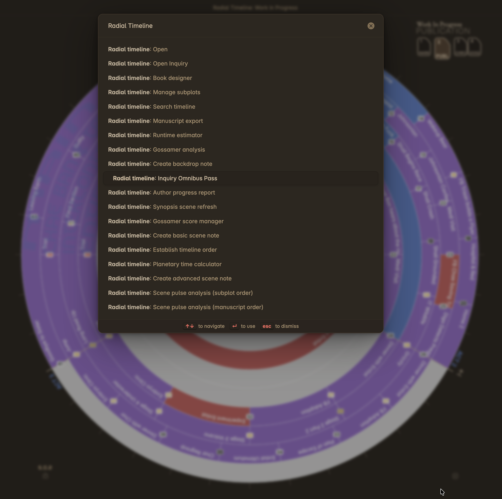

# Commands

Radial Timeline provides commands accessible via the Obsidian Command Palette.

To open the Command Palette:
*   **Mac**: `Cmd + P`
*   **Windows/Linux**: `Ctrl + P`

Type "Radial Timeline" to filter the list.

  
  
Radial Timeline Commands in the palette

## Command Reference

### Core Commands

| Command | Description | Documentation |
| :--- | :--- | :--- |
| **Open** | Opens the main Timeline view. | [[Home#getting-started]] |
| **Search timeline** | Opens the search bar in the Timeline view to filter scenes by text across multiple fields. | [[How-to#search]] |
| **Manage subplots** | Opens the Subplot Manager to rename or delete subplots in bulk across all scene files. | [[How-to#manage-subplots-in-bulk]] |
| **Book designer** | Opens the Book Designer to generate a manuscript template with acts, subplots, and beats. | [[Book Designer]] |
| **Timeline order** | Opens the Timeline Repair wizard to fix chronological ordering, sync patterns, and repair frontmatter. | — |
| **Planetary time calculator** | Opens the calculator for converting Earth dates to custom planetary calendars (requires planetary time enabled in settings). | [[Chronologue Mode#planetary-time]] |

### Scene Creation

| Command | Description | Documentation |
| :--- | :--- | :--- |
| **Create basic scene note** | Creates a new scene note using the **Base** scene YAML template. | [[Core Workflows#creating-scenes]] |
| **Create advanced scene note** | Creates a new scene note using the **Advanced** scene YAML template (includes any Advanced YAML editor customizations). | [[Advanced-YAML]] |
| **Create backdrop note** | Creates a new backdrop file for contextual events that impact the plot. Appears as a dedicated ring in Chronologue mode (see also micro-backdrop rings for lighter-weight context). | [[Chronologue Mode#backdrop-notes]] |

### Export

| Command | Description | Documentation |
| :--- | :--- | :--- |
| **Manuscript export** | Compiles your scenes into a single manuscript or outline file with subplot filtering, ordering, and range selection. | [[Core Workflows#exporting-a-manuscript]] |

### AI & Analysis

| Command | Description | Documentation |
| :--- | :--- | :--- |
| **Scene pulse analysis (manuscript order)** | Runs AI analysis on all scenes sequentially in narrative order. Requires AI features enabled. | [[AI Analysis]] |
| **Scene pulse analysis (subplot order)** | Runs AI analysis on scenes within a selected subplot. Requires AI features enabled. | [[AI Analysis]] |
| **Synopsis scene refresh** | Refreshes AI-generated synopses for scenes. Requires AI features enabled. | [[AI Analysis]] |
| **Gossamer score manager** | Opens the score entry modal for manual Gossamer momentum scoring. | [[Gossamer Mode#manual-entry]] |
| **Gossamer analysis** | Runs AI evaluation of story beat momentum for Gossamer mode. Requires AI features enabled. | [[Gossamer Mode#ai-analysis]] |

### Inquiry

| Command | Description | Documentation |
| :--- | :--- | :--- |
| **Open Inquiry** | Opens the Inquiry view — the second of two views in Radial Timeline — for corpus-level story analysis. | [[Inquiry]] |
| **Inquiry Omnibus Pass** | Runs all enabled Inquiry questions across configured scopes in a single batch. | [[Inquiry]] |

### Pro & Social

| Command | Description | Documentation |
| :--- | :--- | :--- |
| **Runtime estimator** | Opens the runtime estimation modal for screenplay, audiobook, or novel duration analysis. Requires Pro license. | [[Signature#runtime-estimation]] |
| **Author progress report** | Opens the Author Progress Report modal for generating shareable progress graphics. | [[Author Progress Report]] |

## Conditional Commands

Some commands only appear in the Command Palette when their required feature is enabled:

*   **AI commands** (Scene pulse analysis, Synopsis scene refresh, Gossamer analysis): Require **AI LLM features** to be enabled in Settings → Core → AI.
*   **Runtime estimator**: Requires **Pro license** to be active in Settings → Pro.
*   **Planetary time calculator**: Requires **Planetary time** to be enabled in Settings → Core.
