Radial Timeline provides commands through the Obsidian Command Palette.

To open the Command Palette:
*   **Mac**: `Cmd + P`
*   **Windows/Linux**: `Ctrl + P`

Type `Radial Timeline` to filter the list.

  
  
Radial Timeline Commands in the palette

## Command Index

These are the main command-palette entries, listed in the same order as the palette screenshot:

1. **Open** — opens the [Radial Timeline View](Radial-Timeline-View).
2. **[Create note…](#create-note)**
3. **Open inquiry** — opens the [Inquiry View](Inquiry-View).
4. **[Book Designer](Book-Designer)** ← standalone guide
5. **[Timeline order](#timeline-order)** *(beta)*
6. **[Timeline audit](#timeline-audit)** *(beta)*
7. **[Manage subplots](#manage-subplots)**
8. **[Summary refresh](#summary-refresh)**
9. **[Search timeline](#search-timeline)**
10. **[Gossamer analysis](#gossamer-analysis)**
11. **[Runtime estimator](#runtime-estimator)** *(Pro)*
12. **[Manuscript export](Manuscript-Export)** ← standalone guide
13. **[Inquiry omnibus pass](#inquiry-omnibus-pass)** *(beta)*
14. **[Gossamer score manager](#gossamer-score-manager)**
15. **[Planetary time calculator](#planetary-time-calculator)**
16. **[Author progress report (APR)](Author-Progress-Report)** ← standalone guide
17. **[Scene pulse analysis (subplot order)](#scene-pulse-analysis-subplot-order)**
18. **[Scene pulse analysis (manuscript order)](#scene-pulse-analysis-manuscript-order)**

## Conditional Visibility

Some commands only appear in the palette when their required feature is enabled:

*   **AI commands** (Scene pulse analysis, Summary refresh, Gossamer analysis, Inquiry omnibus pass) require **AI LLM features** enabled in [Settings → AI](Settings-AI).
*   **Runtime estimator** requires **Pro** access. Runtime configuration lives in [Settings → Core](Settings-Core#runtime-estimation).
*   **Planetary time calculator** requires **Planetary time** enabled in [Settings → Core](Settings-Core).

---

## Create note…

Opens the guided RT note selector.

  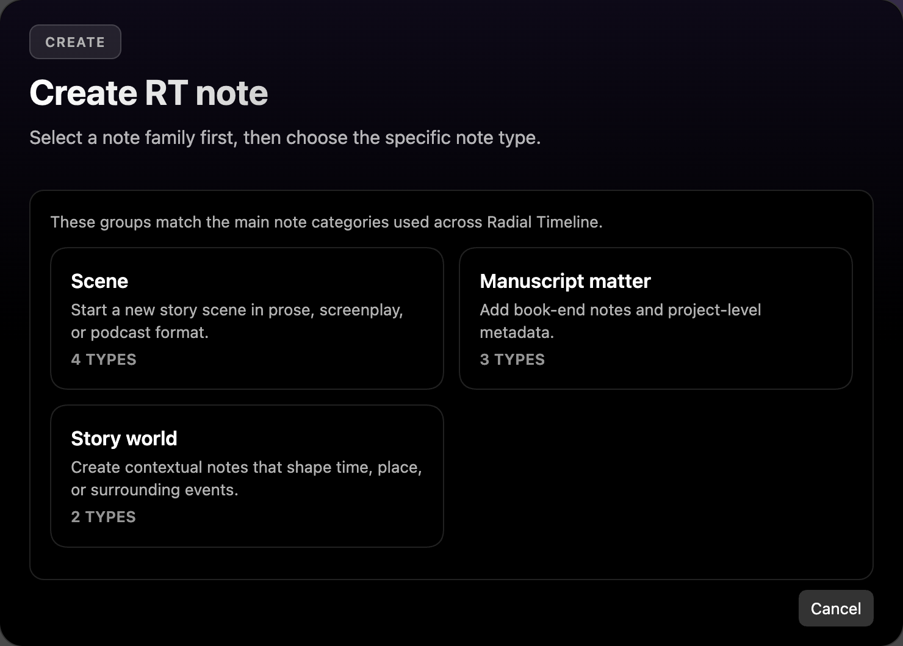

The selector is organized into three families:

*   **Scene** — Core scene, scene with advanced properties, screenplay scene, podcast scene.
*   **Manuscript matter** — Front matter, back matter, `BookMeta`.
*   **Story world** — Beat and Backdrop.

After you choose a subtype, the file is created in the active book folder and opened immediately. Scene creation includes built-in scaffolds: minimal properties for basic scenes, richer metadata for advanced scenes, screenplay/podcast body scaffolds plus runtime defaults for those types.

Related: [Scene Properties (Core + Advanced)](YAML-Frontmatter).

---

## Timeline order *(beta)*

Opens the timeline order normalizer (Timeline Repair wizard).

> [!NOTE]
> Currently undergoing beta testing. Available only in development/testing builds for now.

  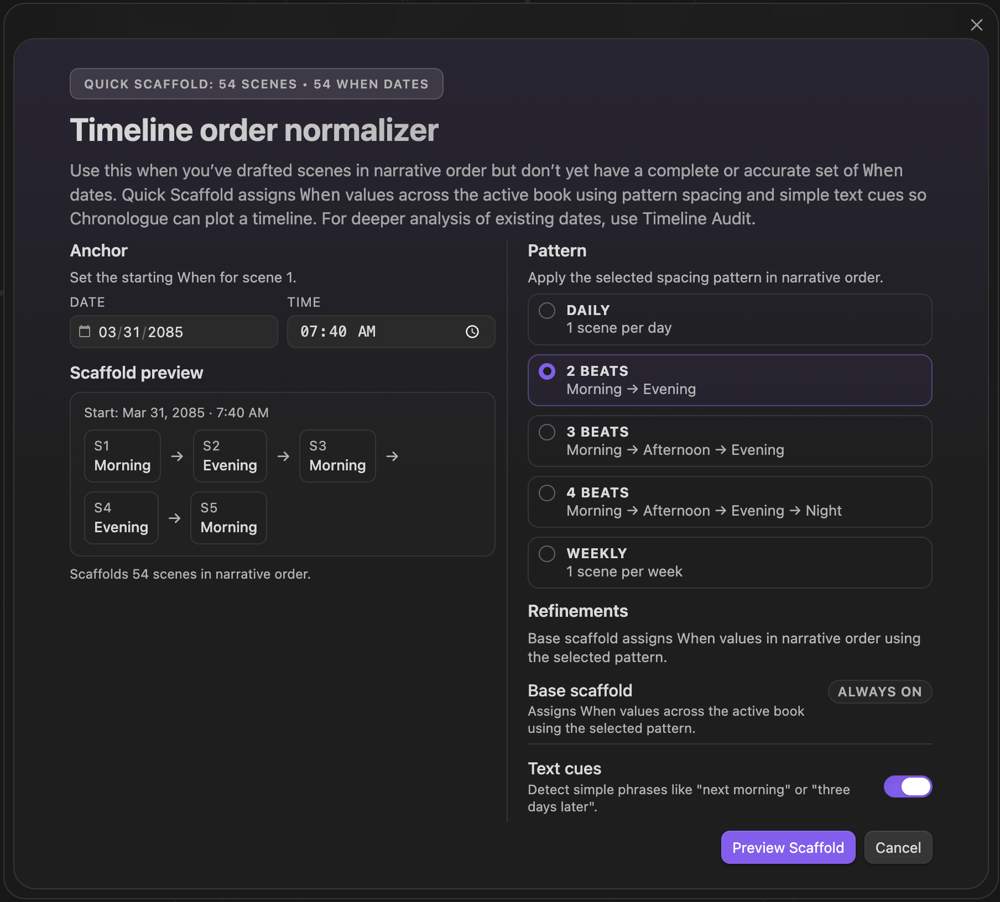

The wizard helps you normalize `When` values in manuscript order, then review the proposed timeline before writing changes back to frontmatter. It supports scaffold-based chronology setup, anchor date and time selection, time-bucket adjustments (morning/afternoon/evening/night), ripple mode for cascading changes, needs-review filtering, and undo/redo before applying.

This command is for repairing and normalizing chronology, not for auditing contradictions — for that, see [Timeline audit](#timeline-audit).

Related: [Chronologue Mode](Chronologue-Mode).

---

## Timeline audit *(beta)*

Opens the timeline audit panel.

> [!NOTE]
> Currently undergoing beta testing. Available only in development/testing builds for now.

  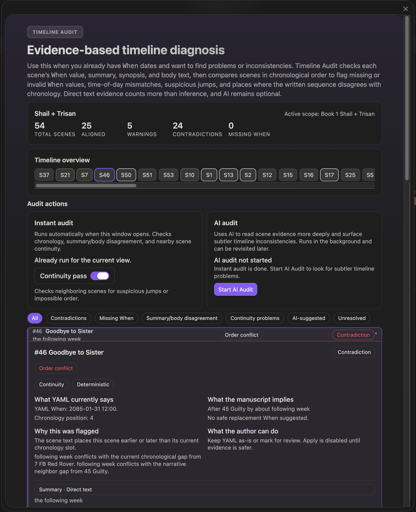

Surfaces contradictions, missing `When` values, summary/body disagreement, continuity problems, and unresolved findings. The panel shows overview stats, finding filters, and finding cards with evidence and suggested actions.

The audit includes a deterministic pass and can optionally run a continuity pass. AI-enhanced findings (when available) appear in the same review surface — the command stays centered on audit and review rather than bulk rewriting. From the panel you can filter findings by issue type, inspect evidence, mark items for review, apply accepted fixes where supported, and rerun the audit after changes.

Related: [Timeline order](#timeline-order), [Chronologue Mode](Chronologue-Mode).

---

## Manage subplots

Opens the subplot manager for bulk cleanup. Use it when subplot names have drifted.

  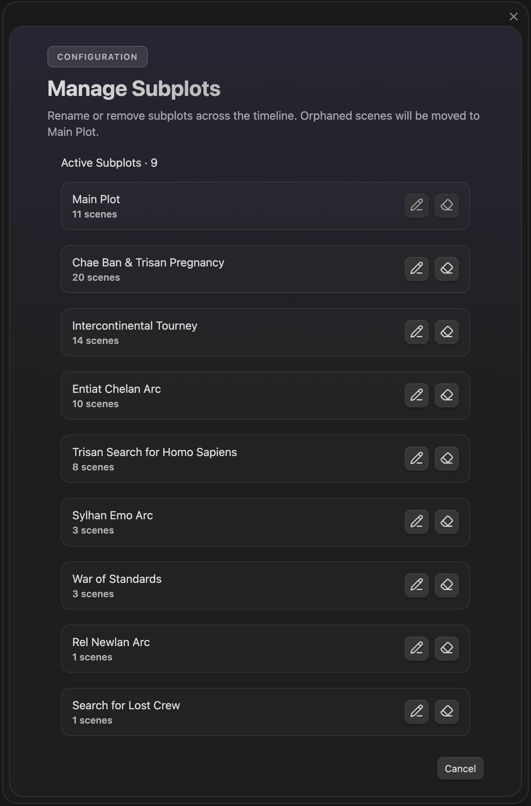

Lists active subplots with scene counts and gives you bulk actions:

*   **Rename** a subplot across scene files.
*   **Remove** a subplot from the timeline.

  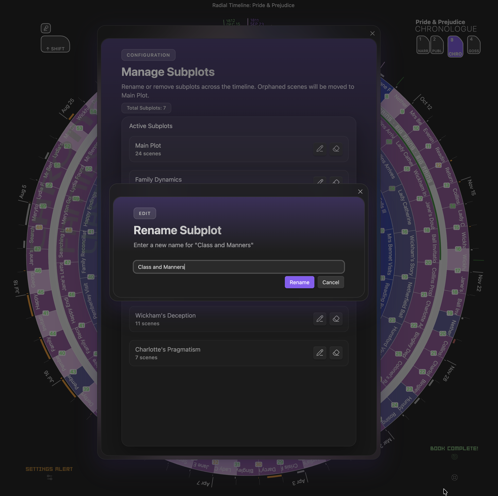
  
Rename a subplot — automatically updates the frontmatter of every scene using it

`Main Plot` is protected and cannot be renamed or deleted. Removing a subplot moves any scenes that only belonged to it back to `Main Plot`.

Related: [Narrative Mode](Narrative-Mode), [How to](How-to#manage-subplots-in-bulk).

---

## Summary refresh

Regenerates scene summaries with AI.

  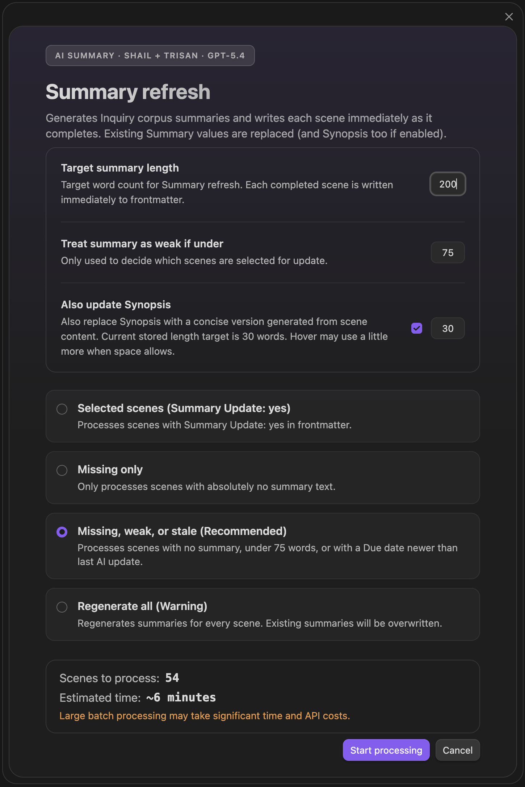

Writes:

*   **Summary** — the longer corpus-oriented summary.
*   **Synopsis** — optional, if you enable `Also update Synopsis`.

Run modes: flagged scenes, missing summaries only, missing/weak/stale, or regenerate all. You can also set target summary length, weak-summary threshold, and optional Synopsis update length.

This command is separate from scene pulse analysis: **Pulse** writes short structured editorial feedback per scene; **Summary refresh** writes longer summary text for corpus-level use.

Related: [AI Pulse Triplet Analysis](AI-Pulse-Analysis), [Inquiry View](Inquiry-View).

---

## Search timeline

Opens the timeline search bar.

  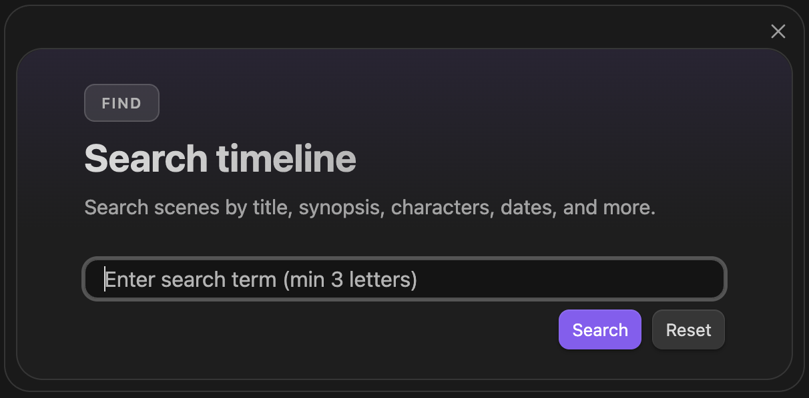

Case-insensitive text search across title, `Synopsis`, `Character`, `Subplot`, `Duration`, scene date/time, current AI Pulse analysis, and planetary-time conversion text when planetary time is active.

Related: [How to → Search](How-to#search).

---

## Gossamer analysis

Runs the built-in AI scoring workflow for the active Gossamer signal.

  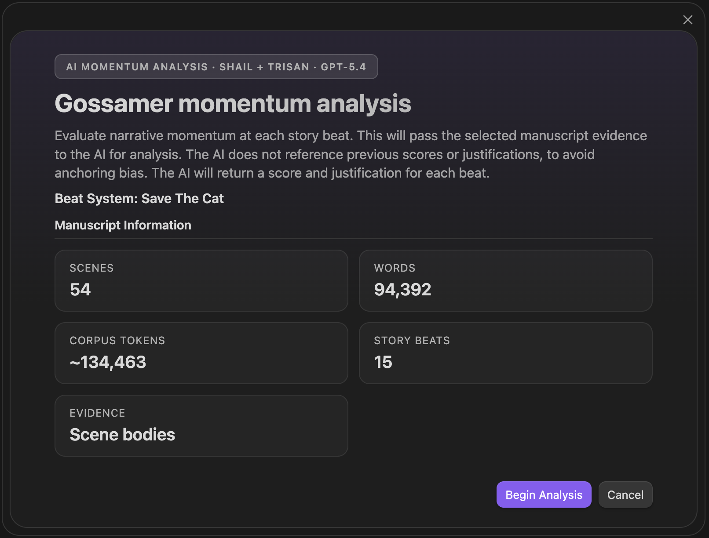

Works against the active beat system and the active signal — Momentum, Tension, Activity, or Interiority. The AI run intentionally does **not** receive ideal-range guidance in its scoring payload, so the result is a fresh read rather than a range-constrained one.

Related: [Gossamer Mode → AI Analysis](Gossamer-Mode#ai-analysis).

---

## Runtime estimator *(Pro)*

Opens the runtime estimation panel.

  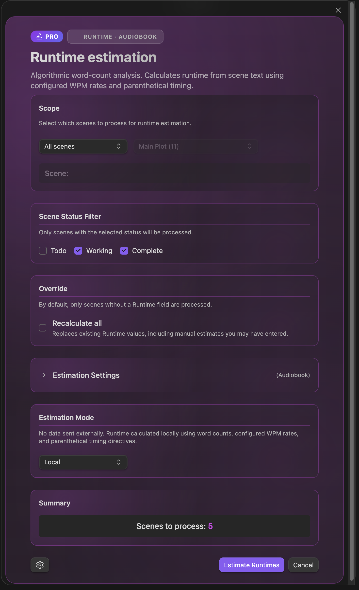

Used for novels, audiobooks, and screenplays. The panel works with runtime profiles and can estimate duration across different scopes and filters. Available only when **Pro** is active.

Related: [Pro → Runtime estimation](Pro#runtime-estimation), [Chronologue Runtime sub-mode](Chronologue-Mode#runtime-sub-mode).

---

## Inquiry omnibus pass *(beta)*

Runs all enabled Inquiry questions in one batch.

> [!NOTE]
> Currently undergoing beta testing. Available only in development/testing builds for now.

  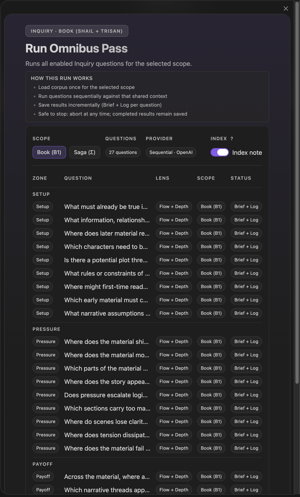

Executes enabled questions across the Inquiry zones and returns a combined set of findings for the current corpus. Works with the active scope (Book or Saga). Depending on provider and engine path, the run may execute as a combined omnibus flow or as sequential provider calls behind the scenes.

Related: [Inquiry View](Inquiry-View), [Running an Inquiry](Inquiry#running-an-inquiry).

---

## Gossamer score manager

Opens the manual score-entry panel for the active signal.

  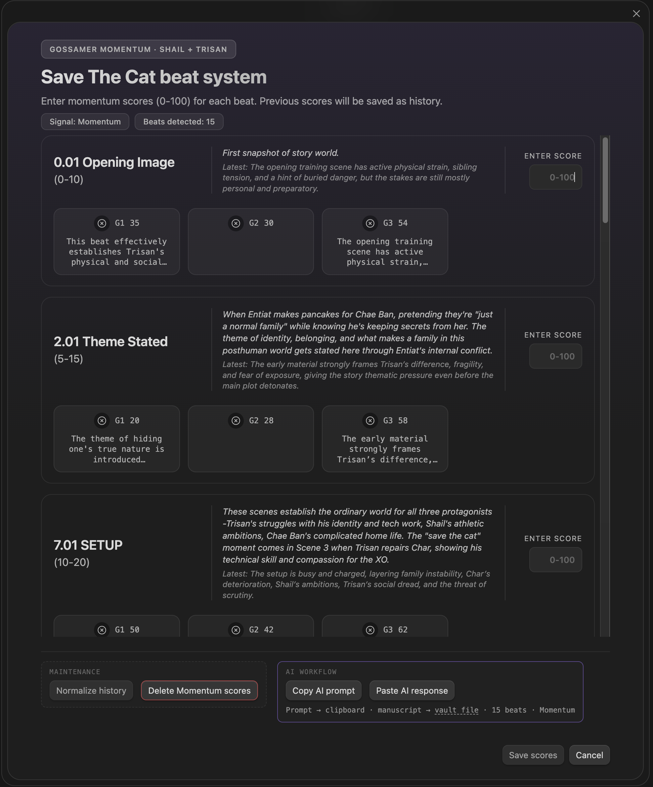

Supports manual score entry, score justifications, run history cleanup and normalization, and working with saved beat runs. If no beat notes are available for the active beat system, the command will not open and instead warns that story beats are missing.

Related: [Gossamer Mode → Manual Entry](Gossamer-Mode#manual-entry).

---

## Planetary time calculator

Opens the planetary conversion panel.

  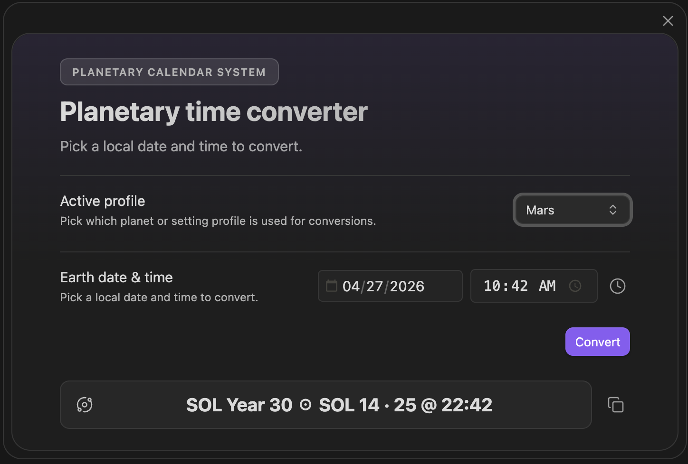

Uses the active planetary profile from [Settings → Core](Settings-Core) and lets you select a date and time, convert that Earth timestamp to local planetary time, and copy a YAML-friendly result block. If no planetary profile exists or no active profile is selected, the calculator cannot produce a result.

Related: [Planetary Calendar](Chronologue-Mode#alt-sub-mode).

---

## Scene pulse analysis (subplot order)

Opens the subplot pulse selector first, then runs pulse analysis for a selected subplot.

  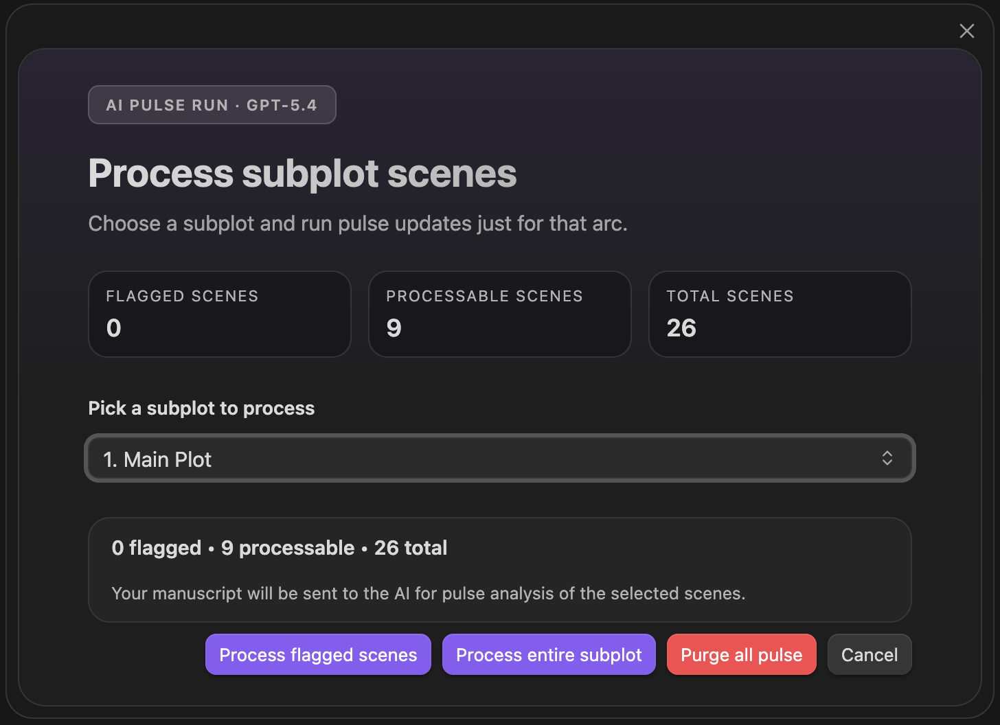

The subplot selector shows flagged scenes, processable scenes, and total scenes. From there you can choose **Process flagged scenes**, **Process entire subplot**, or **Purge all pulse** for that subplot.

Related: [AI Pulse Triplet Analysis](AI-Pulse-Analysis), [Manage subplots](#manage-subplots).

---

## Scene pulse analysis (manuscript order)

Opens the pulse command panel for manuscript-order analysis.

  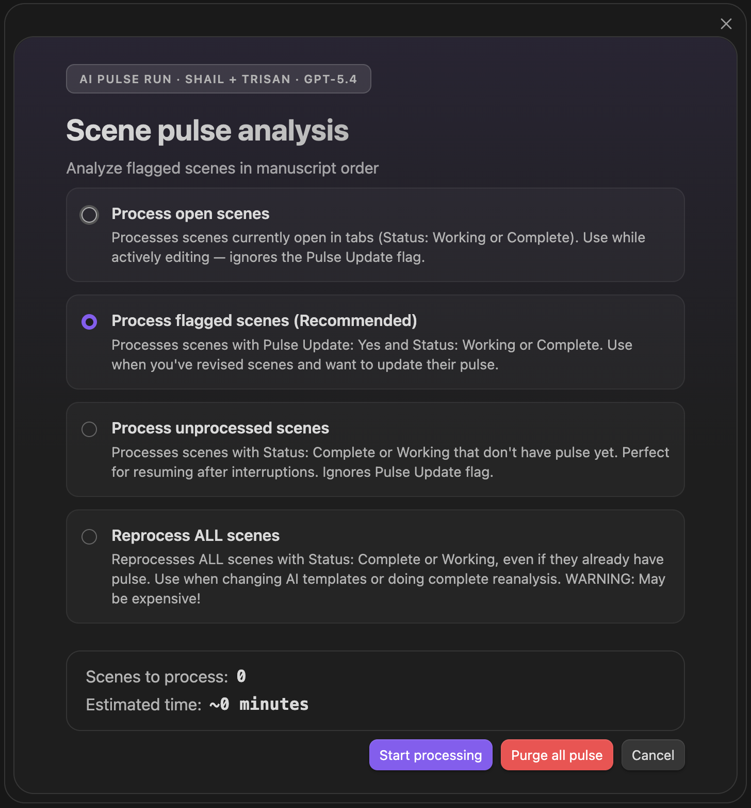

Run modes: process open scenes, process flagged scenes, process unprocessed scenes, or reprocess all scenes.

Related: [AI Pulse Triplet Analysis](AI-Pulse-Analysis), [Summary refresh](#summary-refresh).
