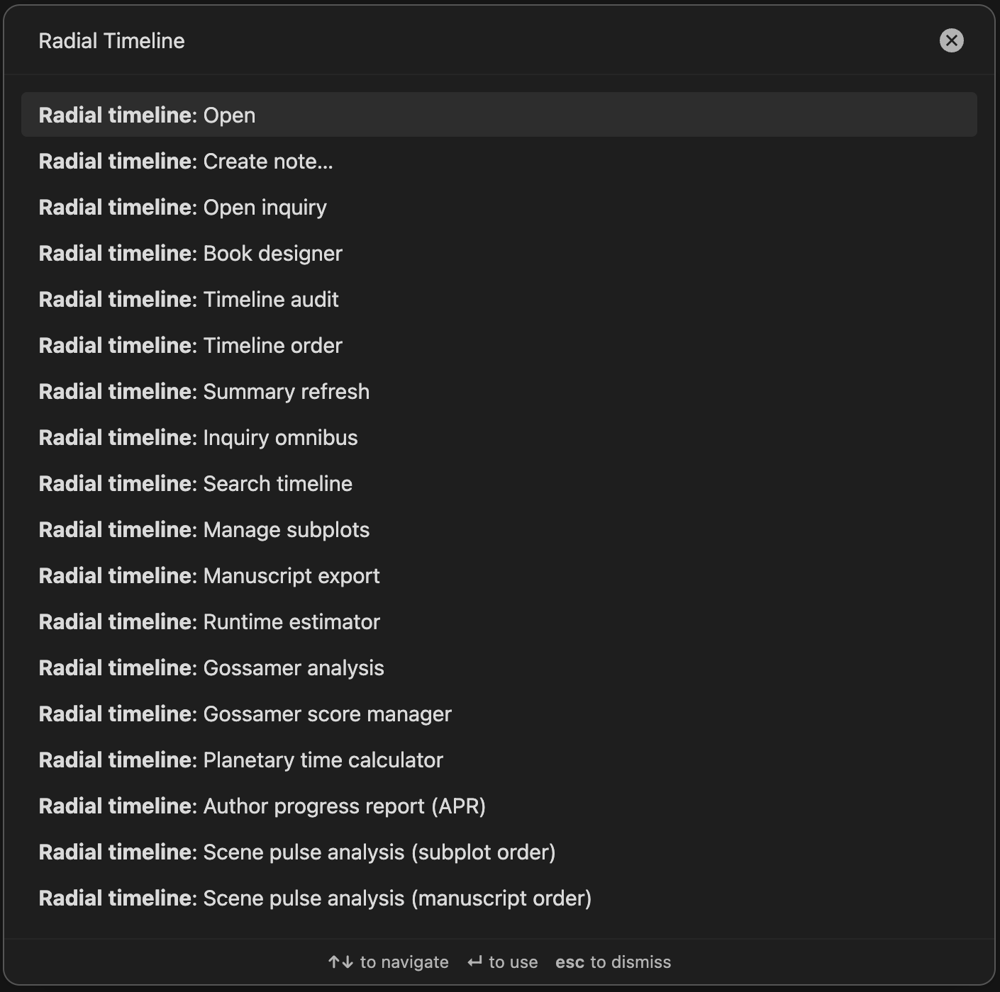

Radial Timeline provides commands through the Obsidian Command Palette.

To open the Command Palette:
*   **Mac**: `Cmd + P`
*   **Windows/Linux**: `Ctrl + P`

Type `Radial Timeline` to filter the list.

  
  
Radial Timeline Commands in the palette

## Commands

These are the main command-palette entries, listed in the same order as the palette screenshot:

1. [Open](Radial-Timeline-View)
2. [Create note…](Create-Note)
3. [Open inquiry](Inquiry-View)
4. [Book Designer](Book-Designer)
5. [Timeline order](Timeline-Order)
6. [Timeline audit](Timeline-Audit)
7. [Manage subplots](Manage-Subplots)
8. [Summary refresh](Summary-Refresh)
9. [Search timeline](Search-Timeline)
10. [Gossamer analysis](Gossamer-Analysis)
11. [Runtime estimator](Runtime-Estimator)
12. [Manuscript export](Manuscript-Export)
13. [Inquiry omnibus pass](Inquiry-Omnibus-Pass)
14. [Gossamer score manager](Gossamer-Score-Manager)
15. [Planetary time calculator](Planetary-Time-Calculator)
16. [Author progress report (APR)](Author-Progress-Report)
17. [Scene pulse analysis (subplot order)](Scene-Pulse-Analysis-Subplot-Order)
18. [Scene pulse analysis (manuscript order)](Scene-Pulse-Analysis-Manuscript-Order)

## Conditional Commands

Some commands only appear in the Command Palette when their required feature is enabled:

*   **AI commands** (Scene pulse analysis, Summary refresh, Gossamer analysis, Inquiry omnibus pass): Require **AI LLM features** to be enabled in Settings → AI.
*   **Runtime estimator**: Requires **Pro** access. Runtime configuration lives in Settings → Core.
*   **Planetary time calculator**: Requires **Planetary time** to be enabled in Settings → Core.
