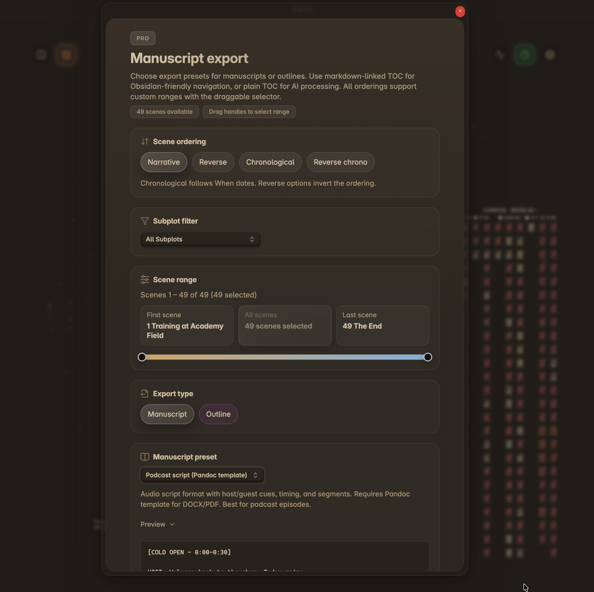
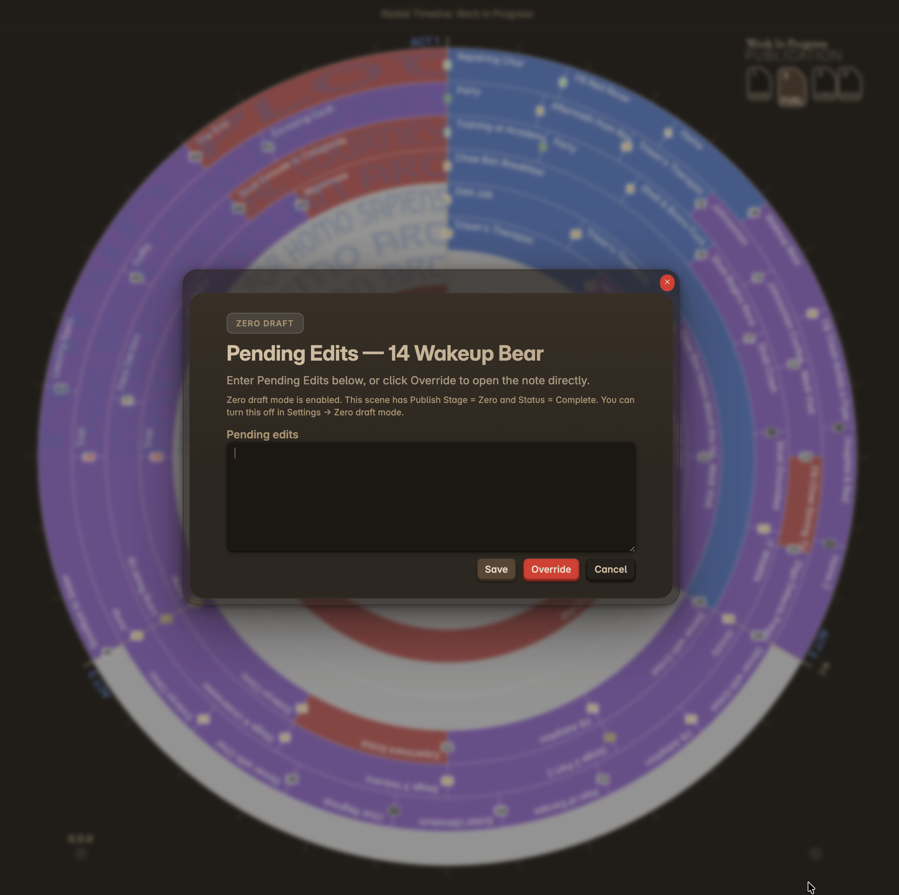

Core workflows are a reference for ongoing use. For first-time setup, see [[Onboarding-Fresh-Vault|Fresh Vault Onboarding]] or [[Onboarding-Existing-Vault|Existing Vault Onboarding]].

### Planning Your Novel
*   **Act Structure**: Scenes are organized by act (default 3 acts, configurable in **Settings → Acts**). Acts come from the scene frontmatter `Act:` field.
*   **Subplot Tracking**: Each ring represents a different subplot. Keep scenes in a single subplot or spread them across multiple subplots to capture common themes, topics, characters, etc.
*   **Story Beats**: Use story beat systems (Save the Cat, Hero's Journey, Story Grid, or Custom) to lay out the momentum scaffolding.
*   **Backdrop & Micro-backdrops**: Mark major plot backdrop events using the special context ring placed below the outer ring in Chronologue mode. For lighter-weight context — eras, seasons, or historical milestones — use **micro-backdrop rings** configured in Settings with a title, color, and date range.

### Creating Scenes

*   **Book Designer**: Use [[Book Designer]] to generate a full manuscript scaffold (acts, subplots, optional beat notes).
*   **Create basic scene note**: Command palette → **Radial Timeline: Create basic scene note** (uses the Base YAML template).
*   **Create advanced scene note**: Command palette → **Radial Timeline: Create advanced scene note** (uses the Advanced YAML template, including any Advanced YAML editor customizations).

### Publication Mode and Tracking Progress (formerly Subplot)
*   **Scene Status Colors**: In Publication Mode, scenes are color-coded by status: Todo = plaid, Working = pink, Overdue = red, Complete = publish stage color. In Narrative and Chronologue modes, scenes display their subplot color.
*   **Publishing Stages**: Track manuscript through Zero → Author → House → Press.
*   **Completion Estimate Mark**: Plugin calculates target completion date based on your recent writing pace. The calculation is most accurate when the `Due` date is updated to the day of scene completion.

**Modes**: Publication `2`
**Settings**: Publishing stage colors

### Exporting a Manuscript

  
  
Manuscript export — filter, order, and select a range of scenes

When you're ready to read through your work or send it to an editor, use the **`Manuscript export`** command.

1.  Open the command palette (`Cmd/Ctrl + P`) and select **`Radial Timeline: Manuscript export`**.
2.  **Subplot Filter**: Optionally filter to compile only scenes from a specific subplot.
3.  **Order**: Choose from Narrative, Chronological, Reverse Narrative, or Reverse Chronological ordering.
4.  **TOC**: Select Markdown, Plain Text, or No Table of Contents.
5.  **Range**: Use the drag-bar slider to visually select a specific range of scenes to include (useful for generating a single act or particular range of scenes).
6.  **Output**: A new file is created in the Export folder (default `Radial Timeline/Export`) containing the compiled text of all selected scenes.

### Zero Draft Mode
Prevents edits to completed zero-draft scenes. Click completed scene → modal for pending edits → save ideas for later revision. Keeps you progressing to new scenes instead of endlessly revising. See the **[Settings](Settings#zero-draft-mode)** for details.

  
  
Zero Draft modal — capture edit ideas without breaking flow

**Settings**: → Radial Timeline → Zero draft mode
