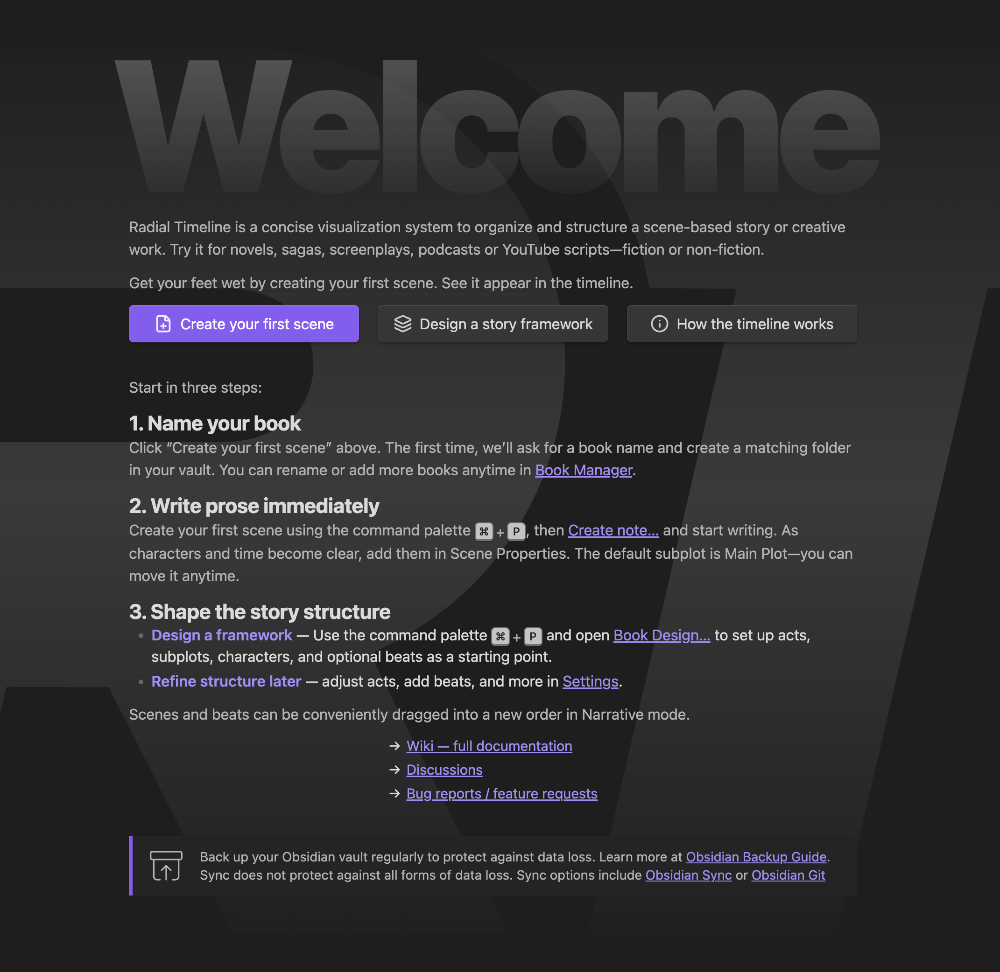

Radial Timeline transforms your manuscript into a live visual map of your story. It works with any Obsidian vault — fresh or existing — by reading and writing scene metadata as note properties (YAML frontmatter) at the top of each note.

You get two co-equal workspaces: the **[Radial Timeline View](Radial-Timeline-View)** for scenes, structure, and chronology, and the **[Inquiry View](Inquiry)** for corpus-level analysis.

  

    
    
Welcome screen — quick-start guide for new vaults

  

> **Coming from Scrivener, Ulysses, or another tool?** Use [Obsidian's Importer plugin](https://help.obsidian.md/plugins/importer) or export your work to Markdown and drop it into your vault. Scene order is controlled by the leading number in each scene's filename plus its `Act` field — not by File Explorer sort order. See [Scene Properties (Core + Advanced)](YAML-Frontmatter) for the full schema.

---

## Setup

Choose a vault layout and stick with it: a single-book vault, a single vault with a dedicated Manuscript folder, or a multi-book vault with one folder per book.

**1. Install and add a book profile.** Install Radial Timeline from Community Plugins, open **Settings → Core → Books**, add a profile, and link its **Source folder** to your manuscript folder.

**2. Bring in scenes.**

*   *Fresh vault:* run **Radial Timeline: Book designer** to generate a scaffold (acts, subplots, optional beats), or run **Radial Timeline: Create note… → Scene → Basic scene** to start with a single scene.
*   *Existing vault:* your scene notes should use `Class: Scene`. The main scene properties are `Act`, `Synopsis`, and `Subplot`. Chronologue uses `When` and `Duration`; Progress uses `Status` and `Publish Stage`. If your vault uses different property names, enable **Remap frontmatter field keys** under **Settings → Advanced → Configuration**.

**3. Choose a beat system (optional).** Select **Save the Cat**, **Hero's Journey**, or **Custom** in [Settings → Core → Story beats system](Settings-Core#story-beats-system). Use **Create** to generate beat notes; **Merge** to realign existing files after changes.

---

## Daily Workflow

The four modes in the Radial Timeline View — switch with `1`/`2`/`3`/`4` or the navigation cluster:

*   **Progress** (`1`) — writing status and revision-stage tracking
*   **Narrative** (`2`) — manuscript order; drag scenes on the outer ring to reorder
*   **Chronologue** (`3`) — story-world time, duration, and gaps
*   **Gossamer** (`4`) — beat-level scoring across Momentum, Tension, Activity, Interiority

**Day to day:** write scenes, keep `Synopsis` current, update `Status` from Todo → Working → Complete. Use **Search timeline** to find scenes across metadata. See [How to](How-to) for task recipes (reordering, subplots, rotation, search).

**When you're ready to share:** run **Radial Timeline: Manuscript export** to compile to Markdown, outline, or PDF. PDF requires [Pandoc](https://pandoc.org/installing.html) and a LaTeX distribution; configure under **Settings → Publish**. See [Publishing](Publishing) for templates and Signature setup.

**Optional next steps:** [AI Pulse Triplet Analysis](AI-Pulse-Analysis) for scene-level editorial feedback, [Inquiry](Inquiry) for corpus-level analysis, [Author Progress Report](Author-Progress-Report) for shareable spoiler-safe progress graphics.

---

> **Protect your work.** Back up your vault regularly. Sync helps but won't guard against all forms of data loss. See Obsidian's [backup guide](https://help.obsidian.md/backup), [Obsidian Sync](https://obsidian.md/sync), or the [Obsidian Git plugin](https://obsidian.md/plugins?id=obsidian-git).
