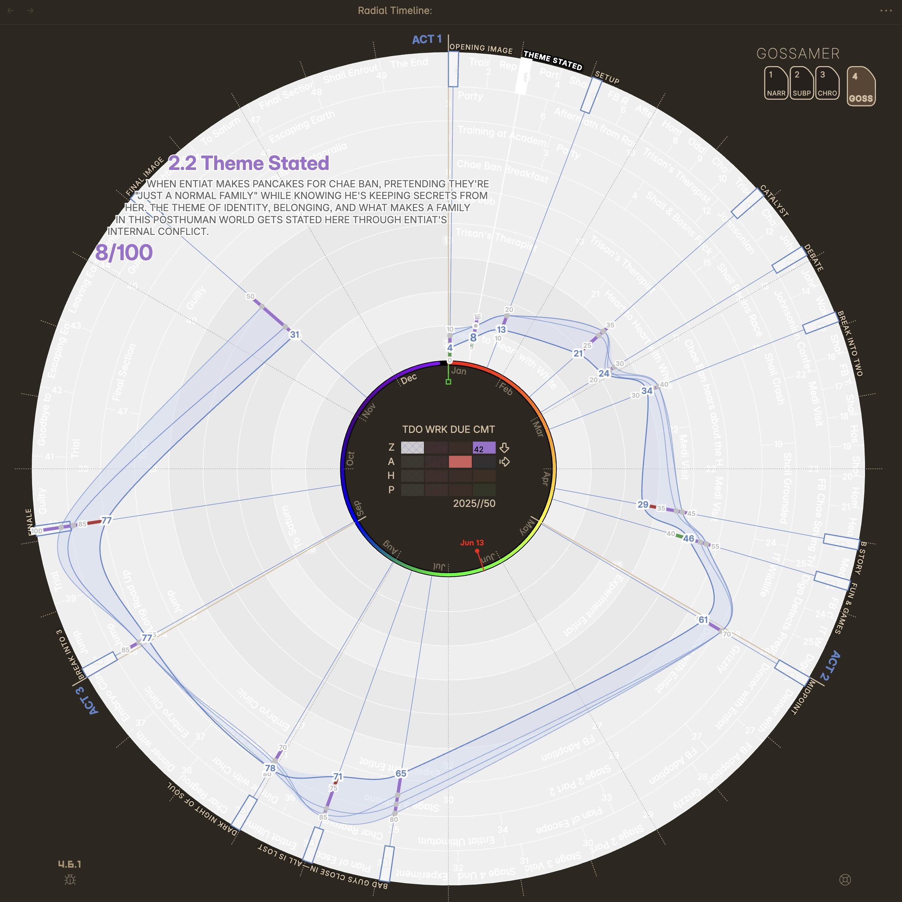
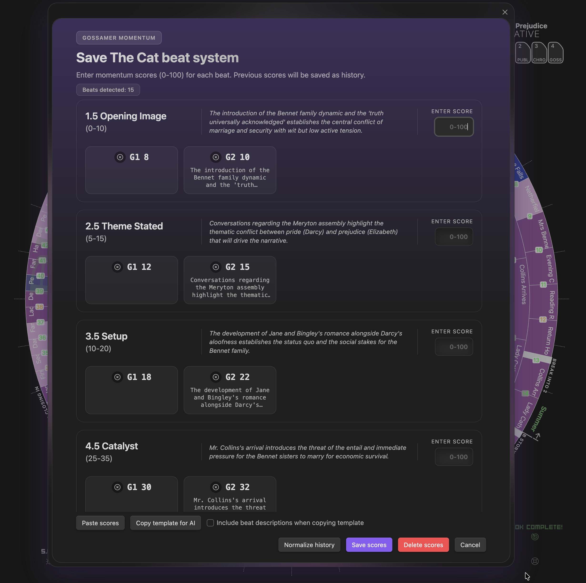

**Analyzing Narrative Momentum**

Gossamer Mode visualizes narrative momentum using story beat scores. Timeline grays out; momentum values display across story beats to show tension/excitement building.

*   **Momentum Tracking**: Chart narrative momentum across story beats and over time with manual or AI-driven scoring.
*   **Historical tracking**: Compare momentum scores across up to 30 iterations to track how your story evolves.
*   **Ideal Range**: Based on `Range=0-20` yaml for each story beat creating an idealized story momentum shape (visual reference only).
*   **Manual score entry**: Track momentum changes over time with manual updates (with or without external AI assistance).
*   **Justification capture**: Each score line now records a brief justification so you know what the score was based on.
*   **Normalize & repair**: Use the **Normalize Scores** button inside the modal to smooth outliers and automatically repair orphaned/out‑of‑sequence entries.

**Timeline mode**: Gossamer (key **4**)
**Command**: `Gossamer score manager`
**Settings**: `Story beats system`

  
  
Gossamer Range & Three Scores

  

    
    
Ideal ranges for story beats

  

  

    
    
Callouts showing score details

  

  
  
Gossamer score manager — manual momentum entry

## Manual Entry

Use **Gossamer score manager** to enter scores yourself. This is a manual workflow by design — you can score purely by your own judgment, or use an external AI tool to help draft scores and justifications, then paste those results into the modal.

## AI Analysis

Use **Gossamer analysis** to run the built-in AI evaluation of narrative momentum. This AI run intentionally **does not receive ideal range guidance** in its payload/instructions, so the result is a fresh take rather than a range‑constrained score.

## Story Beats Configuration

You can configure the underlying system that powers Gossamer Mode in **Settings → Story beats system**.

### 1. Select a System
Choose a preset structure:
*   **Save The Cat** (15 beats)
*   **Hero's Journey** (12 beats)
*   **Story Grid** (5 Commandments)
*   **Custom**: Define your own structure.

### 2. Custom Beat System
When "Custom" is selected, the beat system editor appears:
*   **Name**: Give your system a name (e.g., "7 Point Structure"). This is written to the `Beat Model` YAML field.
*   **Add beats**: Type a name and click **+** to add a new beat. Assign each beat to an act using the dropdown.
*   **Reorder**: Drag and drop beats to change their order within or across acts.
*   **Rename**: Edit beat names inline. After renaming or reordering, use **Merge** to update existing files.
*   **Beat properties editor**: Customize additional beat properties and select which fields appear in beat hover metadata (stored per system).
*   **Saved sets ✦ Pro**: Save and switch between multiple custom beat systems (unlimited beat sets). Each system stores beats plus Beat properties editor fields and hover metadata.

Row colors show the sync status between your beat list and the actual note files:
*   **Green** — beat note exists and is aligned.
*   **Orange** — beat note exists but is misaligned (wrong act). Merge to fix.
*   **Red** — duplicate title or multiple files match. Resolve manually.
*   **No highlight** — new beat, no file yet.

### 3. Create & Merge
*   **Create**: Generates beat set notes in your source folder, one per beat. Notes come pre-populated with properties (`Class: Beat`, `Purpose`, `Beat Model`, `Range`, etc.) so they are immediately recognized by Gossamer Mode. The button is disabled when all beats already have files, and shows how many new notes will be created.
*   **Merge**: Appears when beats are misaligned. Updates existing beat note frontmatter to match current act assignments (and fills missing Beat Model/Beat Id where applicable). It does not rename files or enforce numeric prefix conventions.

> [!NOTE]
> Custom beat notes use the same properties structure as preset systems. Use the Beat properties editor to extend this with your own fields.
