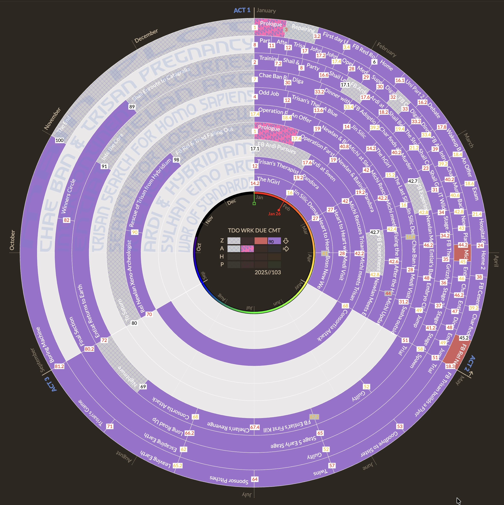

**Welcome to the Radial Timeline Wiki!**

Radial Timeline™ transforms your manuscript into a live visual map where you can see your entire story structure at a glance.

### What It Does
Radial Timeline™ arranges your scenes by act, subplot, narrative or chronological order in a striking radial layout—revealing the structure, rhythm, and scope of your story. Each ring represents a subplot; hover interactions surface important details like scene synopsis and story beats. Scenes highlight across subplots to show interrelationships. Multiple view modes dissect your novel like an X-ray.

### The 4 Critical Timelines
Radial Timeline™ captures and visualizes all 4 critical timelines:
*   **Narrative time**: the sequence you reveal events to readers.
*   **Chronological time**: when events happen in your story's world.
*   **Author time**: your scene writing progress with target due dates tracking Todo, Working, Complete and Overdue.
*   **Publishing time**: manuscript revision stages from Zero draft through Press-ready.

Narrative and Chronologue modes keep subplot colors front-and-center so you can compare structure without workflow noise. When you need to see Todo/Working/Overdue progress or publish stage colors, jump into Subplot Mode where all scenes is replaced by Main Plot and scenes inherit the author-status and publish-stage palette.

---

### Visual Overview

  

    
    
Narrative Timeline

  

  

    
    
Timeline Hover Synopsis

  

  

    
    
Subplot Mode — Author & publishing progress

  

  

  

    
    
Chronologue Mode

  

  

    
    
Chronologue Mode - SHIFT

  

  

    
    
Gossamer View

  

### Getting Started

*   **Welcome Screen**: Opening Radial Timeline in an empty vault now greets you with a quick-start guide.
*   **[[Book Designer]]**: Instantly generate a manuscript template with acts, subplots, and beats.
*   **[[Core Workflows]]**: Learn the basics of Radial Timeline.

