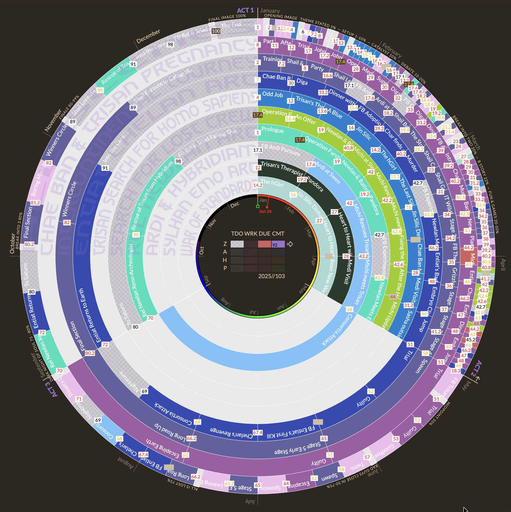
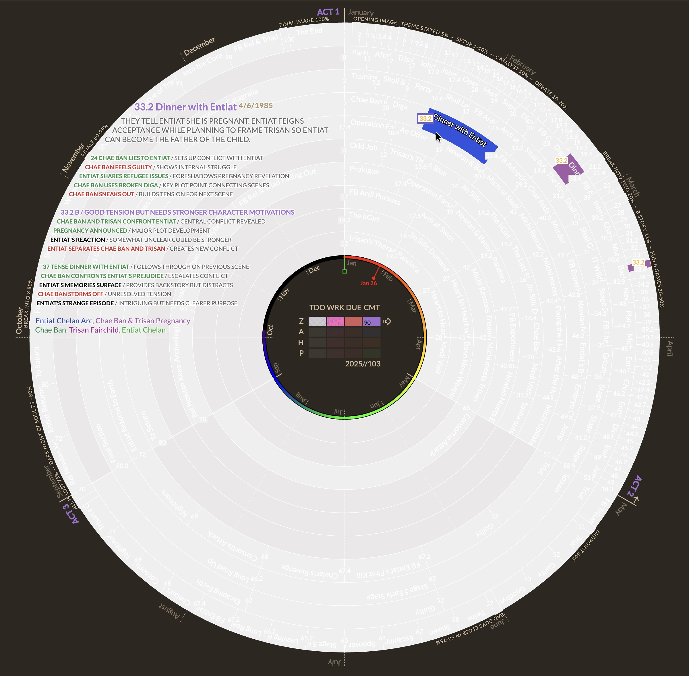
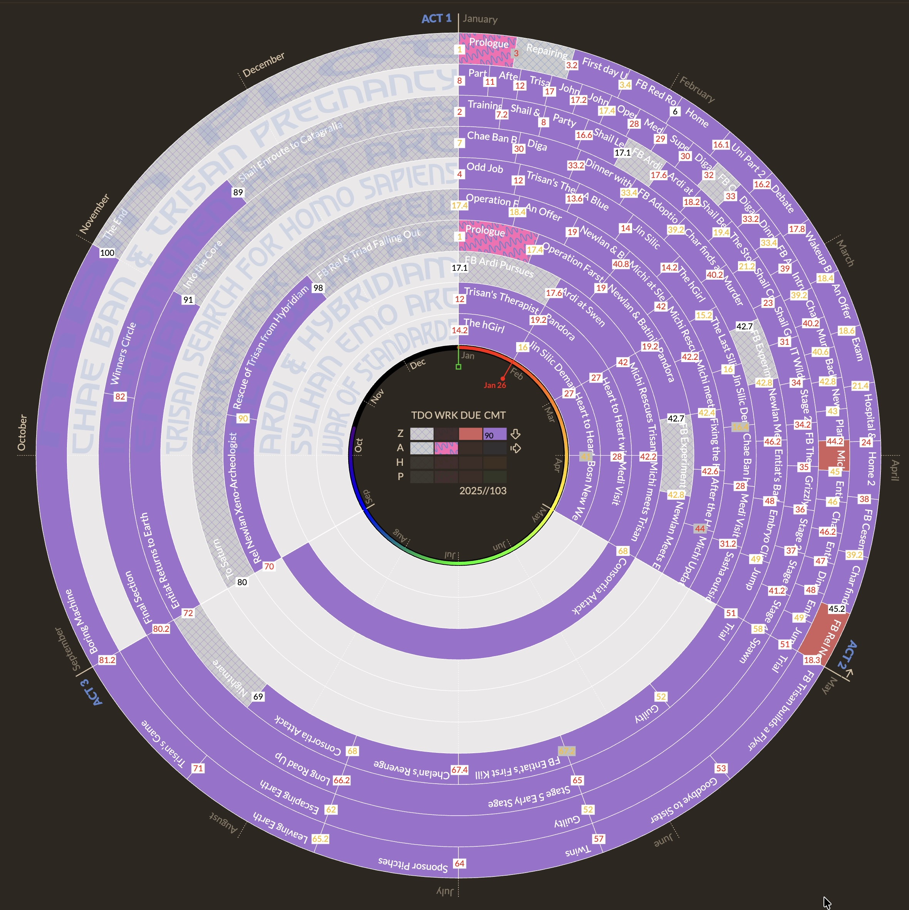
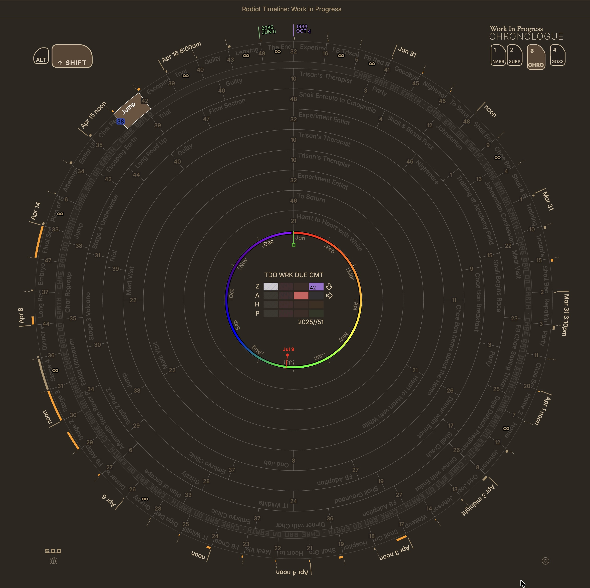

**Welcome to the Radial Timeline Wiki!**

Radial Timeline™ transforms your manuscript into a live visual map where you can see your entire story structure at a glance.

<a href="https://youtu.be/7noTSFaj8Eo" target="_blank" rel="noopener">
  

    
  

  

    Plan your novel with radial timeline in obsidian 
    Complete author walkthrough & setup guide
  

</a>

### What It Does
Radial Timeline™ arranges your scenes by act, subplot, narrative or chronological order in a striking radial layout—revealing the structure, rhythm, and scope of your story. Each ring represents a subplot; hover interactions surface important details like scene synopsis and AI story pulses. Scenes highlight across subplots to show interrelationships. Multiple modes dissect your novel like an X-ray.

### The 4 Critical Timelines
Radial Timeline™ captures and visualizes all 4 critical timelines:
*   **Narrative time**: the sequence you reveal events to readers.
*   **Chronological time**: when events happen in your story's world.
*   **Author time**: your scene writing progress with target due dates tracking Todo, Working, Complete and Overdue.
*   **Progress stages**: manuscript revision stages from Zero draft through Press-ready.

[[Narrative-Mode|Narrative]] and [[Chronologue-Mode|Chronologue]] keep subplot colors front-and-center so you can compare structure without workflow noise. When you need to see Todo/Working/Overdue status or progress stage colors, switch to [[Progress-Mode|Progress Mode]] — the combined outer ring is replaced by a single-subplot view and scenes inherit the author-status and progress-stage palette.

---

### Visual Overview

  

    
    
Narrative Mode — story beats + subplot rings (dominant subplot shown via folded corners)

  

  

    
    
Hover synopsis — information-dense metadata + pulse triplet feedback

  

  

    
    
Progress Mode — schedule/status + progress stage view

  

  

    
    
Chronologue Mode — story chronology with duration arcs and overlaps plus adaptive time scale

  

  

    
    
Chronologue Shift — compare elapsed time between scenes and surface discontinuity gaps

  

  

    
    
Gossamer Mode — compare Momentum, Tension, Activity, and Interiority across beats

  

### Getting Started

*   **[[Welcome]]**: Opening Radial Timeline in an empty vault greets you with a quick-start guide.
*   **[[Fresh-Vault-Onboarding|Fresh Vault Onboarding]]**: Start from scratch with Book Designer and beats.
*   **[[Existing-Vault-Onboarding|Existing Vault Onboarding]]**: Connect an existing manuscript to Radial Timeline.
*   **[[Migrating-from-Other-Apps|Migrating from Scrivener & Other Apps]]**: How Obsidian’s markdown workflow differs from traditional writing tools.
*   **[[Book Designer]]**: Instantly generate a manuscript set with acts, subplots, and beats.
*   **[[Core Workflows]]**: Learn the basics of Radial Timeline.
*   **[[Timeline-Modes|Timeline Modes]]**: Compare Progress, Narrative, Chronologue, and Gossamer at a glance.
