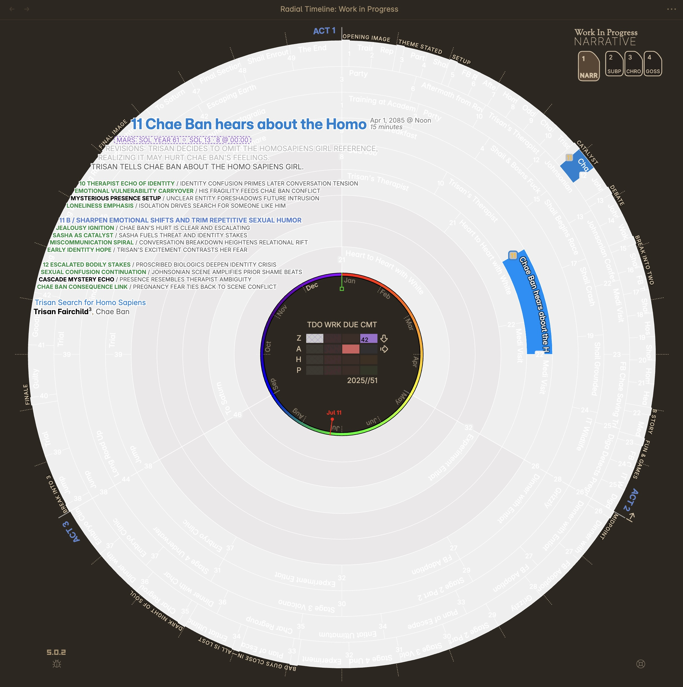
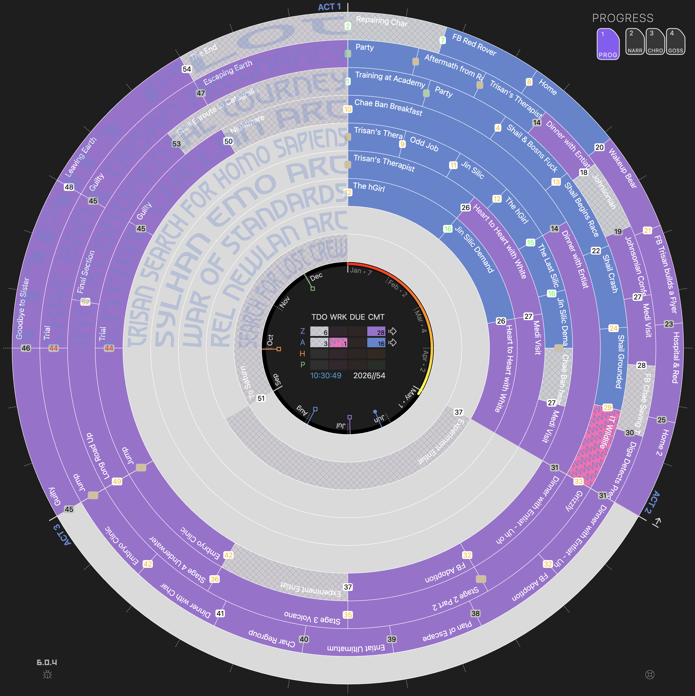
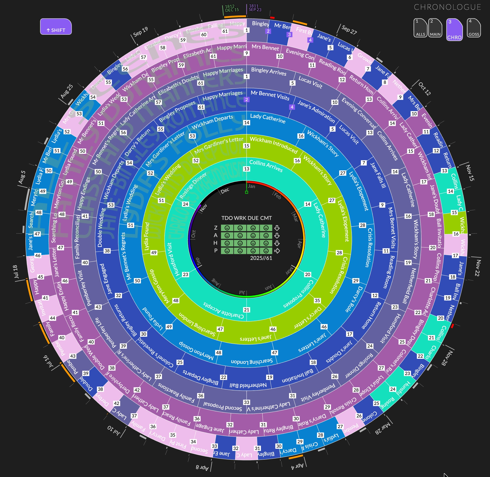
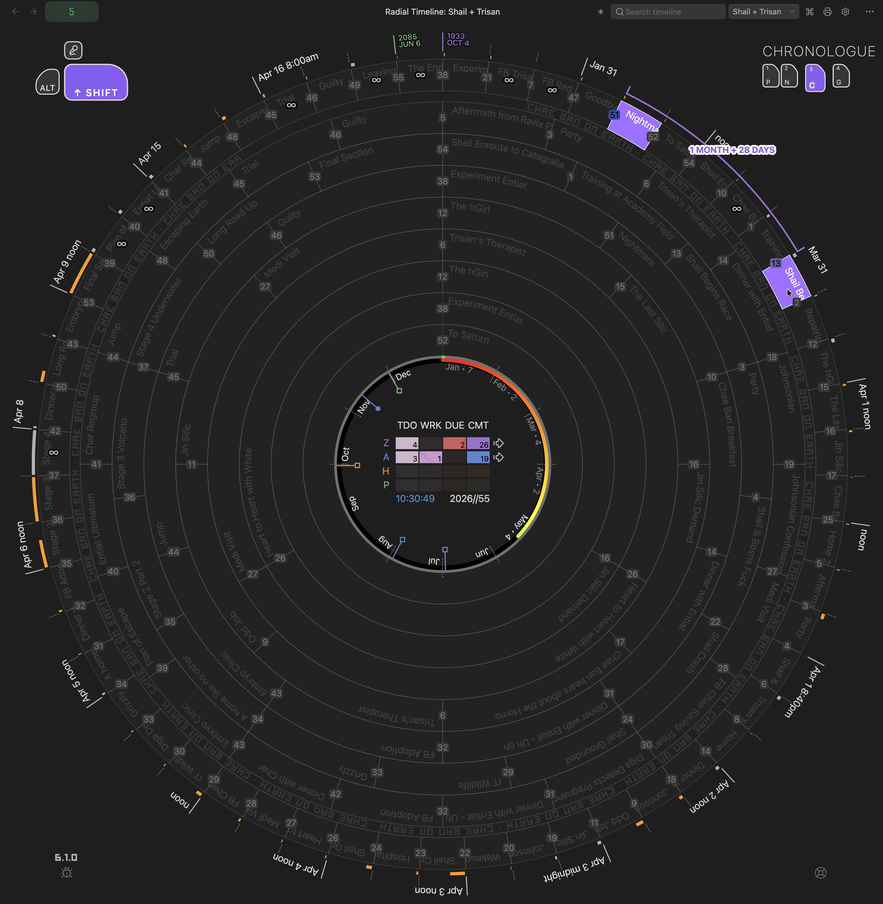
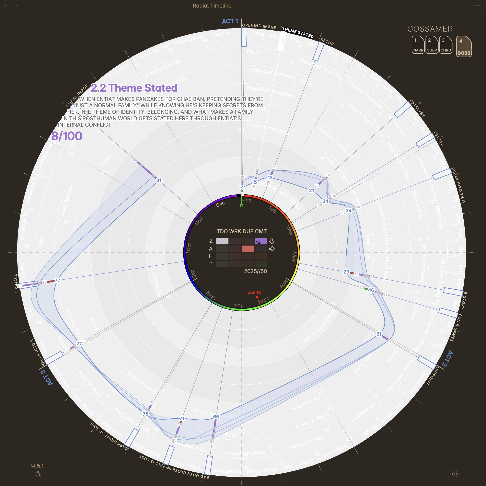

**Welcome to the Radial Timeline Wiki!**

Radial Timeline™ transforms your manuscript into a live visual map where you can see your entire story structure at a glance.

<a href="https://youtu.be/YO6hWevwSWc?si=SilQ6xgnQYReGgd0" target="_blank" rel="noopener">
  

    
  

  

    Release 6 Overview 
    Overview of New Features
  

</a>

### YouTube Video Suite

*   **[Volume 1: Intro](Getting-Started)**: [Original home page intro video](https://youtu.be/7noTSFaj8Eo)
*   **[Volume 2: Chronologue Mode](Chronologue-Mode)**: [Chronologue Mode Volume 2](https://youtu.be/XKWq32LB0d0?si=VF6S1OELNKIAB-h-)
*   **[Volume 3: Release 6 Overview](Getting-Started)**: [Overview of New Features](https://youtu.be/YO6hWevwSWc?si=SilQ6xgnQYReGgd0)
*   **[Volume 4: Inquiry View](Inquiry)**: [Inquiry View Volume 4](https://youtu.be/xfX0rP4-Hv4?si=gSTRnPwbM0wsnlEZ)
*   **[Volume 5: Author Progress Report (APR)](Author-Progress-Report)**: [Author Progress Report (APR) Volume 5](https://youtu.be/euJ2qOUZgco?si=hjx3aegx7bka7Z61)
*   **[Volume 6: Gossamer Mode](Gossamer-Mode)**: [Gossamer Mode Volume 6](https://youtu.be/DOUVYXFwigM?si=vBuzvxPteXVjVFmM)

### Volume 1 Intro

<a href="https://youtu.be/7noTSFaj8Eo" target="_blank" rel="noopener">
  

    
  

  

    Volume 1 Intro 
    Original home page walkthrough
  

</a>

### What It Does
Radial Timeline™ arranges your scenes by act, subplot, narrative or chronological order in a striking radial layout—revealing the structure, rhythm, and scope of your story. Each ring represents a subplot; hover interactions surface important details like scene synopsis and AI story pulses. Scenes highlight across subplots to show interrelationships. Multiple modes dissect your novel like an X-ray.

### The 4 Critical Timelines
Radial Timeline™ captures and visualizes all 4 critical timelines:
*   **Narrative time**: the sequence you reveal events to readers.
*   **Chronological time**: when events happen in your story's world.
*   **Author time**: your scene writing progress with target due dates tracking Todo, Working, Complete and Overdue.
*   **Progress stages**: manuscript revision stages from Zero draft through Press-ready.

[Narrative](Narrative-Mode) and [Chronologue](Chronologue-Mode) keep subplot colors front-and-center so you can compare structure without workflow noise. When you need to see Todo/Working/Overdue status or progress stage colors, switch to [Progress Mode](Progress-Mode) — the combined outer ring is replaced by a single-subplot view and scenes inherit the author-status and progress-stage palette.

---

### Visual Overview

  

    
    
Narrative Mode — story beats + subplot rings (dominant subplot shown via folded corners)

  

  

    
    
Hover synopsis — information-dense metadata + pulse triplet feedback

  

  

    
    
Progress Mode — schedule/status + progress stage view

  

  

    
    
Chronologue Mode — story chronology with duration arcs and overlaps plus adaptive time scale

  

  

    
    
Chronologue Shift — compare elapsed time between scenes and surface discontinuity gaps

  

  

    
    
Gossamer Mode — compare Momentum, Tension, Activity, and Interiority across beats

  

### Getting Started

*   **[Getting Started](Getting-Started)** — fresh vault setup, existing vault setup, migrating from Scrivener, and the core workflow.
*   **[Book Designer](Book-Designer)** — instantly generate a manuscript set with acts, subplots, and beats.
*   **[Radial Timeline View](Radial-Timeline-View)** — the four modes at a glance: Progress, Narrative, Chronologue, Gossamer.
*   **[How to](How-to)** — task recipes for reordering scenes, managing subplots, search, and rotation.
