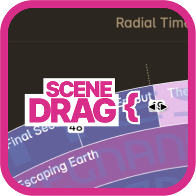
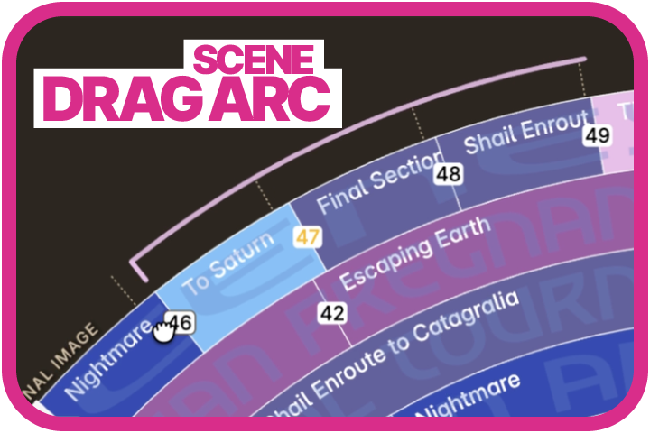
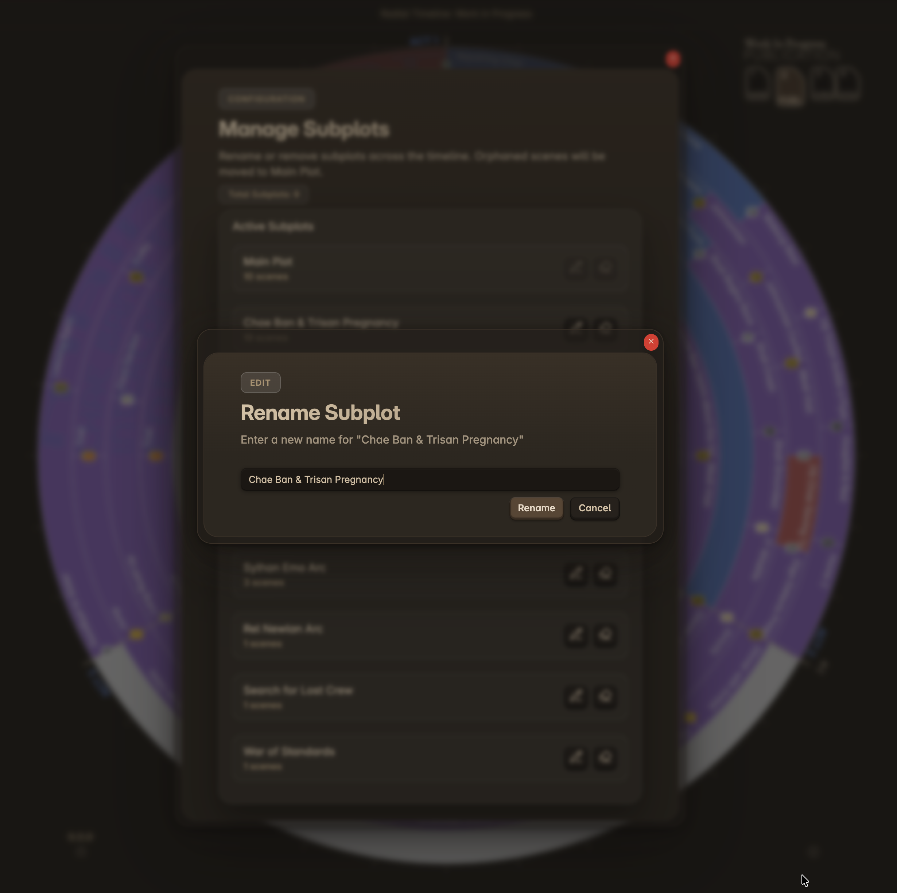
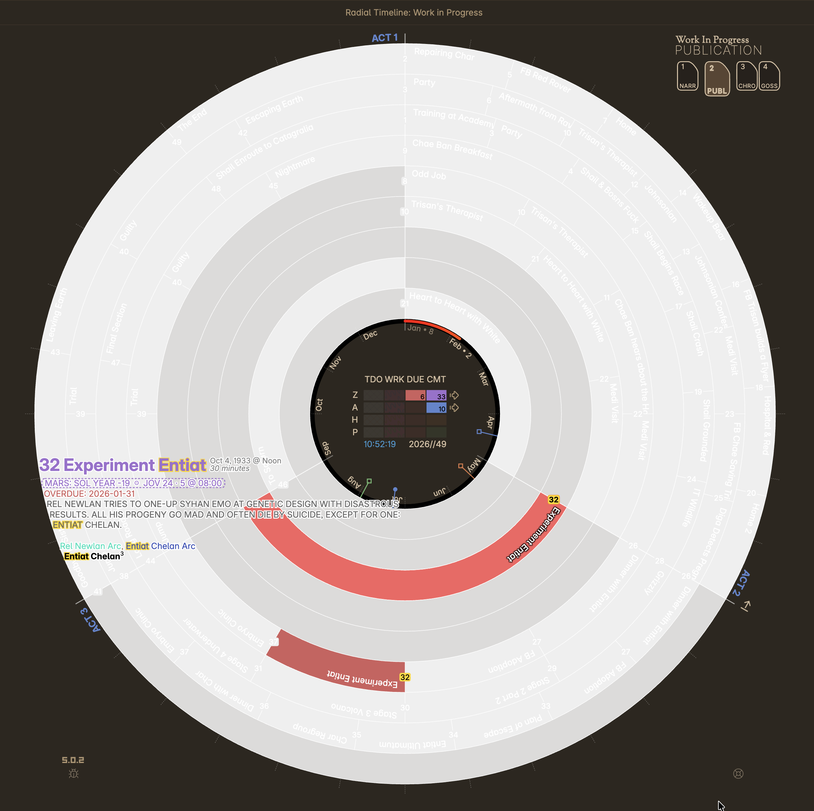

### Reorder Scenes

Scenes in Radial Timeline can be reordered in two ways: **by renaming the scene title** or **by dragging scenes in Narrative Mode**.

---

#### Method 1: Reorder by Scene Title (All Versions)

Radial Timeline uses the **leading scene number in the scene title** to determine order.

Example:

    1 Tom rides a bike

- `1` = scene order  
- `Tom rides a bike` = scene title  

To move the scene, change the leading number:

    3 Tom rides a bike

The scene is now treated as Scene 3.  
Only the number controls ordering—the text after it is the title.

---

#### Acts and Scene Order

Scene order is **act-specific**.

If you change the scene number but do **not** update the Act, the scene will move to the new position **within its current act**.

Example YAML:

    Act: 1

If you rename a scene to the highest number in the manuscript but leave `Act: 1`, it will become the **last scene of Act 1**, not the last scene overall.

To move a scene to a different act, update the YAML:

    Act: 3

Always update both:
- the **scene number in the title**
- the **Act field in YAML**, if changing acts

---

#### Method 2: Drag & Drop (Narrative Mode Only)

In recent versions of Radial Timeline:

- Switch to **Narrative Mode**
- Drag the **numbered scene squares** on the outer ring (cursor becomes double arrow)

- Drop the scene into its new position on the **numbered scene square**

- Confirm the change when prompted

This method automatically updates ordering for you.

**Note:** You can only drag a scene to another act if that act already contains at least one scene. To move a scene to an empty act, either create a new scene in that act first or manually update the `Act` field in the scene's YAML frontmatter.

---

#### Summary

- Scene order is controlled by the **number at the start of the title**
- Scene order is **scoped to the Act**
- Changing acts requires updating the **YAML `Act:` field**
- Narrative Mode supports **drag-and-drop reordering**

### Manage Subplots in Bulk

  
  
Subplot Manager — rename or delete subplots across all scenes

Need to rename or delete a subplot across dozens of scenes? Use the **`Manage subplots`** command (command palette → "Radial Timeline: Manage subplots"). The modal lets you:

* Rename a subplot and automatically update the frontmatter of every scene using it.
* Delete a subplot and strip the tag from all scenes in one action.

This is especially helpful after reorganizing your B/C plots — you no longer have to hunt through every note manually.

### Search

  
  
Search — matching scenes highlighted in yellow across all subplot rings

You can filter scenes by searching for text content across multiple fields. Search requires a minimum of **3 characters**.

*   **Trigger**: Use the command palette (`Cmd/Ctrl + P`) → **Radial Timeline: Search timeline**.
*   **Matches**: Searches case-insensitive text in:

| Field | Examples |
| :--- | :--- |
| Title | Scene filename |
| Synopsis | Scene summary text |
| Characters | All characters listed in the scene |
| Subplot | Subplot name |
| Location | Place field value |
| POV | Point of view (first, third, omni, etc.) |
| Duration | "2 hours", "45 minutes", "3 days" |
| Date/Time | "Dec 28", "2025", "9am", "April", "Midnight" |
| AI Pulse Analysis | Current, previous, and next scene analysis text |
| Planetary Time | Planet name and formatted local time (if enabled) |

*   **Visuals**:
    *   **Scene Numbers**: Highlighted in yellow on all subplot rings.
    *   **Text**: Matching text within the synopsis hover metadata is highlighted in yellow.
*   **Clear**: Click the clear button in the modal.

> **Note**: Status, Publish Stage, Due date, Pending Edits, and Gossamer scores are not included in search.

### Rotate the timeline
In Narrative and Publication modes you can use the **rotation toggle** (arrow icon near the outer ring) to rotate the timeline for easier reading. The rotation offset is **act-aware** (based on your configured **Act count**) and keeps scene number squares oriented correctly.
