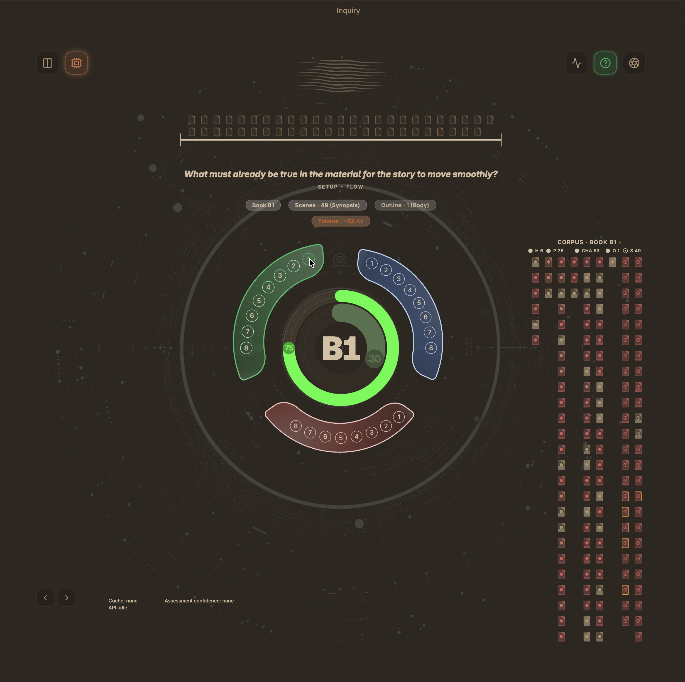

# Inquiry

Inquiry is one of two [[Views]] in Radial Timeline — a dedicated visual interface for corpus-level story analysis. While the Timeline view and its [[AI Analysis|Scene Pulse Analysis]] evaluate individual scenes in triplets, Inquiry takes a higher-altitude perspective — scanning your entire manuscript (or multi-book saga) and world building to surface structural signals, loose ends, continuity issues, inconsistent or conflicting characterization and more.

  
  
Inquiry view — visual glyph with Flow and Depth analysis rings

## Overview

Inquiry sends your manuscript corpus to an AI provider and asks structured questions organized into three narrative zones. The AI returns findings with severity ratings, confidence levels, and scene citations that are visualized in the Inquiry glyph.

**Commands**:
*   `Open Inquiry` — Opens the Inquiry view
*   `Inquiry Omnibus Pass` — Runs all enabled questions in a single batch

**Settings**: [[Settings#inquiry]]

---

## Key Concepts

### Zones

Inquiry organizes questions into three narrative zones that correspond to the structural arc of your story:

| Zone | Focus | Examples |
| :--- | :--- | :--- |
| **Setup** | Foundations and introductions | Character introductions, world-building, initial stakes |
| **Pressure** | Escalation and conflict | Rising tension, subplot intersections, pacing |
| **Payoff** | Resolution and conclusion | Loose ends, thematic resonance, climactic impact |

### Modes

Each Inquiry run produces two complementary analyses:

*   **Flow** — Evaluates narrative momentum: pacing, tension arcs, scene-to-scene energy, and structural rhythm.
*   **Depth** — Evaluates thematic substance: character development, motif recurrence, emotional resonance, and subtext.

The Inquiry glyph visualizes both scores as concentric rings, giving you a snapshot of your story's structural health.

### Scope

*   **Book** — Analyzes scenes within the current source path (single manuscript).
*   **Saga (Σ)** — Expands analysis across multiple books using configured scan folders, ideal for series continuity checks.

---

## The Inquiry Glyph

The visual interface centers on a radial glyph:

*   **Flow ring** (outer) — Represents narrative momentum score (0–1).
*   **Depth ring** (inner) — Represents thematic depth score (0–1).
*   **Zone segments** — Three segments (Setup, Pressure, Payoff) around the glyph show per-zone health.
*   **Minimap** — Scene citations from findings are highlighted, showing where issues cluster in your manuscript.

Click zone segments or findings to drill into specific analysis results.

---

## Running an Inquiry

### Single Question

1.  Open the Inquiry view (`Open Inquiry` command or click the Inquiry ribbon icon).
2.  Select your **scope** (Book or Saga).
3.  Choose a **zone** (Setup, Pressure, or Payoff).
4.  Select a **question** from the prompt library.
5.  Click **Run** to send the corpus to your configured AI provider.
6.  Review findings in the results panel — each finding includes a headline, impact rating, confidence level, and scene citations.

### Omnibus Pass

The Omnibus Pass runs all enabled questions across all three zones in sequence. Use the `Inquiry Omnibus Pass` command or the Omnibus button in the Inquiry view.

---

## Corpus & Material Modes

Inquiry builds a "corpus" from your manuscript files before sending them to the AI. You can control what each YAML class contributes:

| Material Mode | What Is Sent | Best For |
| :--- | :--- | :--- |
| **Full** | Complete note body content | Scenes you want deep analysis on |
| **Summary** | Synopsis field only | Context without token overhead |
| **None** | Excluded entirely | Reference notes, worldbuilding docs you want to skip |

Configure per-class material modes in [[Settings#inquiry-sources]].

### Corpus Content (CC) Thresholds

The Corpus system classifies notes by word count to help you spot thin content:

| Tier | Default Threshold |
| :--- | :--- |
| Empty | < 10 words |
| Sketchy | ≥ 100 words |
| Medium | ≥ 300 words |
| Substantive | ≥ 1,000 words |

When **Highlight completed docs with low substance** is enabled, completed notes that remain Empty or Sketchy are flagged. Adjust thresholds in [[Settings#inquiry-corpus]].

---

## Findings

Each Inquiry result contains **findings** — specific observations the AI identified:

| Finding Kind | Description |
| :--- | :--- |
| **Loose end** | An element introduced but never resolved |
| **Continuity** | A consistency issue between scenes |
| **Escalation** | A tension or stakes progression issue |
| **Conflict** | A structural or thematic conflict |
| **Unclear** | An ambiguous element needing clarification |

Each finding includes:
*   **Impact** rating (low / medium / high)
*   **Confidence** level (low / medium / high)
*   **Status** (introduced / escalated / resolved / dropped / unclear)
*   **Scene citations** linking back to specific notes

---

## Briefings & Artifacts

*   **Auto-save**: When enabled, Inquiry saves a brief after each successful run to your configured Artifact folder (default `Radial Timeline/Inquiry/Briefing`).
*   **Embed JSON payload**: Optionally includes the raw validated JSON response in the artifact file.
*   **Session cache**: Stores recent Inquiry sessions for fast reloads (configurable limit, default 30 sessions).

---

## Action Notes

Inquiry can write findings directly into your scene frontmatter:

*   **Enable**: Toggle **Write Inquiry action notes to scenes** in [[Settings#inquiry]].
*   **Target field**: Findings are appended to the configured YAML field (default `Pending Edits`).
*   **Purge**: Use the purge function in the Inquiry view to remove all Inquiry-generated action notes from scenes.

---

## Prompts

Inquiry comes with built-in prompt questions for each zone. You can also add custom questions:

*   **Free**: Up to 2 custom questions per zone.
*   **Pro**: Up to 7 custom questions per zone.
*   Drag to reorder questions within a zone.
*   Toggle individual questions on/off.
*   Reset to built-in defaults using the restore button.

Configure prompts in [[Settings#inquiry-prompts]].

---

## Scan Folders & Class Scope

Control which vault content Inquiry can access:

*   **Scan folders**: Limit scans to specific paths. Supports wildcards (e.g., `/Book 1-7 */`) and `/` for vault root.
*   **Class scope**: Filter which YAML `Class` values are scanned. Use `/` to allow all classes.
*   **Presets**: Choose Default (recommended), Light (fast, lower token usage), or Deep (comprehensive, higher token usage).

Configure sources in [[Settings#inquiry-sources]].

---

## Tips

*   Start with **Book** scope and a single question to calibrate before running an Omnibus Pass.
*   Use **Summary** material mode for large manuscripts to reduce token usage while maintaining context.
*   Review the **token estimate** indicator before running — amber and red tiers indicate high token consumption.
*   Combine Inquiry findings with [[AI Analysis|Scene Pulse Analysis]] for both macro and micro-level feedback.
*   Inquiry works with all supported AI providers (Anthropic, OpenAI, Gemini, Local LLM).
