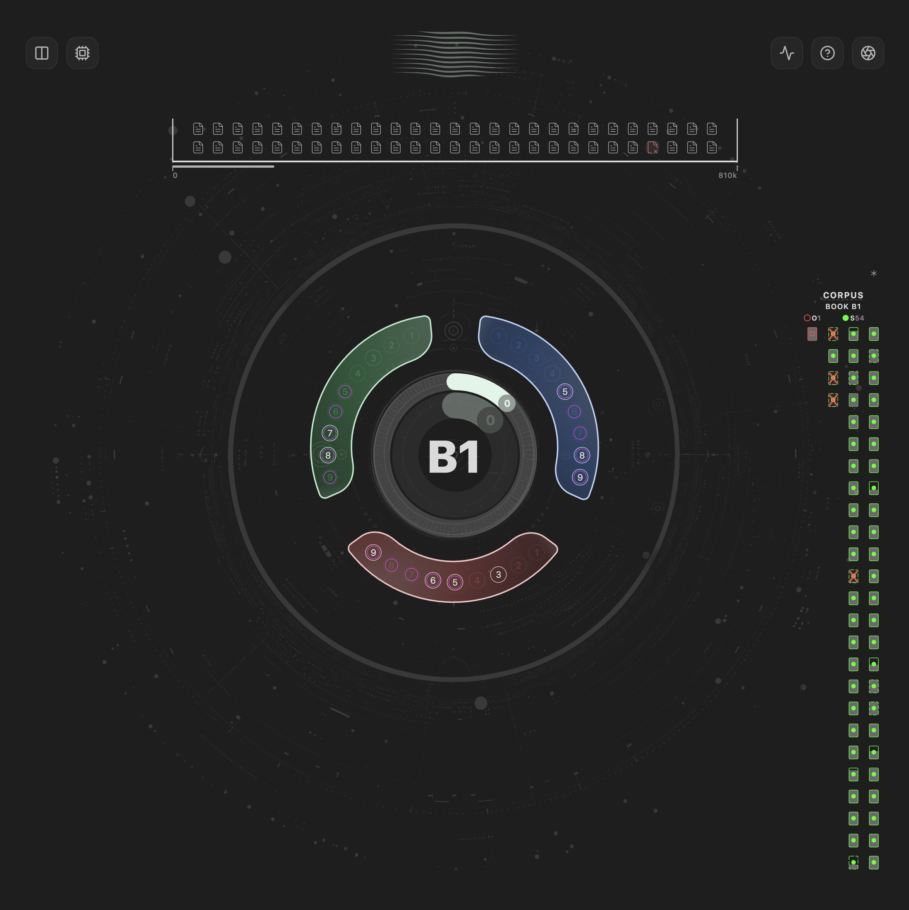

Inquiry is the main operating guide for the Inquiry View. While the [Radial Timeline View](Radial-Timeline-View) focuses on scene-level work, Inquiry takes a higher-altitude perspective — scanning your manuscript corpus and worldbuilding to surface structural signals, loose ends, continuity issues, and pressure gaps across a book or saga.

  
  
Inquiry view — visual glyph with Flow and Depth analysis rings

## Overview

Inquiry sends your manuscript corpus to an AI provider and asks structured questions organized into three narrative zones. The AI returns findings with severity ratings, confidence levels, and scene citations that are visualized in the Inquiry glyph.

**Commands**:
*   `Open Inquiry` — Opens the Inquiry view
*   `Inquiry Omnibus Pass` — Runs all enabled questions in a single batch

**Settings**: [Inquiry settings](Settings-Inquiry)

---

## Key Concepts

### Zones

Inquiry organizes questions into three narrative zones that correspond to the structural arc of your story:

| Zone | Focus | Examples |
| :--- | :--- | :--- |
| **Setup** | Foundations and introductions | Character introductions, world-building, initial stakes |
| **Pressure** | Escalation and conflict | Rising tension, subplot intersections, pacing |
| **Payoff** | Resolution and conclusion | Loose ends, thematic resonance, climactic impact |

### Modes

Each Inquiry run produces two complementary analyses:

*   **Flow** — Evaluates narrative momentum: pacing, tension arcs, scene-to-scene energy, and structural rhythm.
*   **Depth** — Evaluates thematic substance: character development, motif recurrence, emotional resonance, and subtext.

The Inquiry glyph visualizes both scores as concentric rings, giving you a snapshot of your story's structural health.

### Scope

*   **Book** — Analyzes scenes within the active book folder (single manuscript).
*   **Saga (Σ)** — Expands analysis across multiple books using configured scan folders, ideal for series continuity checks.

---

## The Inquiry Glyph

The visual interface centers on a radial glyph:

*   **Flow ring** (outer) — Represents narrative momentum score (0–1).
*   **Depth ring** (inner) — Represents thematic depth score (0–1).
*   **Zone segments** — Three segments (Setup, Pressure, Payoff) around the glyph show per-zone health.
*   **Minimap** — Scene citations from findings are highlighted, showing where issues cluster in your manuscript.

Click zone segments or findings to drill into specific analysis results.

### Minimap

The Minimap gives you a compact view of where findings land in the scanned corpus. It helps you see clustering, sparse coverage, and the relationship between current findings and the underlying manuscript.

Use the Minimap to:

*   spot where issues concentrate
*   jump from a finding back to source material
*   compare the currently scanned corpus against the active result

---

## Corpus Manager

Corpus Manager is the in-view scope manager for Inquiry. It lets you control which material participates in the current run and apply corpus overrides without leaving the view.

Use Corpus Manager to:

*   switch between **Book** and **Saga** scope
*   apply in-view corpus overrides
*   narrow the active material before a single question or Omnibus run

Any Corpus Manager overrides applied in the view affect the current Inquiry session and are respected by Omnibus runs.

---

## AI Engine Popover

The AI Engine Popover shows the current Inquiry engine context for the active run.

Use it to check:

*   which AI engine is currently resolved
*   readiness and run constraints
*   request-size and corpus context
*   whether you need to open **Settings → AI** before running

Inquiry works with all supported AI providers, including Anthropic, OpenAI, Gemini, and Local LLM configurations.

---

## Running an Inquiry

### Single Question

1.  Open the Inquiry view (`Open Inquiry` command or click the Inquiry ribbon icon).
2.  Select your **scope** (Book or Saga).
3.  Hover a **question** inside the desired zone (Setup, Pressure, or Payoff) to preview the prompt and payload details, including the token estimate.
4.  Click the question's **number badge** to run that single question against your selected AI provider.
5.  Review findings in the results panel — each finding includes a headline, impact rating, confidence level, and scene citations.

### Omnibus Pass

The Omnibus Pass runs all enabled questions across all three zones in sequence. Use the `Inquiry Omnibus Pass` command or the Omnibus button in the Inquiry view.

**Corpus overrides**: Any Corpus Manager overrides set in the Inquiry view are applied to the Omnibus run. If no overrides are active, the run falls back to the Inquiry Settings corpus configuration.

---

## Corpus & Material Modes

Inquiry builds a "corpus" from your manuscript files before sending them to the AI. You can control what each YAML class contributes:

| Material Mode | What Is Sent | Best For |
| :--- | :--- | :--- |
| **Full** | Complete note body content | Scenes you want deep analysis on |
| **Summary** | `Summary` field only | Lower token usage while preserving high-level context |
| **None** | Excluded entirely | Reference notes, worldbuilding docs you want to skip |

Configure per-class material modes in [Inquiry sources](Settings-Inquiry#sources).

### Corpus Content (CC) Thresholds

The Corpus system classifies notes by word count to help you spot thin content:

| Tier | Default Range |
| :--- | :--- |
| Empty | ≤ 10 words |
| Sketchy | 11–299 words |
| Medium | 300–999 words |
| Substantive | ≥ 1,000 words |

When **Highlight completed docs with low substance** is enabled, completed notes that remain Empty or Sketchy are flagged. Adjust thresholds in [Corpus (CC)](Settings-Inquiry#corpus).

---

## Findings

Each Inquiry result contains **findings** — specific observations the AI identified:

| Finding Kind | Description |
| :--- | :--- |
| **Loose end** | An element introduced but never resolved |
| **Continuity** | A consistency issue between scenes |
| **Escalation** | A tension or stakes progression issue |
| **Conflict** | A structural or thematic conflict |
| **Unclear** | An ambiguous element needing clarification |

Each finding includes:
*   **Impact** rating (low / medium / high)
*   **Confidence** level (low / medium / high)
*   **Status** (introduced / escalated / resolved / dropped / unclear)
*   **Scene citations** linking back to specific notes

---

## Briefing Manager

Briefing Manager is the Inquiry popover for recent briefing sessions and related actions.

Use Briefing Manager to:

*   reopen recent Inquiry sessions
*   clear or reset corpus-related state
*   purge Inquiry-generated action notes when needed
*   review saved briefing history tied to the current view context

**Inquire session history** does not affect the content of saved briefings. It controls Inquiry View rehydration via the Session Manager Popover, bounded by your **Remember up to** setting.

## Briefings

Inquiry can save results as markdown briefings for later review.

*   **Auto-save**: When enabled, Inquiry saves a markdown briefing after each successful run.
*   **Folder**: Briefings are stored in your configured Inquiry briefing folder (default `Radial Timeline/Inquiry/Briefing`).
*   **Embed JSON payload**: Optionally includes the validated Inquiry JSON payload in the saved briefing.

## Briefing Articles

Inquiry can also produce **Briefing Articles** — HTML-formatted presentation output for reading or sharing in a more polished layout than the markdown briefing.

---

## Action Notes

Inquiry can write findings directly into your scene frontmatter:

*   **Enable**: Toggle **Write Inquiry action notes to scenes** in [Inquiry settings](Settings-Inquiry).
*   **Target field**: Findings are appended to the configured YAML field (default `Pending Edits`).
*   **Purge**: Use the purge function in the Inquiry view to remove all Inquiry-generated action notes from scenes.

---

## Prompts

Inquiry comes with built-in prompt questions for each zone. You can also add custom questions:

*   **Free**: Up to 2 custom questions per zone.
*   **Pro**: Up to 7 custom questions per zone.
*   Drag to reorder questions within a zone.
*   Toggle individual questions on/off.
*   Reset to built-in defaults using the restore button.

Configure prompts in [Inquiry prompts](Settings-Inquiry#prompts).

---

## Scan Folders & Class Scope

Control which vault content Inquiry can access:

*   **Scan folders**: Limit scans to specific paths. Supports wildcards (e.g., `/Book 1-7 */`) and `/` for vault root.
*   **Class scope**: Filter which YAML `Class` values are scanned. Use `/` to allow all classes.
*   **Presets**: Choose Default (recommended), Light (fast, lower token usage), or Deep (comprehensive, higher token usage).

Configure sources in [Inquiry sources](Settings-Inquiry#sources).

---

## Tips

*   Start with **Book** scope and a single question to calibrate before running an Omnibus Pass.
*   Use **Summary** material mode for large manuscripts to reduce token usage while maintaining context.
*   Review the **token estimate** indicator before running — amber and red tiers indicate high token consumption.
*   Combine Inquiry findings with [AI Pulse Triplet Analysis](AI-Pulse-Analysis) for both macro and micro-level feedback.
*   Inquiry works best when you calibrate scope, corpus, and prompt count before running larger passes.
