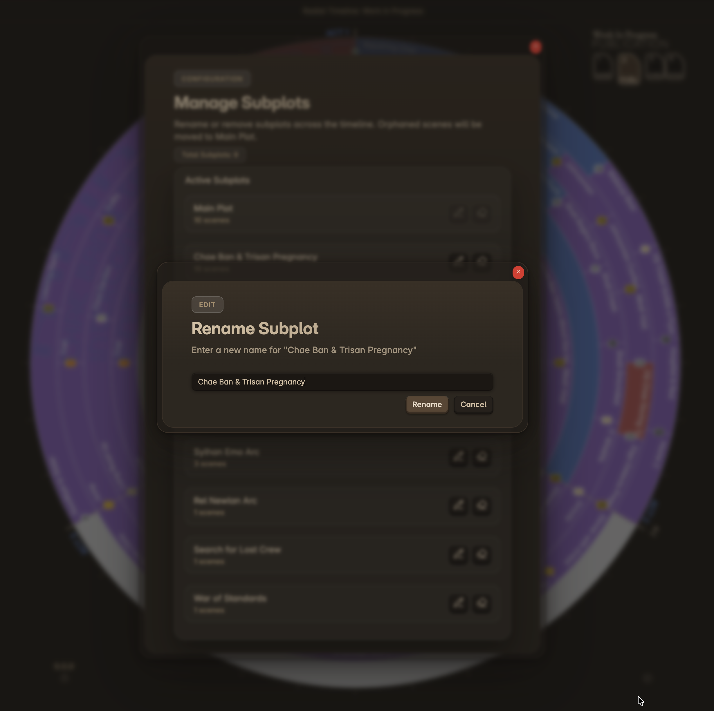

# Manage subplots

`Manage subplots` opens the subplot manager for bulk cleanup.

Use it when subplot names have drifted and you want to rename or remove them across the manuscript in one place.

  
  
Manage subplots — bulk rename or remove subplot labels

## What It Does

The manager lists active subplots with scene counts and gives you bulk actions:

*   **Rename** a subplot across scene files
*   **Remove** a subplot from the timeline

`Main Plot` is protected and cannot be renamed or deleted.

If you remove a subplot, scenes that only belonged to that subplot are moved to `Main Plot`.

## Related Docs

*   [Narrative Mode](Narrative-Mode)
*   [How to](How-to#manage-subplots-in-bulk)

