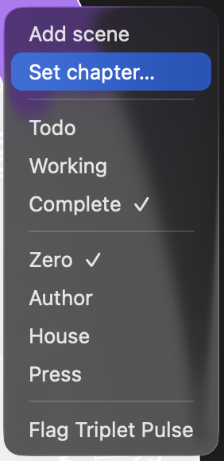
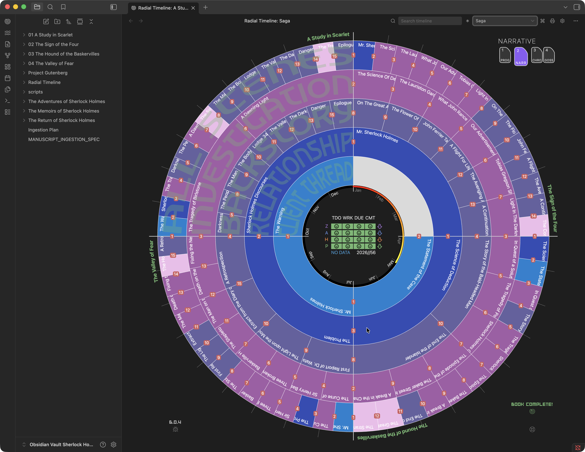

**Keyboard Shortcut**: `2`

Narrative Mode is your primary manuscript-order workspace. It displays all scenes from all subplots on the outer ring, organized by **act divisions** (default 3 acts, configurable in **Settings → Core → Acts**). Each act spans an equal segment of the 360° circle. This view emphasizes **Narrative time** (the order readers will experience the story). Status and progress stage overlays are hidden so the focus stays on story structure and subplot balance.

  

## Key Features

*   **Structure**: Scenes are distributed across Act 1..Act N (based on your **Settings → Core → Acts → Act count**).
*   **Book or Saga scope**: Switch between one active book and a combined Saga view.
*   **Subplot Colors**: The outer ring segments are colored by their subplot. This lets you quickly visualize which plot threads are dominant in each section of the book.
*   **Publishing markers**: Optional outer-ring placards can show chapter starts and part boundaries from your active novel PDF layout.
*   **Story Beats**: Displays story beats (like Save the Cat) along the timeline, helping you pace your narrative structure.
*   **Interactive Reordering**: You can drag scenes on the outer ring to reorder them. See [Reorder Scenes](How-to#reorder-scenes) for details.
*   **Scene right-click menu**: Add a scene after the current one, set a chapter marker, change Status, change Publish Stage, or flag it for Pulse — see below.
*   **Recent moves overlay**: Narrative Mode can show a top-left list of recent committed scene and beat moves. Toggle it in [Settings → Advanced → Configuration](Settings-Advanced#configuration).

## Scene Right-Click Menu

Right-click any scene on the timeline to open a context menu that lets you add a scene or update scene frontmatter without opening the note. The current value in each group is marked with a checkmark.

  
  
Scene right-click menu — Add scene, chapter markers, Status, Publish Stage, and Pulse actions

**Add scene** — inserts a new scene after the selected one, using that scene as the anchor for placement and context.

**Set chapter** — adds, edits, or clears the `Chapter:` marker on the selected scene. The modal previews current chapter containers so you can see how the marker affects the manuscript structure.

**Status** — set `Status` to **Todo**, **Working**, or **Complete**. When you mark a scene **Complete**, the `Due` date is automatically set to today, keeping the [Progress Mode](Progress-Mode) completion estimate and pace tracker accurate.

**Publish Stage** — set `Publish Stage` to **Zero**, **Author**, **House**, or **Press**. Useful for moving scenes through revision tiers without leaving the timeline.

**Flag Triplet Pulse** — sets `Pulse Update: Yes` on the scene so the next [Scene pulse analysis](Commands#scene-pulse-analysis-manuscript-order) run will reprocess it.

The timeline refreshes immediately to reflect the change.

## Book and Saga Scope

The title-bar book selector controls which manuscript the timeline shows.

*   Choose a book to inspect one Book Manager profile.
*   Choose **Saga** to combine all configured books into one multi-book Narrative timeline.
*   Saga scope is available when more than one Book Manager profile is configured.
*   Saga scope stays in Narrative Mode, because multi-book scene order is a narrative-structure view rather than a chronology or progress view.

  
  
Saga view in Narrative Mode — multiple books combined into one manuscript-order timeline

## Chapter and Part Placards

Narrative Mode can show publishing-aware placards on the outside of the scene ring:

*   **C** — a `Chapter:` field starts a chapter at that scene.
*   **P** — the selected PDF layout prints a Part opener at that act boundary.
*   **P/C** — a Part and Chapter begin at the same boundary.

These placards reflect the novel PDF layout selected in the Manuscript Export panel. For example, a layout that prints chapter openers can show **C** markers, while Signature can also show **P** markers for Parts. Changing the selected export layout updates the timeline markers after the layout is saved.

  
  
Publishing markers on the perimeter — chapter starts, part boundaries, and combined Part/Chapter breaks

## Dominant Subplots

When a scene belongs to multiple subplots, the outer All Scenes ring must choose one color. You control which subplot wins:

*   **Click a scene**: Sets its dominant subplot. That subplot's color is used for the scene on the outer ring, taking precedence over all others.
*   **Folded corner indicator**: Each subplot ring shows a small folded corner motif at its start. The corner has three states:
    *   **Missing** — the subplot is not assigned to this scene.
    *   **Gray** — the subplot is assigned but is not dominant.
    *   **Darker hue** of the subplot ring color — this subplot is dominant and expressed on the outer ring above all others.
