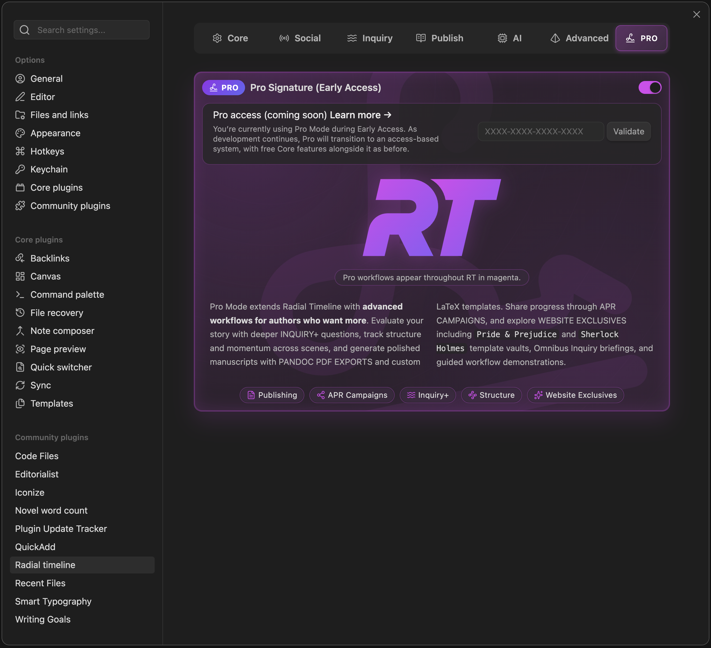

  
  
Settings → PRO

**Advanced workflows for authors who want more.**

Pro Mode extends Radial Timeline with deeper analysis, polished exports, campaign tools, and specialized visualization modes. The core writing experience remains free.

> **Early Access**: During the Open Beta, all Pro features are available free to early adopters. When paid licensing launches, early supporters may receive special perks.

---

## What Pro Adds

*   **Inquiry+** — more custom question slots. See [Settings → Inquiry](Settings-Inquiry) and [Inquiry](Inquiry).
*   **Runtime Estimation** — screen time, audiobook duration, and manuscript-length analysis. See [Runtime Estimator](Runtime-Estimator), [Chronologue Runtime](Chronologue-Mode#runtime-mode-pro), and [Settings → Core](Settings-Core#runtime-estimation).
*   **Advanced publishing layouts** — extra templates and deeper export customization. See [Publishing](Publishing) and [Manuscript Export](Manuscript-Export).
*   **Campaign Manager / Teaser Reveal** — multiple APR campaigns and staged public reveals. See [Author Progress Report](Author-Progress-Report).
*   **Website exclusives** — additional template vaults, guided materials, and related extras.

---

## Access

1. **Open Beta** — Pro is active by default during the beta period.
2. **Pro access key** — When paid licensing launches, enter your key in Settings → PRO to unlock Pro features.
3. **Core remains free** — The core writing, timeline, and analysis experience remains available without Pro.

Pro workflows appear throughout Radial Timeline in magenta.

---

*Questions or feedback? Visit [radial-timeline.com/feedback](https://radial-timeline.com/feedback)*
