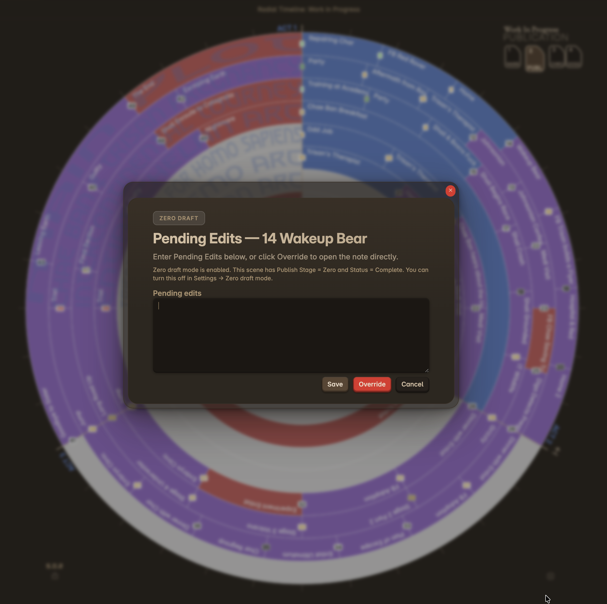

**Keyboard Shortcut**: `1`

Progress Mode isolates each subplot into its own radial pass, removing the combined outer ring. This mode focuses on **Author time** (your writing status) and **Progress stages** (revision stages), making it ideal for tracking workflow at a glance.

  

## Key Features

*   **Single Thread Focus**: View one subplot at a time to analyze its specific arc and continuity.
*   **Act Structure**: Like Narrative Mode, scenes are distributed across your configured act count (default 3). Each act spans an equal segment of the 360° circle.
*   **Cleaner View**: Removes story beats to reduce visual noise while you focus on workflow.

## Status & Progress Stage

Unlike Narrative Mode, this mode replaces subplot colors with your workflow status:

1.  **Author Status**:
    *   **Todo**: Solid light pink.
    *   **Working**: Pink, with an optional Hero Patterns plaid motif overlaid on top. The motif is customizable with the **Pro Signature Tier** — paste any pattern from [heropatterns.com](https://heropatterns.com) in Settings.
    *   **Overdue**: Red.
    *   **Complete**: Inherits the color of the scene Progress Stage.

2.  **Progress Stage Colors**:
    *   Once a scene is "Complete", it displays the color of its current stage (Zero Draft, Author's Draft, House Edit, Press Ready).
    *   These colors can be customized in [Progress stage colors](Settings-Core#progress-stage-colors).

Together, status and progress stage answer two questions:

*   **Status**: what is happening with this scene right now?
*   **Progress stage**: which draft or editing stage has this scene reached?

Together they turn the radial view into a project-management dashboard, highlighting what needs to be written, what is overdue, and what is ready for the next stage of editing.

## Zero Draft Mode

**Zero Draft Mode** is a guardrail against never-ending revision while you finish a first draft. When it is enabled, clicking a scene that has reached **Progress Stage = Zero** and **Status = Complete** opens a **Pending Edits** panel instead of the scene file, so you can jot down what to revise later without dropping back into the prose. Enable it in [Settings](Settings-Core), and capture revision ideas in the scene's `Pending Edits` field.

  
  
Zero Draft Mode — capture revision notes without reopening the scene

