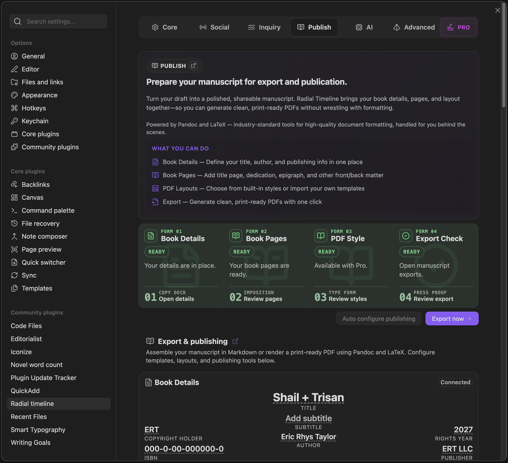

<div style="text-align: center; margin: 20px 0;">
  
  <div style="font-size: 0.85em; margin-top: 8px; color: #666;">Settings → Publish</div>
</div>

Radial Timeline turns your scene notes into a finished manuscript using **Pandoc** and **LaTeX**. You select a template that defines the look of the page — fonts, headers, chapter openers, part dividers — and the plugin assembles your scenes into that format and hands the result to Pandoc to produce a PDF.

**Core includes Pandoc-based PDF export.** Core users can export PDFs with the bundled Core publishing layouts. **Pro** extends that system with extra bundled PDF layouts and more advanced publishing customization.

This page covers:
- The template catalog (what's bundled and what each one looks like)
- Installing and duplicating templates
- Book Details, Book Pages, and inline LaTeX matter examples
- The `Chapter:` field — how you mark chapter breaks
- Parts — how they're generated from Acts
- Setting up **Signature** (advanced book-style structure)
- Act epigraphs, scene opener headings
- Export checks and template readiness
- Exporting

> **Prerequisites**: Pandoc installed, and LaTeX installed for PDF output. See [Setting Up Pandoc Export](Getting-Started#setting-up-pandoc-export) for the one-time install.

---

## Template Catalog

Bundled templates live in **Settings → Publish → PDF Styles**. Each row shows a status pill (**Installed** / **Not installed**), a preview card, and buttons for **Install** and **Duplicate**.

Core includes the standard publishing layouts needed for Pandoc PDF export. Pro adds additional advanced layouts and deeper publishing controls.

### Novel templates

| Template | Structure | Best for |
|---|---|---|
| **Basic** | Standard double-spaced submission format | Sending to agents / editors |
| **Standard** | Book-style with contemporary serif body, running headers, chapter openers | A finished book look with simple chapters |
| **Professional** | Literary book style with refined typography | Polished prose fiction |
| **Signature** | Full book structure — **Parts**, Chapters, act epigraphs, ornament scene breaks | Novels with act structure and multiple chapters per act |

The selected novel PDF layout also informs Narrative Mode publishing markers. Layouts that print chapters can show **C** placards on the timeline. Layouts that print Parts can show **P** placards at act boundaries.

<div style="text-align: center; margin: 20px 0;">
  
  <div style="font-size: 0.85em; margin-top: 8px; color: #666;">Narrative Mode perimeter markers — chapter starts, part boundaries, and combined Part/Chapter breaks</div>
</div>

PDF layouts require their intended fonts rather than substituting fallbacks. Bundled fonts are installed into `Radial Timeline/Pandoc/fonts/` when you install the PDF styles.

| Template | Font |
|---|---|
| **Basic** | Arial |
| **Standard** | Source Serif 4 |
| **Professional** | Sorts Mill Goudy |
| **Signature** | Latin Modern Roman |

### Other formats

| Template | Format |
|---|---|
| **Screenplay** | Industry-standard screenplay |
| **Podcast Script** | Audio script with structured cues |

---

## Installing a Template

1. Open **Settings → Publish → PDF Styles**.
2. Find the template you want in the list. If the pill says **Not installed**, click **Install**.
3. The plugin copies the template's `.tex` file into `Radial Timeline/Pandoc/` inside your vault and installs bundled fonts into `Radial Timeline/Pandoc/fonts/`. The pill changes to **Installed**.

Only installed templates can be used for export.

## Core and Pro Publishing Tiers

Settings → Publish is split around Core and Pro publishing work:

*   **Core** includes Pandoc setup, output folders, Book Details, Book Pages, bundled Core PDF layouts, and Auto configure publishing.
*   **Pro** adds advanced bundled layouts and deeper designed publishing controls.

The export panel and **Settings → Publish** use the same template access rules. If a Core user selects a Pro-only layout, Radial Timeline falls back to a supported Core layout instead of leaving the export blocked.

## Book Details and Matter Pages

**Auto configure publishing** is part of Core. It creates a Book Details note, optional inline LaTeX Book Pages examples, bundled PDF layout files, and required bundled fonts.

Standard Book Pages can render directly from Book Details. You do not need separate note files for title page, copyright, dedication, epigraph, acknowledgments, author note, about the author, or other works pages when the matching Book Details fields are filled in.

Use a standalone LaTeX matter note only when you want a custom page body:

```yaml
---
Class: Frontmatter
BodyMode: latex
---
```

Example body:

```latex
\begin{center}
\vspace*{0.32\textheight}
\begin{minipage}{0.72\textwidth}
\itshape This optional front matter page is rendered as raw LaTeX.

\vspace{0.8em}
\raggedleft\normalfont --- Attribution
\end{minipage}
\vfill
\end{center}
\newpage
```

Inline LaTeX examples keep their own page content and do not require Book Details values.

Auto configure publishing refreshes exact retired starter examples while preserving edited author files. If a matter note no longer matches the old bundled starter content, Radial Timeline treats it as author-owned.

## Duplicating a Template

Every bundled template has a **Duplicate** button next to Install. Duplicating copies the `.tex` into your vault under a new name (e.g., `rt_modern_classic-copy.tex`), gives it a new display name ("Signature Copy"), and leaves the original untouched.

Use Duplicate when you want to tweak a bundled template — change margins, swap a font, add a custom title page — without losing the original. The copy shows the same preview card as the bundled template and accepts edits to its `.tex` file directly in your vault.

## The `Chapter:` Field

The `Chapter:` YAML frontmatter field is how you tell the exporter "this is where a new chapter starts."

Add it to the first scene note that belongs to each chapter:

```yaml
---
Class: Scene
Chapter: The Homecoming
---
```

Key behaviors:

- **Scene notes only.** Publishing reads `Chapter:` from exported scene notes. Beat and Backdrop/context notes are not chapter anchors in the publishing pipeline.
- **First occurrence wins.** If five scenes share `Chapter: The Homecoming`, only the first one starts the chapter — the rest flow inside it.
- **Case-insensitive.** `Chapter`, `chapter`, `CHAPTER` all work.
- **Numbering is automatic.** You provide the title; the exporter supplies the number (`Chapter 1`, `Chapter 2`, …).

You do **not** need `Chapter:` on every scene. Only on the scene where a chapter begins.

---

## Parts — Derived from Acts

You don't type "Part I" anywhere. Parts are generated automatically from your **Acts**.

1. Set **Act count** in **Settings → Core → Acts** (e.g., 3). This is the canonical partition that also drives the timeline ring.
2. Set the `Act:` field on each scene (`Act: 1`, `Act: 2`, …). This is the same field the timeline reads to place the scene in its act segment, so what you see in the ring is what the export prints.
3. When the exporter crosses from Act 1 to Act 2, it emits a **Part II** divider page.

**Part ordering**: Part → Chapter → Scene.

- Part I contains all scenes whose `Act: 1` (with their chapters)
- Part II contains all scenes whose `Act: 2`
- Part III contains all scenes whose `Act: 3`

Not every template uses Parts. Only templates with `usesModernClassicStructure` (currently **Signature**) print Part divider pages. Simpler templates ignore act boundaries and flow straight through.

> Beats are not used to determine acts for export. The export reads each scene's own `Act:` field directly, the same way the timeline ring does, so Parts in the PDF always match the act partitioning you see in Narrative mode.

Narrative Mode can show these same publishing structures as outer-ring placards. See [Narrative Mode](Narrative-Mode#chapter-and-part-placards) for the UI behavior.

---

## Setting Up Signature

Signature is the most structured bundled template. It produces a book-style manuscript with:

- **Part openers** on their own page (with Roman numerals: I, II, III)
- **Optional act epigraphs** — a quote + attribution printed after each Part page
- **Numbered chapter openers** from your `Chapter:` fields
- **Ornament scene breaks** between scenes inside a chapter (instead of scene numbers/titles)
- **Suppressed scene headings** — scenes flow as continuous prose separated by a centered ornament

Here's the full setup, step by step.

### Step 1 — Install Signature

**Settings → Publish → PDF Styles → Signature → Install**

The template file writes to `Radial Timeline/Pandoc/rt_modern_classic.tex` in your vault.

### Step 2 — Set your Act count

**Settings → Core → Acts → Act count**

This is a global plugin setting (not a per-template one). Most novels use 3 acts; some use 4 or 5. Whatever you select here is the number of Parts your book will have.

### Step 3 — Make sure your scenes carry an `Act:` value

Signature generates Part breaks at every act-boundary transition in narrative order. It reads each scene's own `Act:` field directly (the same field the timeline ring uses to place the scene), so what you see partitioned in Narrative mode is exactly what gets printed as Parts.

If you used **Book Designer** to scaffold your manuscript, this is already set. Otherwise, check that every scene has a numeric `Act:` field (`1`, `2`, `3`, …) in its frontmatter.

See [Scene Properties](YAML-Frontmatter) for the full frontmatter schema.

### Step 4 — Add `Chapter:` markers

Decide where each chapter should begin. On the first scene of each chapter, add:

```yaml
Chapter: The Gathering Storm
```

You can have many chapters per act. There's no upper limit and no naming requirement — choose titles that fit your book.

### Step 5 — (Optional) Add act epigraphs

**Settings → Publish → PDF Styles → Signature** → click the **+** button at the end of the row to expand special options → **Act epigraphs**.

For each act, fill in:
- **Quote** — the epigraph text
- **Attribution** — source line (e.g., "— Ursula K. Le Guin")

Epigraphs are **per-book** (stored against your active book profile), so different books can have different epigraphs using the same template. Leave them blank and the Part pages print without any quote.

### Step 6 — Assign Signature to the Novel format

Open the export panel (Command Palette → **Manuscript export**). In the template dropdown for Novel, choose **Signature**. The plugin remembers your last selection for next time.

### Step 7 — Export

Command Palette → **Manuscript export** → choose your options → **Export**.

The exporter:
1. Walks the timeline in narrative order.
2. Emits a **Part** divider every time a new act begins (with epigraph if you filled one in).
3. Emits a **Chapter** opener every time a new `Chapter:` value appears.
4. Emits scene prose separated by ornaments inside each chapter.
5. Hands the assembled markdown to Pandoc, which produces a PDF.

Output goes to `Radial Timeline/Export/` by default. The export destination is shown in **Settings → Advanced → Configuration**.

### Minimum viable Signature manuscript

The smallest setup that produces a valid Signature PDF:

- Signature **Installed**
- **Act count** set (default 3 is fine)
- At least one scene with an `Act:` field (`1`, `2`, …) — and one transition to a higher Act if you want a Part II
- At least one scene (anywhere) with a `Chapter:` value

Epigraphs, extra chapters, and multi-act structure are all optional refinements.

---

## Scene Opener Heading Options

Templates that have the **Scene opener heading options** capability let you choose how scene titles appear at the start of each scene. Available modes:

- **Scene number** — just the number (`3` or `Scene 3`)
- **Scene number + title** — `3 — Opening Beat` (default)
- **Title only** — `Opening Beat` (no number)

Find this in **Settings → Publish → PDF Styles → [template] → +** (expand) → **Scene openers**.

**Signature ignores this setting** because it doesn't print scene headings — scenes are separated by ornaments and carry no label. If you want labeled scene openers, use Basic, Standard, or Professional.

---

## Exporting a Manuscript

**Command Palette → Manuscript export**

The export panel lets you:
- Select the output format (Novel, Screenplay, Podcast Script)
- Choose the template for that format
- Select which scenes to include (all, or filtered by act/subplot)
- Toggle Markdown-only vs. PDF
- Review export checks for missing templates, missing fonts, template compatibility, and layout-specific warnings
- Preview the selected layout's page structure before generating a PDF

Files land in `Radial Timeline/Export/` unless you've set a custom export folder.

For the end-to-end export workflow and troubleshooting (Pandoc install, LaTeX issues), see [Export Workflow](Getting-Started#exporting-a-manuscript).

---

## Troubleshooting

**Template shows "Not installed" after I clicked Install.** The `.tex` file couldn't be written — check that `Radial Timeline/Pandoc/` exists and is writable.

**Parts don't appear in my Signature export.** Parts only emit when scenes cross an act boundary. Check that your scenes have `Act:` values in their frontmatter and that more than one act is represented in the selection.

**Chapter numbering is wrong.** The exporter numbers chapters by the order `Chapter:` values appear in the timeline. If a `Chapter:` value appears out of order, renumbering will reflect that. Check narrative order via [Timeline Modes](Radial-Timeline-View#modes-at-a-glance).

**Duplicated template looks different from the original.** If you're on an older plugin build, duplicates lost their preview card due to a bug. Update to the latest build — duplicates now render with the same preview card as the original and can be edited in place.

**Epigraph fields are greyed out.** Epigraphs are per-book. Make sure you have an **active book** selected before editing them.

**Export checks say a bundled font is missing.** Click **Install fonts** or **Install all** in Settings → Publish. Bundled layouts use exact fonts; Radial Timeline does not silently substitute a different body font.
