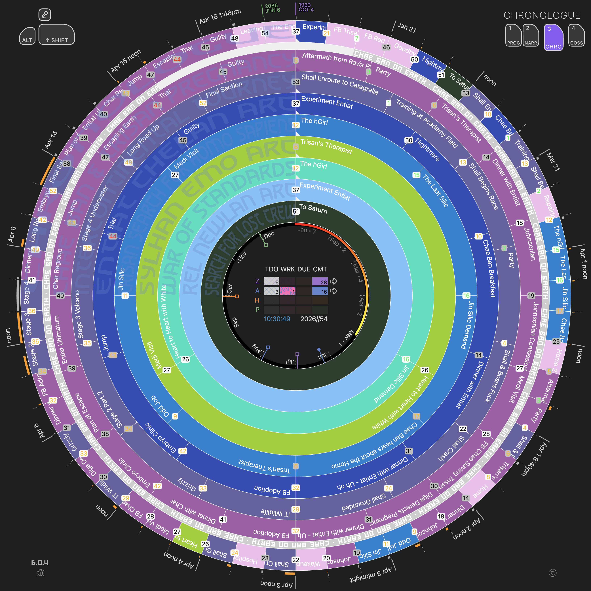
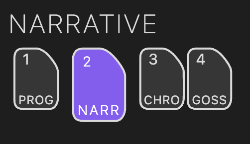

  
  
Radial Timeline View — shown in Chronologue mode

The Radial Timeline View is the main authoring and analysis workspace in Radial Timeline. It is where you work directly with scenes, subplots, chronology, beats, and scene-level AI feedback.

**Open**: Command palette → **`Radial Timeline: Open`**, or click the shell icon in the ribbon.

## Overview

A radial manuscript workspace with four modes:

| Mode | Key | Focus |
| :--- | :--- | :--- |
| **[Progress](Progress-Mode)** | `1` | Writing status and revision stages |
| **[Narrative](Narrative-Mode)** | `2` | Manuscript order and subplot structure |
| **[Chronologue](Chronologue-Mode)** | `3` | Story-world chronology and duration |
| **[Gossamer](Gossamer-Mode)** | `4` | Beat-level scoring and comparison |

  
  
Mode navigation in the Radial Timeline View

## What You Can Do

*   write and reorganize scenes
*   switch between one book and Saga scope from the title-bar book selector
*   compare subplot balance and structure
*   check chronology and elapsed time
*   score beats and compare Gossamer runs
*   review scene-level AI feedback via [AI Pulse Triplet Analysis](AI-Pulse-Analysis)

## Modes At A Glance

### Progress Mode (`1`)
Isolates each subplot into its own unitary radial pass — no combined outer ring — so you can focus on one thread at a time. Scenes inherit the author workflow palette (Todo plaid, Working pink, Overdue red, Complete = progress-stage color) along with progress-stage indicators. Removes story beats for a cleaner view. Structured around your configured **act count** (default 3) with acts spanning equal segments of the 360° circle. Emphasizes **Author time** (writing status) and **Progress stages** (revision stages). Press `1` to cycle between subplots.

### Narrative Mode (`2`)
Shows all scenes from all subplots on the outer ring with story beats and subplot color-coding. Structured around your configured **act count** (default 3) with scenes organized by act divisions (360° divided evenly across acts). Your primary manuscript-order workspace showing **Narrative time** (reading order). Status/progress overlays are hidden so subplot colors remain dominant.

**Interactive reordering**: drag scenes on the outer ring. See [Reorder Scenes](How-to#reorder-scenes).

**Tip**: For scenes in more than one subplot, click on a scene to make that subplot dominant in the outer ring color. The folded-corner motif at the start of each subplot ring shows the state: missing (not assigned), gray (assigned but not dominant), or a darker hue of the subplot color (dominant and expressed on the outer ring).

See [Narrative Mode](Narrative-Mode) for Saga scope, chapter/part placards, and dominant subplot behavior.

### Chronologue Mode (`3`)
Displays scenes in chronological story order based on `When`. **Removes act divisions** entirely — scenes are positioned across the full 360° circle based solely on when they occur in your story's timeline. Color styling mirrors Narrative mode (subplot colors only) to keep time comparisons clean.

Three sub-modes for deeper temporal analysis:

*   **Shift** (press `Shift`, use `Caps Lock`, or click the button) — gray wireframe revealing the chronological backbone. Click scenes to measure elapsed time and spot discontinuity gaps.
*   **Alt** (press `Alt`) — planetary wireframe overlay translating Earth dates into your active local time profile.
*   **Runtime** ✦ Pro (click the `RT` button) — blue wireframe showing scene runtime duration arcs instead of elapsed story time.

Additional features: discontinuities marked with ∞, smart duration labels, dynamic duration arc cap.

### Gossamer Mode (`4`)
Visualizes beat-level scoring across your active story beat system. Supports **Momentum**, **Tension**, **Activity**, and **Interiority**, with saved run history and a top-left plots panel for switching signals and comparing runs.

## Book Selector

The tab title bar includes a book selector. Choose an individual Book Manager profile to focus the timeline on one manuscript, or choose **Saga** to view all configured books together in Narrative Mode.

  
  
Tab title bar actions — book selector, mode controls, and quick view actions

See [Narrative Mode](Narrative-Mode#book-and-saga-scope) for Saga behavior and limits.
