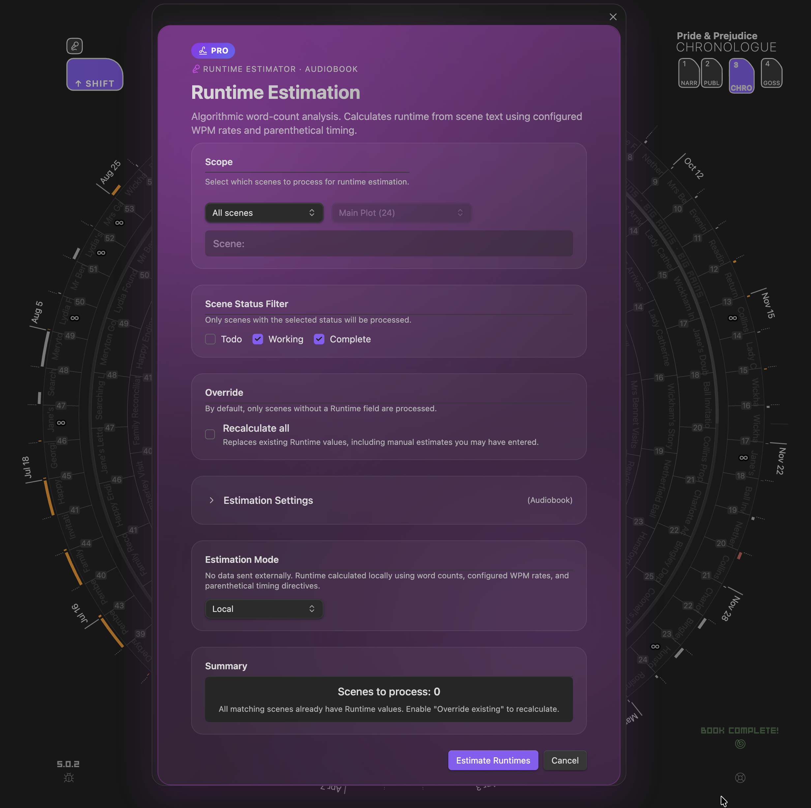

# Runtime estimator

`Runtime estimator` opens the runtime estimation modal.

Use it when you want duration estimates for scenes, books, or selected scopes.

  
  
Runtime estimator — choose scope and profile for duration estimates

## What It Supports

Runtime estimation can be used for:

*   novels
*   audiobooks
*   screenplays

The modal works with runtime profiles and can estimate duration across different scopes and filters.

This command is only available when **Pro** is active.

## Related Docs

*   [Pro](Pro#runtime-estimation)
*   [Runtime](Chronologue-Mode#runtime-sub-mode)

