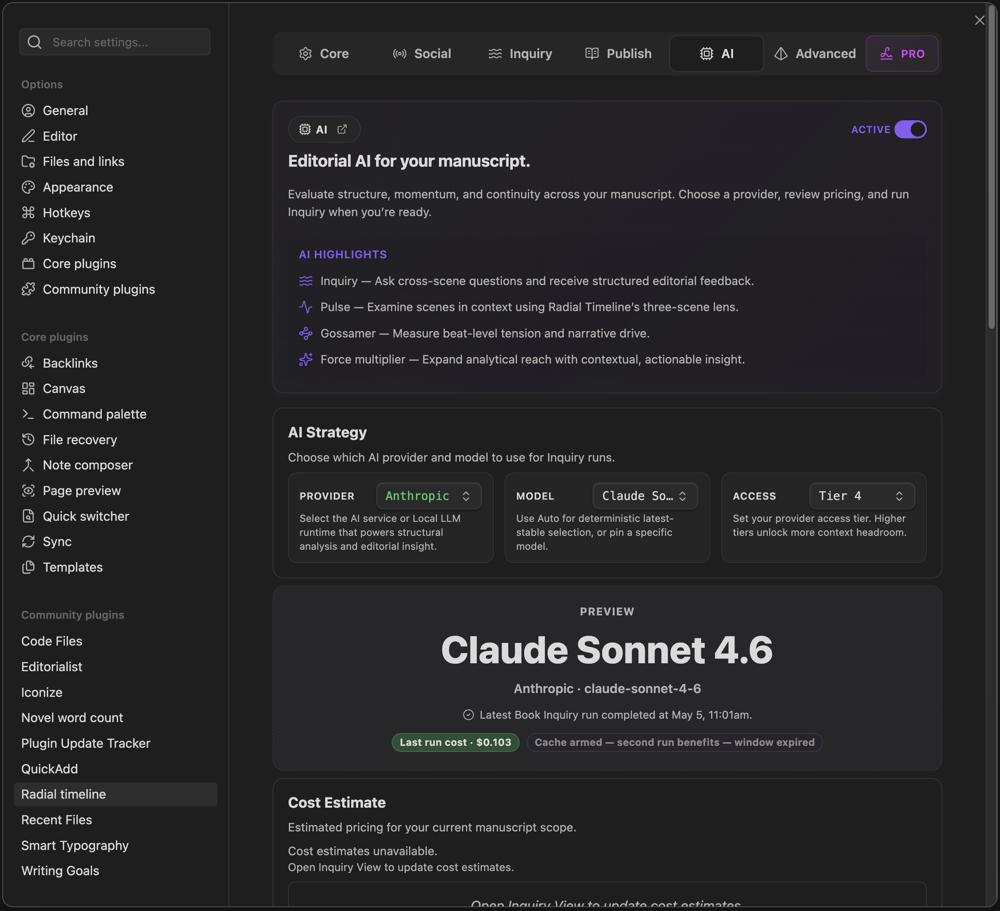

  
  
Settings → AI

The AI tab controls provider setup, model selection, prompt framing, cost awareness, and the defaults used by Inquiry, Pulse, Gossamer, and Summary Refresh.

## AI Toggle

*   **Enable AI LLM features**: Turns AI-driven commands and scene-analysis UI on or off. Disabling AI hides those surfaces but does not delete existing note properties.

## AI Strategy

This is the main routing section for cloud and local AI.

*   **Provider**: Choose **Anthropic**, **OpenAI**, **Google**, or **Local LLM**.
*   **Model**: Leave it on the latest stable lane or pin a specific model.
*   **Access**: Set the tier that your provider account has granted you. These tiers are applied for and approved by the provider, then reflected here for context limits and capability headroom.
*   **Cost Estimate**: Shows estimated Inquiry pricing for your current manuscript scope.
*   **What gets sent to the AI**: Breakdown cards for Inquiry and Gossamer so you can see the rough corpus, prompt, output, and processing footprint.

## Role Context

*   **AI prompt role & context template**: Controls the shared editorial framing used across AI features.
*   **Manage context templates**: Use the gear button to edit templates and switch the active one.

## API Keys

Provider API keys are configured here.

*   Keys are validated against the selected provider.
*   Saved keys show a live status such as **Ready**, **Not configured**, **Key rejected**, or **Provider validation failed**.
*   When supported by the current Obsidian build, Radial Timeline uses secure key storage instead of plain-text settings fields.

## Configuration

These settings control AI feature defaults rather than provider identity.

### Inquiry

*   **Enable citations (temporarily unavailable)**: Strict provider-level inline citations are still paused.
*   Inquiry currently uses a looser partial-citation path instead, centered on per-finding evidence quotes and Sources blocks in the result view.

### Timeline Display

*   **Pulse context**: Include previous and next scene analysis in the scene hover reveal.
*   **Synopsis max words**: Base target for stored Synopsis generation.

### Summary Refresh Defaults

*   **Target summary length**: Default word target when opening Summary Refresh.
*   **Treat summary as weak if under**: Default threshold for selecting scenes as weak/stale in the Inquiry View Corpus model.
*   **Also update Synopsis**: When enabled, Summary Refresh also rewrites `Synopsis` using the configured cap.

## Logging

*   **Log AI interactions to file**: Saves AI request and response diagnostics to the AI output folder.

---

## Local LLM

Choose **Provider → Local LLM** when you want to use a local runtime such as Ollama, LM Studio, or another OpenAI-compatible server.

### Local LLM Configuration

*   **Local server**: Select the runtime behind the Local LLM path.
*   **Base URL**: Endpoint for the selected server.
*   **Manual model ID (fallback)**: Only use this when automatic model discovery cannot find the model you want.

### Local LLM Status And Validation

This section is the health check for local AI.

*   **Load Servers**: Detect available local runtimes.
*   **Load Models**: Query the selected runtime for installed models.
*   **Validate Local LLM**: Run connection and capability checks.
*   The status area reports connection, model availability, validation state, and rough capability strength.

### Why Pulse Is Strict For Local LLM

Pulse is more demanding than a simple one-shot text task.

It sends the **previous**, **current**, and **next** scenes together, then expects clean structured output that Radial Timeline can parse into scene hover properties. That means a local model has to do both of these reliably:

*   handle a larger three-scene prompt without falling apart
*   return stable structured output instead of chatty or malformed output

That is why Local LLM support can be limited for Pulse even when a model works fine for lighter tasks. For now, Pulse is most reliable with the hosted providers.

### Recommended Use

*   Use **Anthropic**, **OpenAI**, or **Google** when you want the most reliable Pulse and Inquiry behavior.
*   Use **Local LLM** when you want private/local experimentation, summary work, lighter editorial tasks, or compatibility testing against your own runtime.
