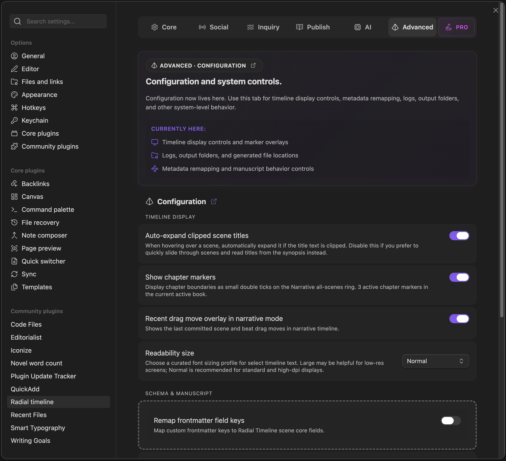

  
  
Settings → Advanced

The Advanced tab holds lower-level system and workflow controls.

## Configuration

Advanced is currently grouped into three areas:

### Timeline Display

*   **Auto-expand clipped scene titles**: Automatically expands truncated scene titles on hover.
*   **Show chapter markers**: Displays chapter boundaries on the Narrative all-scenes ring and reports how many active chapter markers exist in the current book.
*   **Recent drag move overlay in narrative mode**: Shows the last committed scene and beat drag moves.
*   **Readability size**: Switches curated timeline text sizing between `Normal` and `Large`.

### Schema & Manuscript

*   **Remap frontmatter field keys**: Map custom frontmatter keys to Radial Timeline scene core fields.
*   **Manuscript ripple rename**: Normalizes scene and active-beat filename prefixes after drag reorder. Scenes stay integer-numbered; beats use decimal minors.

### Logs

*   **AI output folder**: Readout of the main RT logs location.
*   **Export folder**: Readout of the manuscript/export destination.
*   **Enable AI content logs**: When enabled, full prompts, materials, and API responses are written as content logs.
