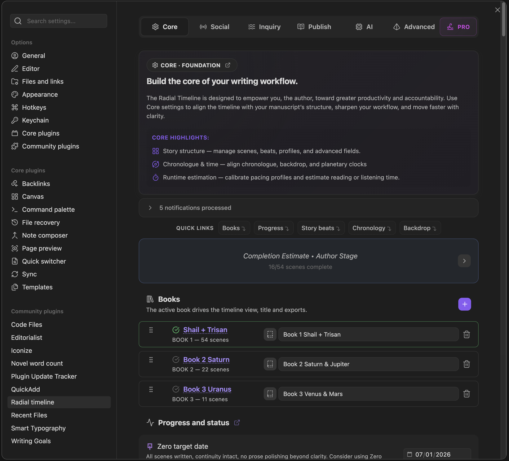

  
  
Settings → Core

The Core tab is the main structural control center for Radial Timeline. It covers book profiles, progress tracking, runtime estimation, story beats, scene properties, chronology, POV, planetary time, and ring colors.

## Books

*   **Book profile manager**: Create one profile per book, set the title, and link each profile to its manuscript folder.
*   **Active book**: The active book drives the timeline view, central title, and exports.
*   **Linked folder**: Each book profile stores its own folder path. That is where Radial Timeline looks for that book's notes.
*   **Project metadata**: Add optional genre, project stage, public label, and description.
*   **Scene count**: Each book card shows how many `Class: Scene` notes are currently found in that folder.
*   **Reorder books**: Drag books to control saga order.
*   **Create draft**: Make a sibling draft copy of a book folder and add it as a new book profile.
*   **Remove profile**: Deletes the profile only. It does not delete files.

## Progress And Status

Manage your project milestones and status tracking.

**Stage target dates:**

*   **Zero target date**: Target completion date for the Zero Draft stage (`YYYY-MM-DD`).
*   **Author target date**: Target completion date for the Author's Draft stage. Must be after the Zero target date.
*   **House target date**: Target completion date for the House Edit stage. Must be after the Author target date.
*   **Press target date**: Target completion date for the Press Ready stage. Must be after the House target date.

Target dates are validated to ensure proper stage ordering. Overdue dates are highlighted in red. Each stage has its own color-coded marker on the timeline.

*   **Show completion estimate**: Toggles the predicted completion tick mark on the timeline.
*   **Zero draft mode**: A focused mode for first-draft writing. Intercepts clicks on scenes with `Publish Stage = Zero` and `Status = Complete` to open a `Pending Edits` panel instead of the full note.

**How the completion estimate works**

*   Scope: Only the active stage (highest stage with any incomplete scenes). Other stages do not affect pace or remaining.
*   Total scenes for the active stage: `max(unique stage scenes, highest scene number seen anywhere)`. This lets an early high-numbered scene (for example, `Scene 70`) set a floor even if few notes exist.
*   Remaining: Total - Completed (stage-scoped, deduped by path, clamped to `>= 0`).
*   Date: Requires at least 2 completed scenes in the window for a confident pace. With fewer, the geometry stays but the label shows `?`.
*   Pace window: The estimate uses completions from the last 30 days.
*   Staleness colors: fresh (`<= 7d`), warn (`8-10d`), late (`11-20d`), stalled (`>20d` or no pace/insufficient samples, red `?`).

> [!NOTE]
> Learn more in [Workflow Overview](Getting-Started#daily-workflow) and [Progress Mode](Progress-Mode).

## Sessions

Sessions is a Core workflow for writing accountability and basic planning.

*   **Average drafting pace**: Optional words-per-minute estimate for new drafting. Used for writing-time estimates and completion planning.
*   **Daily session target**: Optional minutes you realistically want to write each day. Used to estimate session counts and calendar time.
*   **Daily word target**: Optional typed-word target for writing sessions.
*   **Session goal mode**: Choose whether the session control and writing stats track time, typed words, or both.
*   **Writing stats**: A collapsible local stats panel summarizes today, the last 7 days, and the last 30 days from timer records and scene completion dates.
*   **Timeline count/session button**: The compact title-bar button opens the writing-session popover. Start an open-ended session or a countdown sprint, then pause, resume, stop, or discard it there.
*   **Session ring**: While a session is active, a thin timer ring appears just outside the rainbow progress ring. It fills toward the active time or word target.
*   **Save session details**: Saving a timer session opens a confirmation modal for minutes, words added, scenes completed, pages edited, and an optional note.

Runtime and export tools may read these values, but Sessions owns the writing/session estimate settings.

Scene completion stats use scenes with `Status = Complete` and a `Due` date. `Publish Stage = Zero` counts as fresh scene completion; `Author`, `House`, and `Press` count as revision rounds.

## Runtime Estimation

Runtime estimation is a Pro workflow configured from the Core tab.

*   **Enable runtime estimation**: Activates runtime calculations for scenes and the Chronologue Runtime sub-mode.
*   **Default runtime profile**: The profile used when no per-scene override is set.
*   **Edit profile**: Manage multiple profiles with different settings for various project types.
*   **Profile label**: Display name shown in selectors and the runtime panel.
*   **Content type**: Choose between Novel/Audiobook (unified narration pace) or Screenplay (separate dialogue/action pacing).

**Screenplay mode settings:**

*   **Dialogue words per minute**: Reading speed for quoted dialogue (default 160).
*   **Action words per minute**: Reading speed for scene descriptions (default 100).
*   **Parenthetical timings**: Seconds added for screenplay directives such as `(beat)`, `(pause)`, `(long pause)`, `(a moment)`, `(silence)`.

**Novel/Audiobook mode settings:**

*   **Narration words per minute**: Reading pace for all content (default 150).

> [!NOTE]
> See [Pro](Pro) for the full runtime workflow and [Runtime](Chronologue-Mode#runtime-mode-pro) for the visualization.

## Story Beats System

Configure the structural pacing guide for your story.

*   **Story beats system**: Select a preset structure (**Save The Cat**, **Hero's Journey**) or choose **Custom**.
*   **Custom story beat system editor**: Name your beat system, add beats, assign each beat to an act, and drag to reorder.
*   **Create beat notes**: Generate beat notes in the active book folder.
*   **Beat filename numbering**: Generated beat notes use decimal minor prefixes (for example, `7.01 Midpoint.md`) so scene integer slots remain canonical.
*   **Repair beat notes**: Updates frontmatter (`Act`, `Beat Model`, `Class`) only. Does not rename files.
*   **Beat properties editor**: Customize additional beat properties and choose which fields appear in beat hover metadata. Stored per beat system.
*   **Saved sets**: Save and switch between multiple custom beat systems.

> [!NOTE]
> Learn more in [Gossamer Mode](Gossamer-Mode) and [Beat Audit + Heal](Beat-Audit-Heal).

## Acts

Configure the high-level structure of your narrative ring.

*   **Act count**: Sets the number of acts (minimum 3). This divides the Progress, Narrative, and Gossamer rings.
*   **Act labels**: Optional custom names for your acts.
*   **Show act labels**: Toggle to hide labels and show only act numbers.

> [!NOTE]
> See [Narrative Mode](Narrative-Mode) for how acts render in the timeline.

## Scene Properties

Manage the scene note properties that Radial Timeline maintains and shows in hover metadata.

*   **Core properties**: Always included in scene notes and maintained automatically.
*   **Advanced properties**: Optional scene note properties you can enable, edit, and reveal in hover.
*   **Scene hover preview**: Preview how enabled scene note properties appear in hover metadata.
*   **Scene note maintenance**: Check notes, add missing properties, add missing IDs, reorder maintained properties, and clean up duplicate IDs.

Important behavior:

*   RT-maintained scene normalization only manages the **core** and current **advanced** scene-property fields.
*   External or foreign YAML properties from other plugins or your own custom workflows are **not deleted** by scene-property maintenance.
*   During reorder, foreign keys stay anchored to the RT-managed item directly above them instead of being dumped into a generic end block.
*   **Remap frontmatter field keys** now lives in [Settings → Advanced → Configuration](Settings-Advanced#configuration).

> [!NOTE]
> Use [Scene Properties (Core + Advanced)](YAML-Frontmatter) for the full schema and examples.

## Chronologue Mode Settings

Configure the time-based visualization of your story.

*   **Chronologue duration arc cap**: Determines the maximum duration used for scaling the duration arcs. Can be `Auto` or a specific timeframe.
*   **Discontinuity gap threshold**: Controls the sensitivity of the Shift sub-mode. When the gap between scenes exceeds this threshold, an infinity symbol appears.
*   **Default Chronologue display**: Choose whether Chronologue opens in the standard Earth timeline or jumps straight to the Planet Calendar view when planetary time is enabled and a valid profile is active.

> [!NOTE]
> Read more in [Chronologue Mode](Chronologue-Mode).

## Point Of View

Control how narrative perspective is visualized.

*   **Global POV**: Sets a default POV mode for the entire project.
*   **Scene level YAML overrides**: Override the global default on a per-scene basis using the `POV` YAML key.

> [!NOTE]
> See [POV Keywords](YAML-Frontmatter#pov-keywords).

## Planetary Time

Configure custom calendars for sci-fi and fantasy worlds.

*   **Enable planetary time**: Activates planetary time conversion features.
*   **Active profile**: Selects which custom calendar profile is currently active.
*   **Profiles**: Create and edit profiles with day length, year length, epoch offsets, and custom month/day names.

> [!NOTE]
> See [Planetary Calendar](Chronologue-Mode#alt-sub-mode).

## Backdrop And Micro-backdrops

Configure the Chronologue backdrop ring and micro-backdrop rings.

*   **Show backdrop ring**: Display the backdrop ring in Chronologue mode.
*   **Micro backdrops**: Create thin ring segments with a title, color, and date range for eras, seasons, or milestones without creating full backdrop note files.

> [!NOTE]
> See [Backdrop](Chronologue-Mode#backdrop-notes-and-micro-backdrop-rings).

## Working Patterns

*   **Working patterns**: The pattern library used for scenes whose `Status` is `Working`.
*   **Working pattern**: Choose the live motif used on the timeline for `Working` scenes.
*   **Custom patterns**: Pro adds a custom-pattern editor for author-defined motifs.

## Progress Stage Colors

*   **Progress stage colors**: Customize the colors used for the progress stages (`Zero`, `Author`, `House`, `Press`).

## Subplot Ring Colors

*   **Subplot ring colors**: Customize the 16-color palette used for subplot rings.
