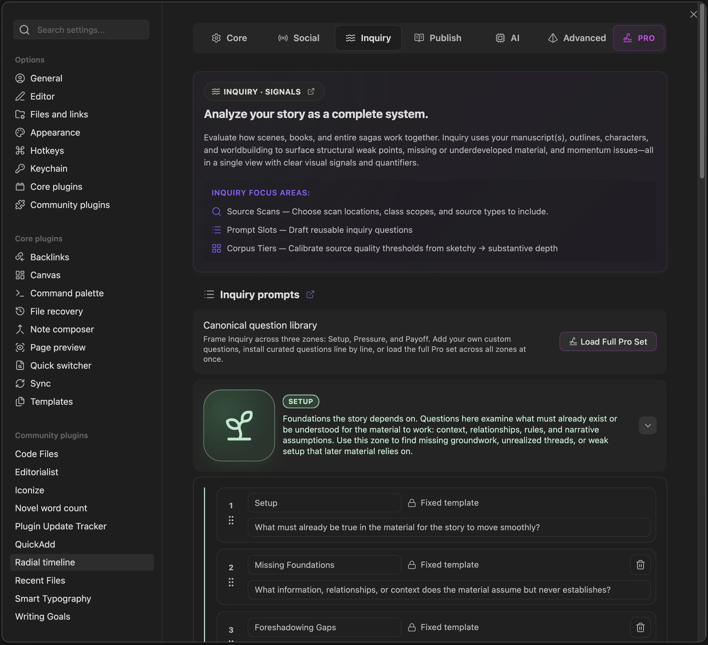

  
  
Settings → Inquiry

The Inquiry tab controls how Inquiry scans your vault, saves briefings, writes action notes, and manages prompts and corpus thresholds.

For the operating guide to the Inquiry View itself, see [Inquiry](Inquiry).

## Briefings And Auto-save

*   **Briefing folder**: Where Inquiry markdown briefings are stored when auto-save is enabled (default `Radial Timeline/Inquiry/Briefing`).
*   **Embed JSON payload in briefings**: Includes the validated Inquiry JSON payload in the saved briefing.
*   **Auto-save Inquiry briefings**: Save a briefing automatically after each successful Inquiry run.

## Action Notes

*   **Write Inquiry action notes to scenes**: Append Inquiry action notes to the target YAML field on hit scenes.
*   **Action notes target YAML field**: Frontmatter field to receive Inquiry action notes (default `Pending Edits`).

## Inquire Session History

*   **Inquire session history**: Controls Inquiry View rehydration only. It does not affect saved Inquiry Briefs.
*   **Remember up to**: Select how many recent sessions to keep for Inquiry View rehydration (10, 30, 60, or 100; max 100).

## Inquiry Sources

*   **Inquiry class scope**: Limit which YAML classes Inquiry can scan (use `/` to allow all classes).
*   **Inquiry scan folders**: Limit scans to specific vault paths. Supports wildcards and `/` for vault root.
*   **Class enablement & scope**: Toggle which classes are scanned and whether they apply to Book and/or Saga scopes.

### How Inquiry Identifies Books

Inquiry uses the book profiles you configure in **Settings -> Core -> Books**.

Each book profile contributes one book folder to Inquiry. In **Book** scope, Inquiry uses the active book profile. In **Saga** scope, it can scan across the included book profiles together.

**Inquiry scan folders** are separate. They add support material and other configured vault paths, but they are not the main way books are defined.

## Inquiry Prompts

*   **Default prompts**: Built-in prompt slots for Setup, Pressure, and Payoff zones.
*   **Custom questions**: Add and reorder custom prompts per zone. Pro unlocks extra slots.

> [!NOTE]
> The behavior of these prompts in the live view is documented in [Inquiry](Inquiry#prompts).

## Corpus (CC)

*   **Thresholds**: Tune the word-count tiers (`Empty`, `Sketchy`, `Medium`, `Substantive`) used in Corpus cards.
*   **Highlight completed docs with low substance**: Flags completed notes that remain in `Empty` or `Sketchy` tiers.

> [!NOTE]
> See [Corpus & Material Modes](Inquiry#corpus-material-modes) for how Inquiry uses these settings in actual runs.
