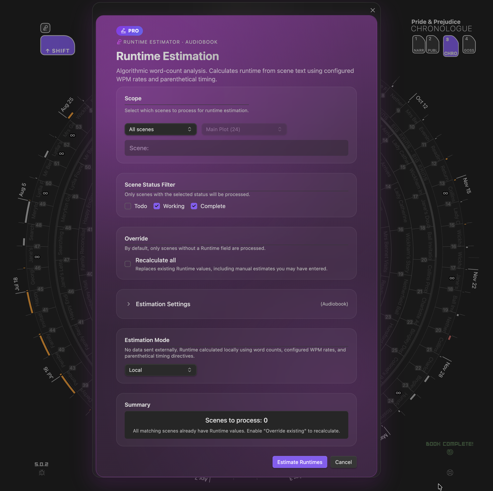

# Signature · Pro Features

**Professional tools for serious writers.**

Radial Timeline's Signature tier unlocks advanced capabilities designed for professional workflows: runtime estimation, premium exports, campaign tools for Author Progress Reports, and specialized Chronologue visualization modes.

> **Early Access**: During the Open Beta, all Pro features are available free to early adopters. Your feedback shapes the future of Radial Timeline. When paid licensing launches, early supporters may receive special perks.

---

## Runtime Estimation

  
  
Runtime Estimator — select mode and scope for duration analysis

*Estimate screen time, audiobook duration, and manuscript length with precision.*

Runtime Estimation analyzes your scenes to calculate realistic duration estimates for different content types. Create multiple profiles for different projects or formats.

**Capabilities:**
- **Screenplay mode** — Separates dialogue and action line pacing, with parenthetical timing for (beat), (pause), (long pause), (a moment), and (silence)
- **Novel/Audiobook mode** — Unified narration pace calculation for prose content
- **Custom word rates** — Fine-tune words-per-minute for dialogue, action, and narration
- **Session planning** — Track drafting speed and daily writing minutes for completion projections
- **Scene hover metadata** — Runtime estimates appear in scene hover tooltips
- **Chronologue integration** — Duration arcs visualize scene length in the timeline

**Explicit duration patterns** are always parsed when found in your scene content:
- `(30 seconds)` or `(30s)`
- `(2 minutes)` or `(2m)`
- `(runtime: 3m)`
- `(allow 5 minutes)` — for demos, podcasts, presentations

> **Settings**: [[Settings#runtime-estimation]]

---

## Pro Exports

*Generate production-ready manuscripts via Pandoc.*

Export your manuscript in professional formats using customizable Pandoc templates. Configure paths for your local Pandoc installation and assign templates per format.

**Supported formats:**
- **Screenplay** — Industry-standard screenplay formatting
- **Podcast Script** — Structured audio content with timing
- **Novel Manuscript** — Standard submission format for prose

**Configuration:**
- Primary and fallback Pandoc binary paths
- Custom LaTeX templates per format
- Output to your AI folder alongside analysis files

> **Settings**: [[Settings#professional]]

---

## Campaign Manager and Teaser Reveal

*Run multiple Author Progress Report (APR) campaigns and reveal your timeline over time.*

Campaign Manager lets you manage multiple APR configurations for different platforms (Kickstarter, Patreon, newsletter, website) with independent schedules and export targets. Teaser Reveal adds a progressive reveal system that exposes more detail as your completion percentage rises.

**Capabilities:**
- **Multiple campaigns** - Separate refresh schedules, export sizes, and embed paths per platform
- **Update frequency** - Manual, Daily, Weekly, or Monthly auto-updates
- **Refresh alerts** - Custom reminder thresholds for manual campaigns
- **Manual reveal options** - Toggle acts, subplots, status colors, and percent display when Teaser Reveal is disabled
- **Teaser Reveal presets** - Slow (15/40/70), Standard (10/30/60), Fast (5/20/45), or custom thresholds

> **Settings**: [[Settings#social-media]]

---

## Chronologue Runtime Sub-mode

*Visualize scene duration in the chronological timeline.*

The Runtime sub-mode is one of three sub-modes within Chronologue mode. It replaces elapsed story time with runtime duration arcs. Toggle it using the **RT** button in Chronologue mode.

**Features:**
- **Blue wireframe overlay** — Distinct from the Shift sub-mode (gray) and Alt sub-mode (red)
- **Duration arcs** — Arc length represents estimated runtime, not story elapsed time
- **Runtime cap slider** — Adjust the maximum arc size to emphasize shorter or longer scenes
- **Scene selection** — Click scenes to compare their runtime visually

**Usage:**
1. Enable Runtime Estimation in Settings → Pro
2. Switch to Chronologue mode (keyboard **3**)
3. Click the **RT** button to enter the Runtime sub-mode
4. Adjust the cap slider to tune visualization

> **Sub-mode details**: [[Chronologue-Mode#runtime-mode-pro]]

---

## Getting Started

1. **Configure Runtime Estimation** — Go to Settings → Pro and enable Runtime Estimation. Create profiles for your content types.
2. **Set up Pandoc** (optional) — If you want Pro Exports, configure your Pandoc path in Settings → Pro.
3. **Explore the Chronologue Runtime sub-mode** — Switch to Chronologue and click the RT button to visualize scene durations.

---

*Questions or feedback? Visit [radial-timeline.com/feedback](https://radial-timeline.com/feedback)*
