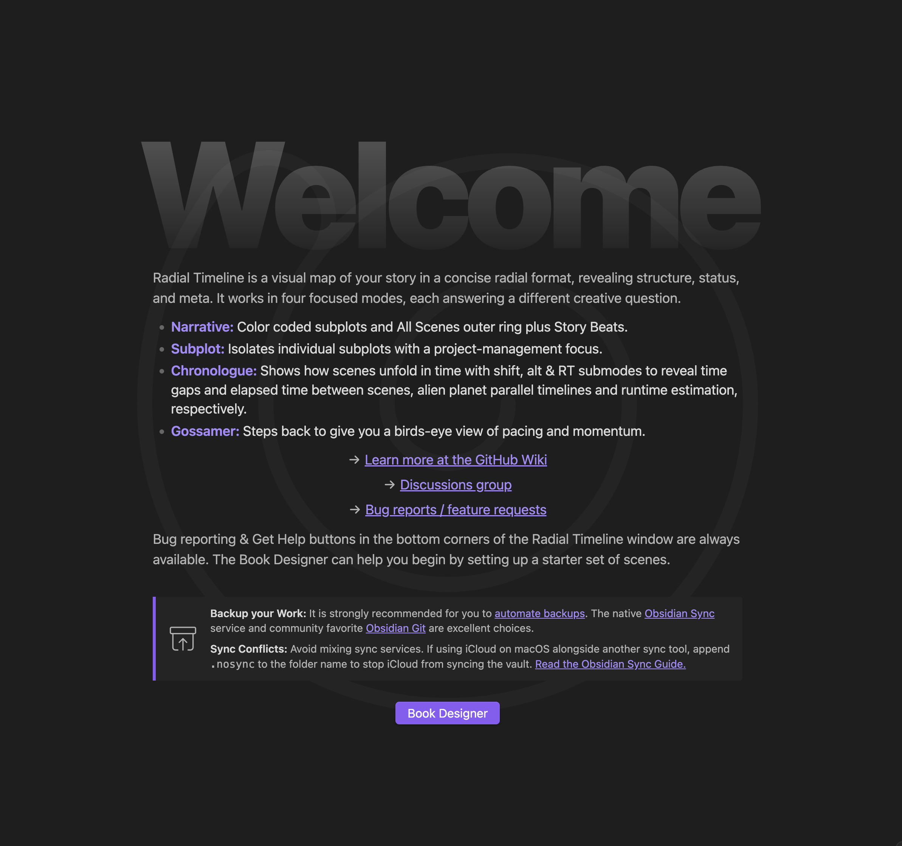

# Welcome Screen

When you open Radial Timeline in an empty vault (or a vault with no scenes configured), a **Welcome Screen** greets you with a quick-start guide to get you writing fast.

  

    
    
Welcome screen — quick-start guide for new vaults

  

## Get Started in a Few Steps

### 1. Set your source path
Point Radial Timeline at the folder containing (or that will contain) your manuscript scene files. Go to **Settings → Core → General → Source path**.

### 2. Create scenes
You have two paths:

*   **[[Book Designer]]** — Generate a complete manuscript scaffold with acts, subplots, characters, and optional beat notes in one click. This is the fastest way to see Radial Timeline in action.
*   **Manual** — Use the command palette (`Cmd/Ctrl + P`) → **Radial Timeline: Create basic scene note** or **Create advanced scene note** to add scenes one at a time.

### 3. Set up your structure

*   **Acts** — Default is 3-act structure. Adjust in **Settings → Core → Acts**.
*   **Story beats** — Activate a beat system (Save the Cat, Hero's Journey, Story Grid) or create your own custom system in **Settings → Core → Story beats system**. Custom systems support naming, act assignment, drag-to-reorder, and merge-to-realign.

### 4. Explore modes
Switch between the three primary Timeline modes using keyboard shortcuts **1** (Narrative), **2** (Publication), and **3** (Chronologue) to see your story from different angles. Once you have a zero draft, try Gossamer mode (**4**) to map out the initial AI take on your momentum graph.

---

## Backup & Sync

Back up your Obsidian vault regularly to protect against data loss. Sync does not protect against all forms of data loss.

*   **[Obsidian Backup Guide](https://help.obsidian.md/backup)**
*   **[Obsidian Sync](https://obsidian.md/sync)** or **[Obsidian Git](https://obsidian.md/plugins?id=obsidian-git)**

## Next Steps

*   **[[Fresh-Vault-Onboarding|Fresh Vault Onboarding]]** — Start from scratch with Book Designer and beats.
*   **[[Existing-Vault-Onboarding|Existing Vault Onboarding]]** — Connect an existing manuscript to Radial Timeline.
*   **[[Core Workflows]]** — Learn how to plan, write, and track your novel.
*   **[[How-to]]** — Reorder scenes, manage subplots, search, and rotate the timeline.
*   **[[YAML Frontmatter]]** — Understand the metadata that powers your timeline.
*   **[[Commands]]** — Full command palette reference.
